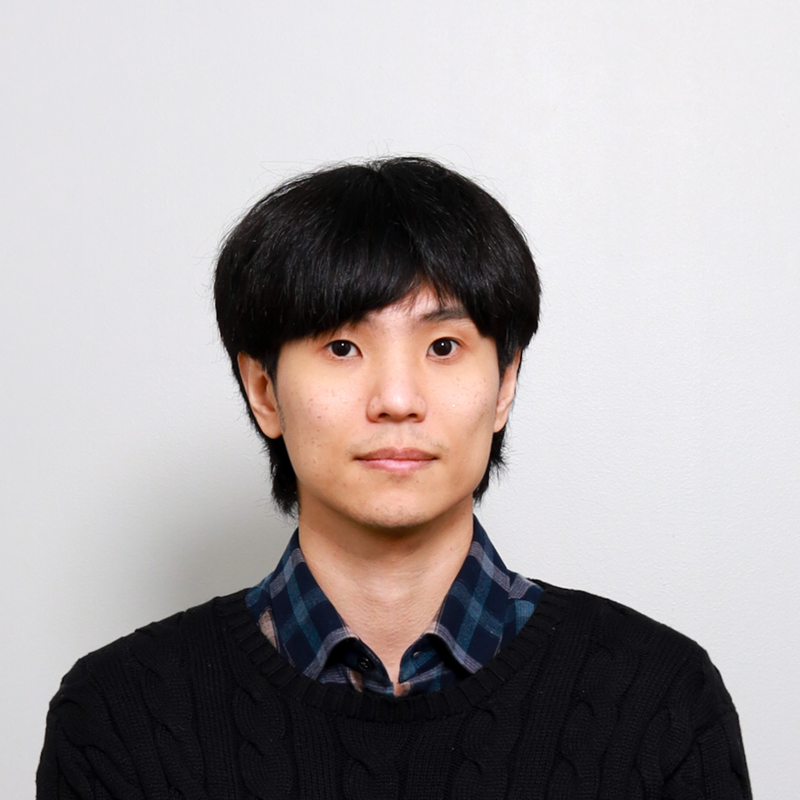

# 이학

Computational architectural design^[__1)__](./works/tools-and-tales/thoughts/2024/0623.md)^ 분야를 연구하며 서비스를 개발하고 있습니다.

## Education

- **서울과학고등학교**, 2009 Mar – 2012 Feb
- **서울대학교, 건축학과 건축학전공**, 2012 Mar – now
- **서울대학교, 영상매체예술 연합전공**, 2014 Sep – now
- **서울대학교, 컴퓨터공학 부전공**, 2016 Mar – now

## Work Experience

- **[서울대학교 건축사연구실](https://architecture.snu.ac.kr/research/%EA%B1%B4%EC%B6%95%EC%82%AC%EC%97%B0%EA%B5%AC%EC%8B%A4-architectural-history-lab/), short term researcher**, 2014 Jul – 2014 Aug
- **[경계없는작업실](http://boundless.kr), Boundless-X 팀, 파라메트릭 디자이너**, 2016 Jan – 2016 Aug
- **[스페이스워크](https://www.spacewalk.tech), 개발자**, 2017 Jan – 2017 Feb
- **[스왈라비](https://www.swallaby.com), 연구원**, 2018 Jan – 2018 Feb
- **[엔진스튜디오](https://www.ngine.co.kr), 라이브팀, 개발자**, 2018 Aug – 2019 Apr
- **[엔진스튜디오](https://www.ngine.co.kr), 기술연구팀, 프로그래머**, 2019 May – 2020 Aug
- **[제너레잇](https://zenerate.ai), 사내이사, 소프트웨어 엔지니어**, 2020 Sep – Now

## Me!

{width=500}

-----

1) [__컴퓨테이셔널 디자이너에 대하여 (06. 23.)__](./works/tools-and-tales/thoughts/2024/0623.md)  