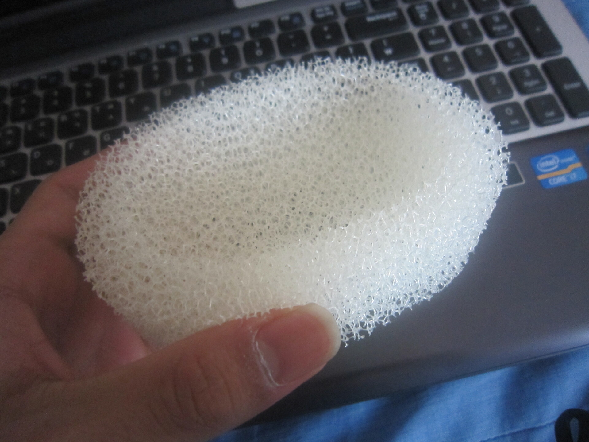
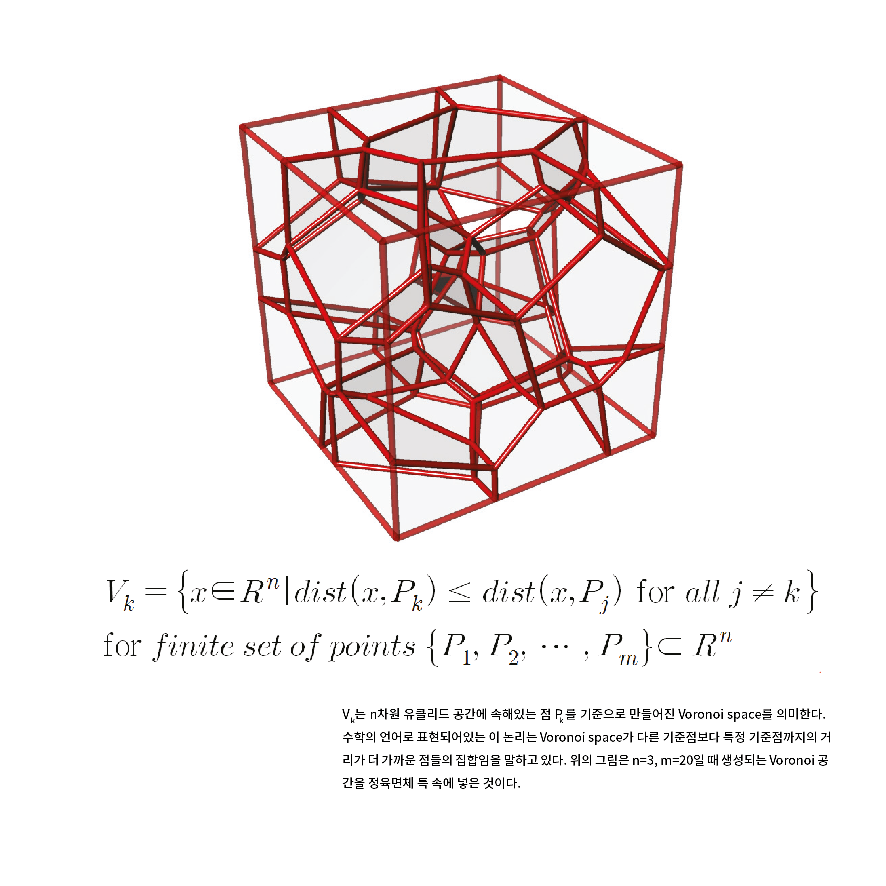
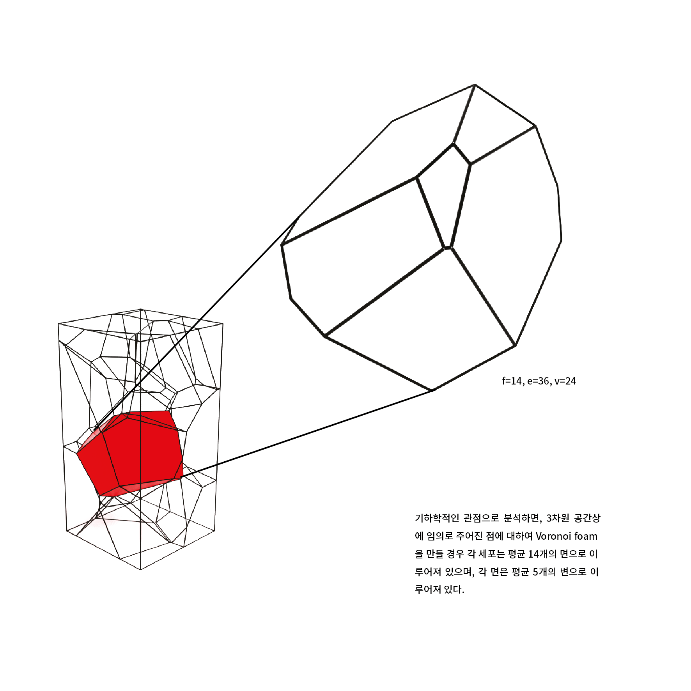
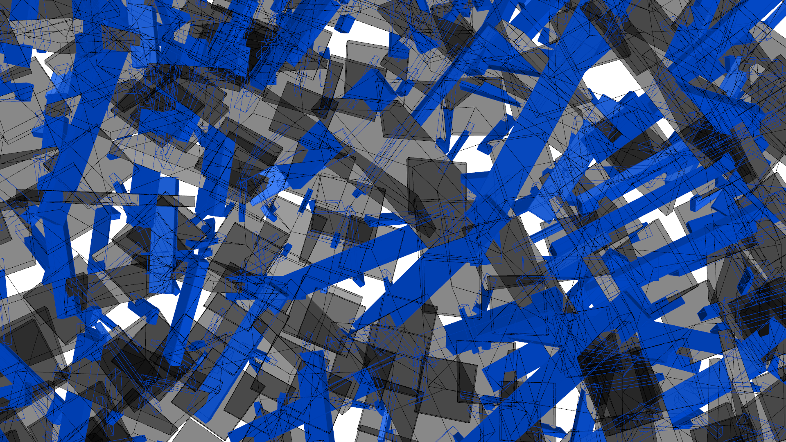

Just after entering university in the spring of 2012, I received my first architectural design class to choose and describe an object. After a brief deliberation, I chose the sponge soap dish in my bathroom.  

{width=500}  

As you can see, the sponge has a lot of holes, and there is no simple pattern that is repeated. When I chose the sponge, I didn't deeply consider that I would have to draw it and make models with it. As I worked on the assignment, I soon realized I had made the wrong choice. I had hardly done any drawings in a past, and the sponge was not something that I could render by hand. To finish the assignment on time, I had to find a way to simplify the structure for representation. Wondering if people who study sponge structures might know a method, I searched and learned that sponge structures follow the form and generation principles of Voronoi diagrams. As I researched Voronoi diagrams further, I discovered that a software called Rhinoceros3D has a tool called Grasshopper that can easily visualize Voronoi diagrams.  

{width=600}  
{width=600}  

Fortunately, using Grasshopper to draw the Voronoi diagram wasn't too difficult, and I was able to successfully visualize the sponge structure and bring it to the class. It was the first time I realized that by skillfully using computers, I could instantly create forms that I couldn't even imagine with just my hands and brain.  

After finishing the semester, I reopened the Grasshopper window and noticed there were countless components that I never dared to touch. Questions arose - what do other components do? If I learn to use the other components, what diverse forms could I generate with it? These inquiries sparked an exploration that continues to this day.
&NewLine;  
&NewLine;    
&NewLine;  
{width=1700}
