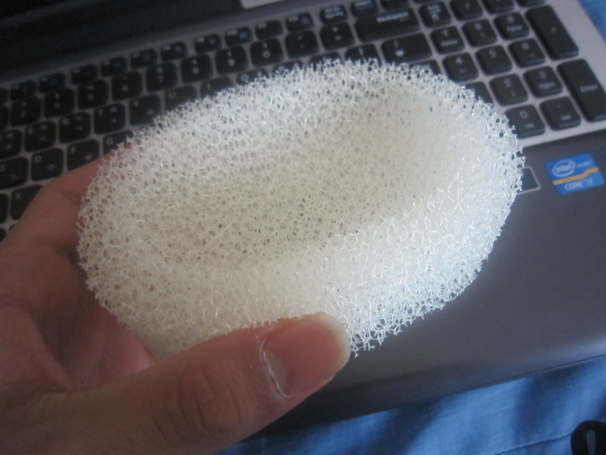
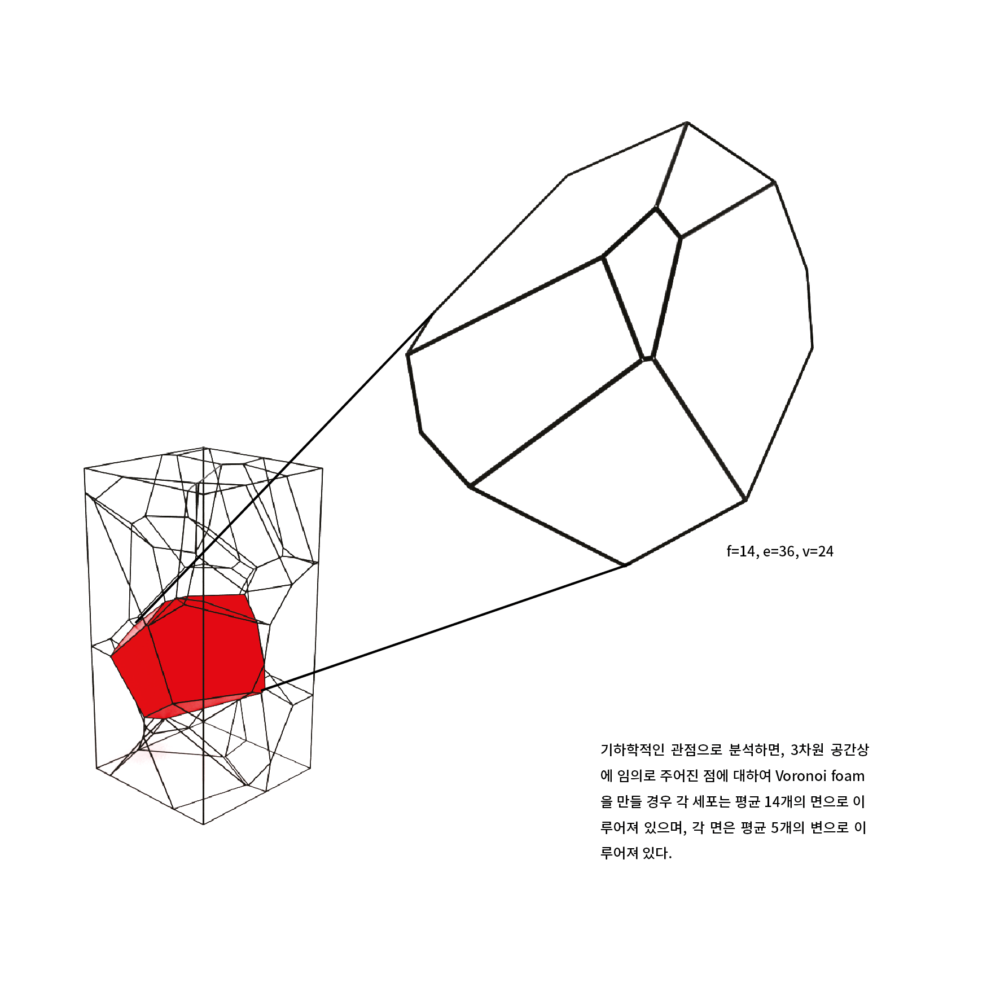

2012년 봄, 대학에 들어오고 나서 첫 설계 수업 과제로 사물을 하나 선택해서 묘사해보라는 과제를 받았다. 나는 짧은 고민 끝에 집 화장실에 있던 스펀지 비누 받침을 골랐다.  

{width=500}  

스펀지는, 보면 알겠지만, 구멍이 정말 많고, 단순히 복사해서 붙여넣을 수 있는 어떤 패턴이 존재하지 않는다. 스펀지를 고를 때만 해도 이걸로 드로잉도 하고 모형도 만들어야 한다는 것에 대해 깊게 생각하지 않았었는데, 과제를 하면서 곧바로 내가 잘못된 선택을 했다는 것을 깨달았다. 스펀지는 드로잉을 거의 해보지 않은 초짜가 손으로 그릴 만한 것이 못 되었다. 시간 안에 과제를 마치려면 어떻게든 구조를 단순화해서 표현할만한 방법을 찾아야 했는데, 혹시 스펀지 구조를 연구하는 사람들은 방법을 알고 있지 않을까 싶어 검색을 하던 중 스펀지 구조는 보로노이 다이어그램의 형태 및 생성 원리를 따른다는 것을 알게 되었다. 그리고 보로노이 다이어그램에 대해 좀 더 알아보던 중 라이노라는 소프트웨어에 그래스호퍼라는 것이 있는데 이를 활용하면 간단하게 보로노이 다이어그램을 시각화할 수 있다는 것을 발견했다.

{width=600}  
{width=600}  

다행히도 그래스호퍼를 사용해서 보로노이 다이어그램을 그리는 것은 크게 어렵지 않았고, 나는 무사히 스펀지 구조를 시각화해서 수업에 가져갈 수 있었다. 컴퓨터를 잘 활용하면 내 손과 머리만으로는 상상조차 하지 못할 만한 형태를 순식간에 만들어낼 수 있다는 걸 처음으로 깨닫는 순간이었다. 

과제를 끝내고 나서 스펀지 구조를 만들어내는 그래스호퍼 창을 다시 켜보며, 아직 건드려보지도 않은 수없이 많은 컴포넌트들이 눈에 들어왔다. 어떤 기능들이 더 있을까? 다른 기능들까지 사용할 수 있게 된다면, 얼마나 더 다양한 형태들을 생성해볼 수 있을까? 하는 질문들이 이어서 떠올랐고, 지금까지도 이에 대해 탐구하고 있다.  
&NewLine;  
&NewLine;    
&NewLine;  
{width=1700}
