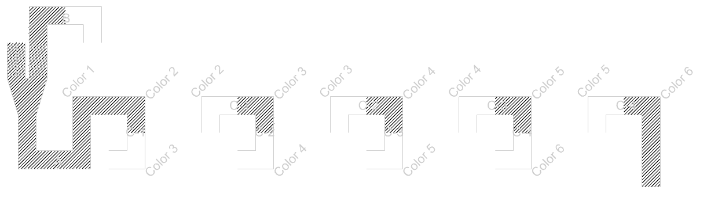

[:material-arrow-left-bold: Back to post list](../index.md){ .md-button }

`2025. 03. 28.`

In the early part of the game [Antichamber](https://store.steampowered.com/app/219890/Antichamber/){:target="\_blank"} released in 2013, there's a space that would be physically difficult to implement.

<iframe width="560" height="315" src="https://www.youtube.com/embed/3Bc8sgakXOw?si=yDfFDQ-ZJ4tAAj6J" title="YouTube video player" frameborder="0" allow="accelerometer; autoplay; clipboard-write; encrypted-media; gyroscope; picture-in-picture; web-share" referrerpolicy="strict-origin-when-cross-origin" allowfullscreen></iframe>

To explain with some spoilers:

- As you walk down a corridor, you reach a fork with stairs going down on the left and stairs going up on the right.
- Whichever path you take, you end up back at the same fork. This fork repeats infinitely regardless of which path you choose.
- If you give up moving forward and turn back, a new path appears instead of the fork you came through.
- Following this new path, after taking six right turns, you reach a dead end.

If we were to represent this experience in a floor plan, it would look as follows. The hatched areas represent spaces the user can actually see from their position, confirming their existence. Areas outlined in black represent spaces the user has previously passed through and knows exist.

{width=600}

Even in just this section, two problems are already apparent:

- There's an infinitely repeating path. Even in a virtual space, since this space must exist in memory or storage, infinite hardware capacity would be required to accommodate an infinite space.
- After making three "┌" shaped turns, the path should intersect with the previous path, but it doesn't. This can be confirmed in the floor plan when the user moves from point 4 to point 5, as the corridor leading to the previous fork disappears.

How can we work around these problems? If we assume teleportation is possible while the user moves through the space, we could solve the problem as follows.

{width=600}

The letters in this image represent teleportation locations, following these rules:

- If the user takes the right fork and moves from left to right at point B, they emerge at point A moving from right to left. The left fork can be explained similarly.
- If the user passes from left to right at point A, nothing happens.
- If the user moves from top to bottom at point C-1 in the left diagram, they emerge at point C-1 in the right diagram moving from left to right, and similar things happen when moving in the opposite direction. Similar events occur at points C-2, C-3, and C-4.

In this diagram, the only areas where the user can actually move are represented by the hatched regions in the image below; the rest are areas that can only be seen visually.

{width=600}

If we overlay the initial floor plan (from the user's perspective) onto the teleportation-based diagram, it would look like this.

{width=600}

By simply adding the rule of teleportation, the problems of infinite space and physically conflicting spatial implementation are solved! However, this creates a separation between the floor plan the user thinks they've experienced and the floor plan the space designer drew to implement the space. Why does this separation occur? Is this separation truly inevitable? I'll discuss this in more detail in my next article.

[:material-arrow-left-bold: Back to post list](../index.md){ .md-button }
