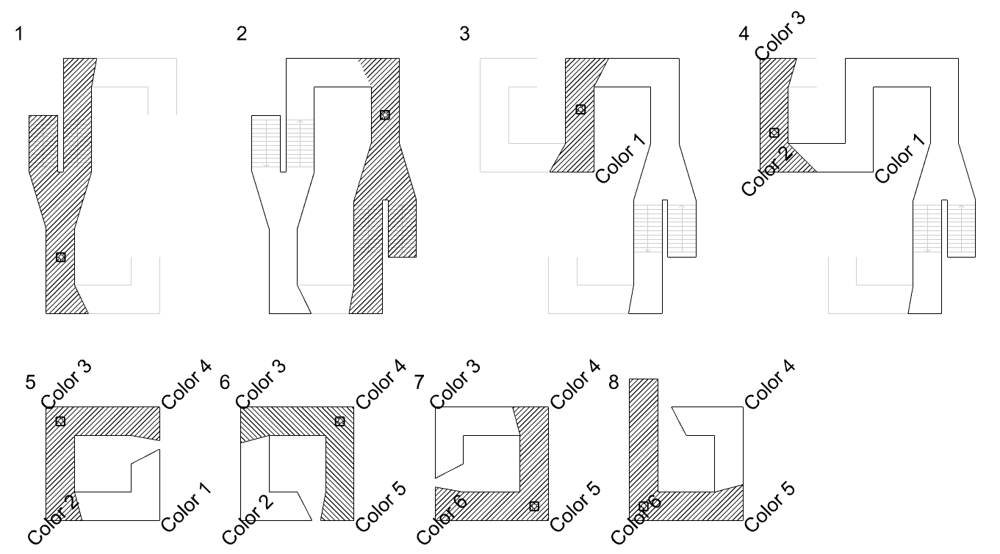

[:material-arrow-left-bold: 전자-건축](../index.md){ .md-button }

(ref: [가상 공간과 도면 - 1](../../city-fragments/thoughts/2025/0328.md))

2013년에 출시된 [Antichamber](https://store.steampowered.com/app/219890/Antichamber/){:target="\_blank"}라는 게임의 도입부에는 다음과 같이 물리적으로는 구현하기 어려울만한 공간이 나온다.

<iframe width="560" height="315" src="https://www.youtube.com/embed/3Bc8sgakXOw?si=yDfFDQ-ZJ4tAAj6J" title="YouTube video player" frameborder="0" allow="accelerometer; autoplay; clipboard-write; encrypted-media; gyroscope; picture-in-picture; web-share" referrerpolicy="strict-origin-when-cross-origin" allowfullscreen></iframe>

설명을 위해 약간의 스포일러를 첨부하자면

- 복도를 따라서 가다 보면 왼쪽으로는 내려가는 계단이, 오른쪽으로는 올라가는 계단이 있는 갈림길이 나온다.
- 둘 중 어느 길을 따라가도 다시 처음 보았던 갈림길이 나온다. 이 갈림길은 어느 길을 택하더라도 무한히 반복된다.
- 앞으로 나아가는 걸 포기하고 뒤로 돌아가면 내가 지나온 갈림길이 아닌 새로운 길이 나타난다.
- 새로운 길을 따라서 나아가면 오른쪽으로 꺾는 길을 6번 지나고 나서 막다른 길에 도달한다.

이러한 경험을 도면에 표현하자면 다음과 같다. 해치로 표현된 영역은 유저가 본인의 위치에서 실제로 볼 수 있는, 즉, 존재한다는 것을 확인할 수 있는 영역이고, 검은 선으로 둘러싸인 영역은 유저가 이전에 지나온, 즉, 존재한다고 알고 있던 영역이다.

{width=800}

이 구간에만 해도 벌써 두 가지 문제가 발견되는데,

- 무한히 반복되는 길이 있다. 아무리 가상 공간이라 하더라도 이 공간은 메모리나 저장장치에 존재하므로, 무한 공간을 담기 위해서는 무한 용량의 하드웨어가 필요하다.
- '┌' 모양으로 세 번 꺾고 나면 기존에 왔던 길과 만나야 하는데, 그러지 않았다. 이는 도면상에서 유저가 4번에서 5번으로 넘어갈때 기존의 갈림길로 이어지는 통로가 사라진 것을 통해 확인할 수 있다.

이러한 문제를 어떻게 우회할 수 있을까? 유저가 공간을 이동하던 중 텔레포트가 가능하다고 한다면 다음과 같이 문제를 해결할 수도 있다.

{width=800}

이 이미지에 써있는 알파벳은 텔레포트가 일어나는 장소로, 다음과 같은 규칙을 따른다.

- 유저가 오른쪽 갈림길을 택해서 B 지점의 왼쪽에서 오른쪽으로 이동하면, A 지점의 오른쪽에서 왼쪽으로 이동하는 방향으로 빠져나온다. 왼쪽의 갈림길도 비슷하게 설명할 수 있다.
- 유저가 A 지점의 왼쪽에서 오른쪽으로 지나가면 아무 일도 발생하지 않는다.
- 유저가 왼쪽 도면의 C-1 지점을 위에서 아래쪽으로 이동하면, 오른쪽 도면의 C-1 지점의 왼쪽에서 오른쪽으로 이동하는 방향으로 빠져나오고, 반대 방향으로 이동할 때도 유사한 일이 일어난다. C-2, C-3, C-4 지점에서도 비슷한 일이 벌어진다.

이 도면에서 유저가 실제로 이동할 수 있는 구역은 아래 이미지에서 해치로 표현된 영역 뿐이고, 나머지는 시각적으로 볼 수만 있는 영역이다.

{width=800}

처음에 그린 유저 관점에서 파악한 공간의 도면을 위의 순간이동이 전제된 도면 위에 표현하면 다음과 같다.

{width=800}

유저도 모르는 사이 순간이동이 가능하다는 규칙을 추가하는 것만으로 무한 공간과 물리적으로 충돌하는 공간 구현의 문제를 해결했다! 그런데 이로 인해 사용자가 생각하는 본인이 경험한 공간에 대한 도면과 공간 설계자가 공간 구현을 위해 그린 도면이 분리되었다. 이런 분리는 왜 일어난 것일까? 분리가 일어나는 것이 정말 불가피할까?

[:material-arrow-left-bold: 전자-건축](../index.md){ .md-button }
