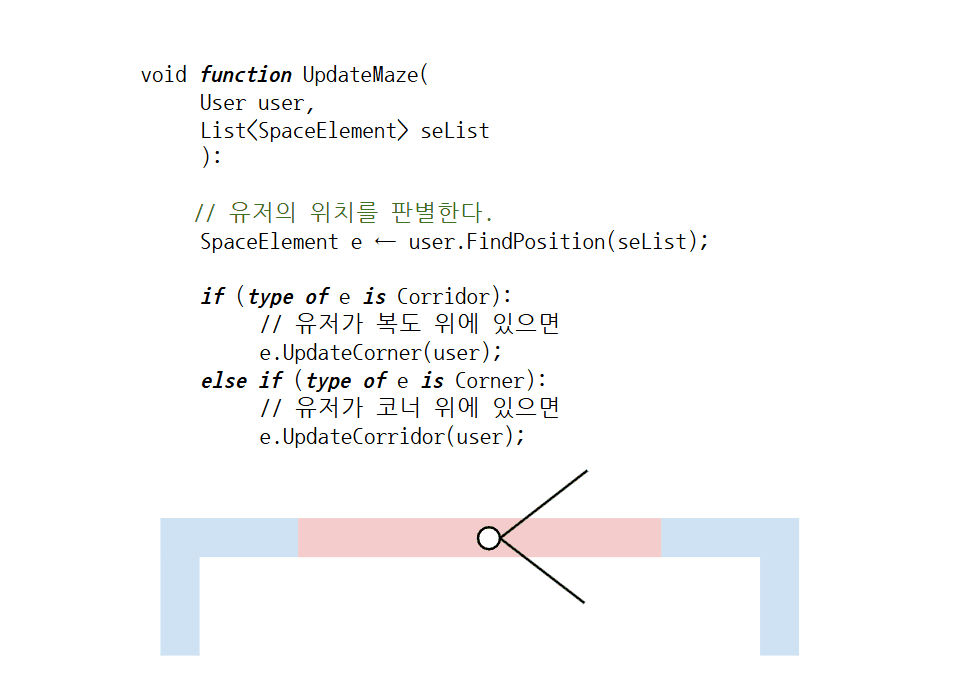

[:material-arrow-left-bold: 어플리케이션](./index.md){ .md-button }

`Maze`에서는 전자 공간에서는 언제든지 공간의 정보를 생성하거나 제거하는 것이 가능하다는 특성을 활용하여 유저의 시선이 닿지 않는 공간을 제거했다가 새로 생성하는 방식으로 공간을 구현한다.

전통적인 도면은 실시간으로 바뀌는 공간을 표현하는 데에는 한계가 많고, `Maze` 공간의 경우 길을 새로 생성하는 방법이 공간의 성질을 더 잘 설명해주므로 이 방법을 수도 코드(pseudo code) 형식으로 소개하도록 하겠다.

```c#
void function PlayMaze():
    User user ← new user;
    List<SpaceElement> seList ← empty list;

    // 미로와 유저를 초기화한다.
    InitializeMaze(user, seList);

    while (true):
        // 매 프레임마다 유저의 위치를 기반으로 미로
        // 공간을 업데이트 한다.
        UpdateMaze(user, seList);

void function InitializeMaze(
    User user,
    List<SpaceElement> seList
    ):

    // 복도를 만들고
    Corridor line ← CreateCorridor();
    seList.Add(line);

    // 복도의 양 끝에 코너를 붙인다.
    for (corner in line.ExtendCorner()):
        seList.Add(corner);

    // 그리고 유저를 복도 위에 위치시킨다.
    user.Place(line);

void function UpdateMaze(
    User user,
    List<SpaceElement> seList
    ):

    // 유저의 위치를 판별한다.
    SpaceElement e ← user.FindPosition(seList);
  
    if (type of e is Corridor):
        // 유저가 복도 위에 있으면
        e.UpdateCorner(user);
    else if (type of e is Corner):
        // 유저가 코너 위에 있으면
        e.UpdateCorridor(user);
```

이 수도 코드는 다음과 같이 작동하는 것을 의도한 것이다.



예시 구현은 다음 영상을 통해 확인할 수 있다.

<iframe width="560" height="315" src="https://www.youtube.com/embed/aBUkLX6OyUU" title="YouTube video player" frameborder="0" allow="accelerometer; autoplay; clipboard-write; encrypted-media; gyroscope; picture-in-picture; web-share" referrerpolicy="strict-origin-when-cross-origin" allowfullscreen></iframe>

[:material-arrow-left-bold: 어플리케이션](./index.md){ .md-button }
