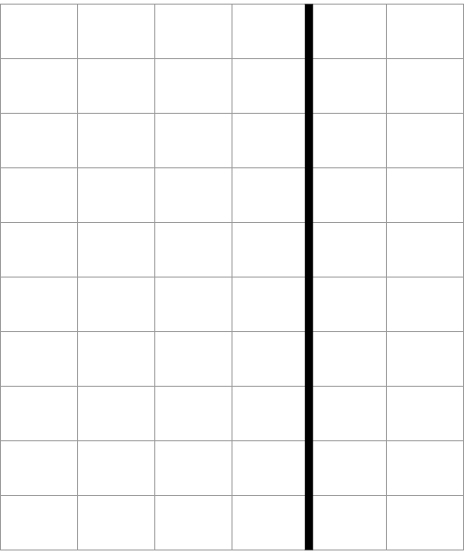
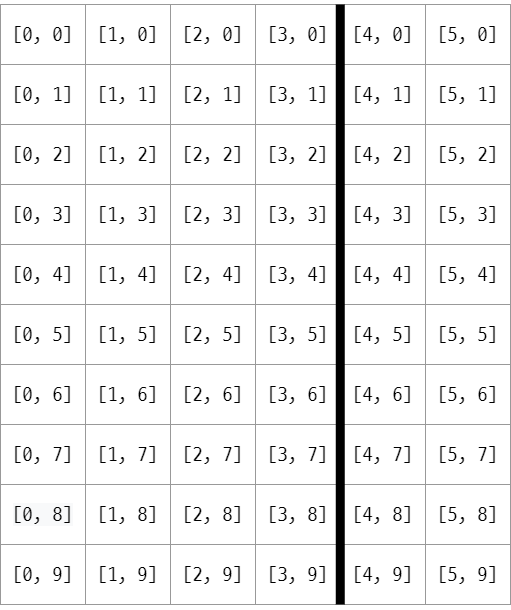
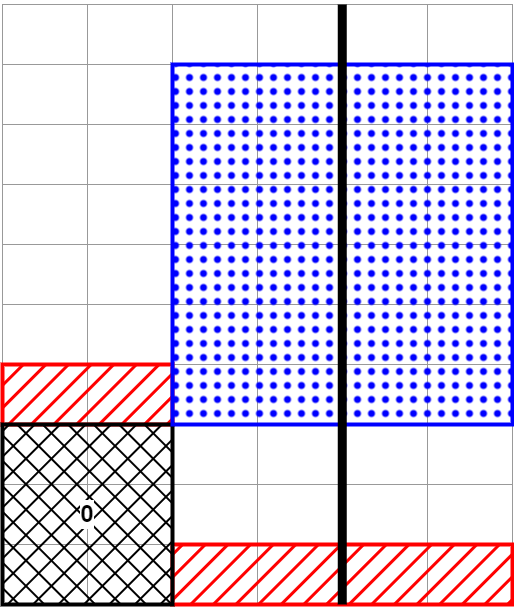
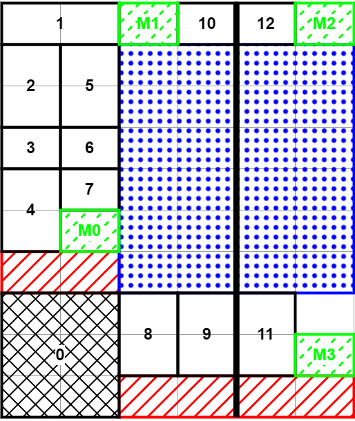

[:material-arrow-left-bold: 전자-건축](../index.md){ .md-button }

## Concept

전시를 진행하기 위한 설치물은 다음과 같은 조건을 만족해야 했다.

- 설치물의 면 중 일정한 부분이 중첩되는 증강현실을 보여주기 위한 바탕의 역할을 해야 한다. 증강현실이 적용된 공간을 더 효과적으로 보여주기 위해서 90도로 꺾여있는 모서리가 있으면 좋다.
- 증강현실을 보기 위한 기기를 제공한다. 갤럭시 탭을 사용할 예정이므로 이를 올려둘 책상이 필요하다.

이에 더하여, 다음과 같은 기획을 추가했다.

- 물리적인 모형이 전혀 없는 전시가 될 것이므로 책상 이외의 부분은 모두 벽과 같은 평면이다. 그렇다면 이 면적을 메모리 공간처럼 생각하는 것은 어떨까?

## Base

{width=400}

- 전체 공간을 6 x 10 칸으로 나눈다.
- 90도로 꺾이는 부분을 굵은 선으로 표시했다.
- 각 칸의 치수는 정확히 정해진 것은 아니지만, 한 칸에 a5 크기의 종이가 적당히 들어갈 수 있는 정도면 충분히다. 이 그리드가 메모리라고 생각하면, 한 주소에 a5 크기의 정보가 들어갈 수 있는 식.
- 각 칸이 모두 크기가 같을 필요는 없다. 즉, 이 그리드는 개념적인 그리드에 가깝다.

## Address

{width=400}

- 각 칸에 주소를 위와 같이 좌표로 부여할 수 있다.
- 이렇게 부여된 주소는 평면상에 맵핑하기 위해 벡터로 표현되어 있으나, 앞 숫자에 10을 곱한 뒤 뒷 숫자를 더하여 스칼라로 만들어서 사용해도 무방하다.
- 처음 아이디어를 구상하면서는 주소를 부여했으나, 이후 과정에서 주소가 사용될 일이 없어 개념으로만 남아있다.

## Reserved Space

{width=400}

- 창문이 들어가는 영역을 파란색으로 표시했다.
- 태블릿을 올려놓을 책상을 둘 공간에 번호 0을 부여했다. 이 위치는 전시를 보러 온 사람들이 가장 먼저 상호작용할 것으로 생각되는 곳으로, 태블릿 외에도 전시를 설명하는 리플렛도 올려놓을 예정이다.
- 책상 위, 그리고 바닥 부분에 버퍼 공간을 만들고 빨간색으로 표시했다.

## Contents and Markers

{width=400}

- 남은 영역에 전시 내용을 할당했다.
- 전시 내용을 할당하고 남은 공간에 마커를 할당했다. 이 마커는 증강현실 어플리케이션이 실행될때 기준점을 잡는 데에 도움을 줄 것이다.

[:material-arrow-left-bold: 전자-건축](../index.md){ .md-button }
