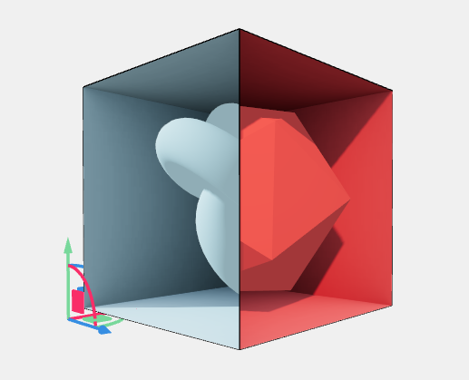

[:material-arrow-left-bold: 전자-건축](../index.md){ .md-button }

전자 공간이 존재하는 현장(site)은 메모리다. 예전에는 이 메모리가 데스크탑 컴퓨터에 장착되어 있었으므로 사람들은 컴퓨터가 있는 곳에 가서 프로그램을 실행해야지만 메모리 위에 올려진 전자 공간에 접근할 수 있었다. 하지만 기술이 발전하면서 랩탑, 그리고 스마트폰이 출시되었고, 와이파이를 통해 무선 인터넷을 사용할 수 있게 되었다. 이제 우리는 이제 메모리를 휴대할 수 있게 되었고, 랜선에 물리적으로 연결하지 않고도 네트워크에 접속할 수 있게 되었다. 전자 공간에 자유롭게 드나들 수 있는 환경이 갖춰진 것이다.

그렇다면 우리에게 새로 주어진 사이트를 통해서는 어떤 새로운 공간 경험을 할 수 있게 되었을까? 직접 공간을 구현하기에 앞서 널리 알려진 몇 가지 예시들을 몇 가지 살펴보도록 하자.

## 포탈

서로 다른 공간을 연결해주는 장치다. 포탈을 통해 우리는 아주 멀리 떨어진 곳으로 곧장 이동하거나, 포탈 없이는 접근할 수 없을 만한 공간으로 이동하는 것이 가능하다.

### [맵 사이를 이동하는 포탈](./portal-1.md)

### [눈 앞에 보이는 공간으로 이동하는 포탈](./portal-2.md)

## loop

무한히 이어지는 공간을 구현하는 방식이다. 음악에 도돌이표가 존재하듯이 제한된 공간만으로 끊임없이 이어지는 경험을 만들어낼 수 있지 않을까?

### [`Manifold Garden` 사례](./loop-1.md)

### [`Antichamber` 사례: 도입부](../antichamber-study/index.md){:target="\_blank"}

## 중첩

전자 공간에서는 같은 위치에 여러 공간이 중첩되어 있도록 하는 것이 가능하다. 물리적인 공간에서는 특정 위치를 오로지 하나의 물체만 점유할 수 있겠지만, 전자 공간에서는 같은 위치에 여러 물체가 존재할 수 있기 때문이다. 전자 공간에서 물리적으로 고유한 위치에 대응되는 개념은 메모리상의 주소다. 한 주소에는 하나의 정보만 존재할 수 있고, 다른 정보를 넣으려고 하는 순간 기존의 정보가 덮어 씌워진다.

### [`r3f magic box` 사례 (PC 접속 권장)](https://codesandbox.io/p/sandbox/drc6qg){:target="\_blank"}

### `Antichamber` 사례: stencil shader

<iframe width="560" height="315" src="https://www.youtube.com/embed/TykxwxpTtRo?si=cen74f4bpezG8RR3" title="YouTube video player" frameborder="0" allow="accelerometer; autoplay; clipboard-write; encrypted-media; gyroscope; picture-in-picture; web-share" referrerpolicy="strict-origin-when-cross-origin" allowfullscreen></iframe>

[:material-arrow-left-bold: 전자-건축](../index.md){ .md-button }
