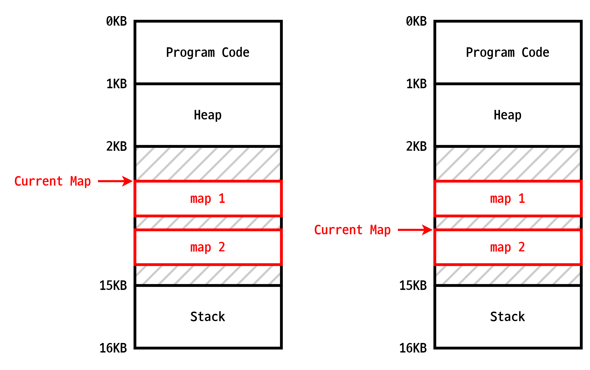
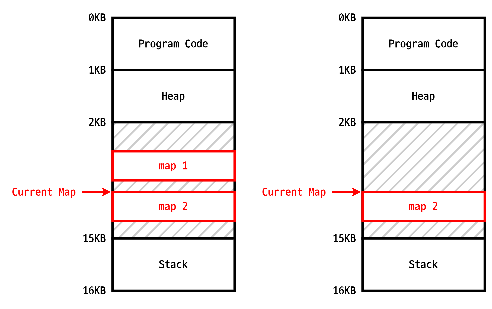
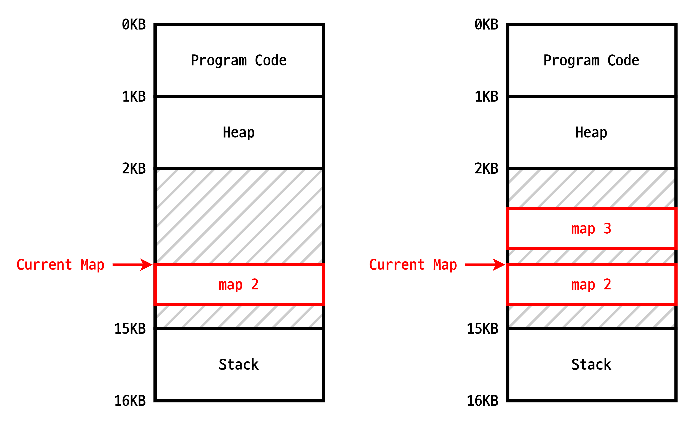
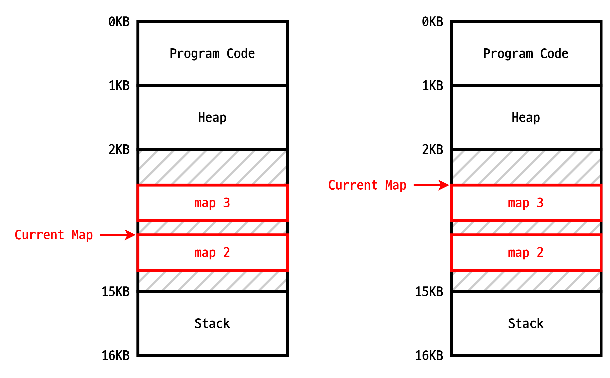

[:material-arrow-left-bold: 전자 공간의 메커니즘](./index.md){ .md-button }

포탈을 구현하는 방법에는 여러 가지가 있겠지만, 가장 단순한 방법은 현재 화면에 보이는 맵의 정보를 새로 이동하고 싶은 위치로 바꾸는 것이겠다. 원리를 설명하자면 아래와 같다.

1. 시작할때는 맵 1에 있는 상황이다. 여기서 맵 2로 이동하려고 한다.
2. 맵 2로 이동하는 것은 현재 보이는 맵의 참조를 맵 2로 바꾸는 것으로 충분하다.
    - {width=500}
3. 여기서 맵 3으로 이동하려고 한다고 해보자. 그런데 맵 3은 메모리 위에 아직 안 올라와있다. 이 경우 맵 3을 새로 메모리에 올려야 하는데, 할당된 메모리가 작거나 메모리가 부족한 경우 기존에 올라와있는 맵의 정보를 지우고 새로 공간을 만들어서 새로운 맵을 메모리에 올려야 할 때도 있다. 메모리에 새로운 맵을 올리는 과정에는 시간이 들 수도 있는데, 이 경우 게임에서는 로딩 화면을 보여주기도 한다.
    - {width=500}
    - {width=500}
4. 메모리에 새로운 맵이 성공적으로 올라간 뒤 현재 보이는 맵의 참조를 새로운 맵으로 변경하면 맵 이동이 가능하다.
    - {width=500}

[:material-arrow-left-bold: 전자 공간의 메커니즘](./index.md){ .md-button }
