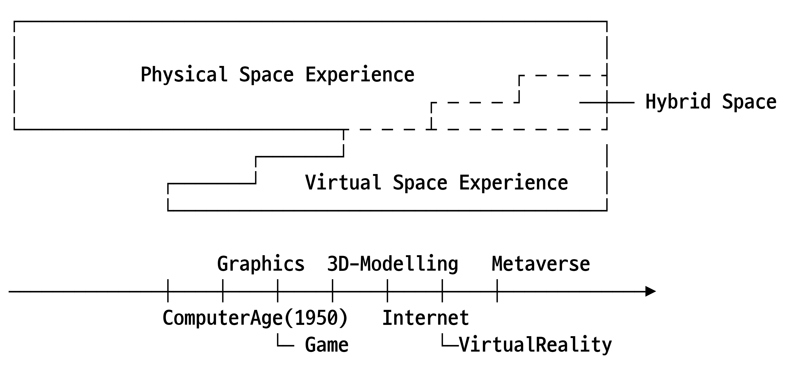
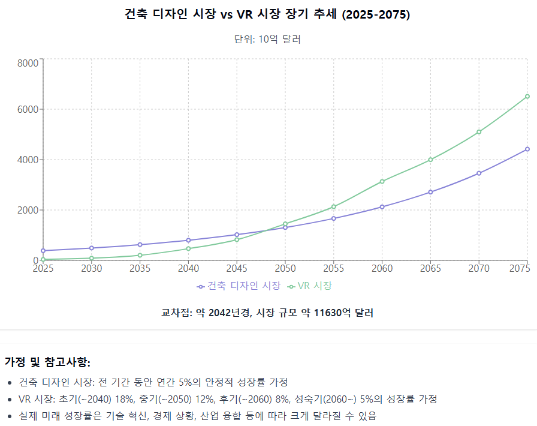

[:material-arrow-left-bold: 전자-건축](../index.md){ .md-button }

도면의 역사, 특히 시공을 위한 도면 세트의 개념이 등장한 이후부터의 역사는 물리적인 공간을 만들어내기 위한 방법의 역사라고 할 수 있다. 어떤 공간이 만들어질지 미리 시각적으로 표현하기 위해 도면을 그리고, 이를 정확히 시공하기 위해 관계자들이 볼 수 있도록 도면을 복제한다. 표준화된 부재가 등장하고 나서는 이를 표현하기 위한 도면의 요소들도 표준화한다. 손으로 그리기는 어렵지만 컴퓨터로 계산하여 생성할 수 있는 형태를 만들기 위해 CAD등의 소프트웨어를 활용하고, 더 나아가 생성한 형태를 만드는 과정에서 어떤 문제가 발생할 수 있을지 확인하기 위해 컴퓨터로 시뮬레이션을 돌려본다.

이렇게 발전해온 도면의 문제는 발전해나가는 방향이 너무나도 물리적인 시공에 특화된 나머지 물리적이지 않은 공간을 표현하는 데에 많은 제약이 있다는 점이다. 나니아 연대기에 나오는 세계와 세계 사이의 숲, 그리고 하울의 움직이는 성에 나오는 다이얼 문을 도면으로 나타내는 것이 가능할까? 이들 공간은 어떻게 작동하는지 상상은 할 수 있어도 현실에서는 존재할 수 없기 때문에 도면을 그리는 데에 성공하더라도 다이어그램적인 도면이 될 것이며, 이 도면을 공간을 시공하는 데에 활용하기는 어려울 것이다.

물리적으로 존재할 수 없는 공간을 도면으로 제대로 표현하지 못하는 것은 조금 아쉽긴 하지만 처음부터 시공할 수 없는 대상을 도면으로 표현하려고 했으니 그저 불가능한 걸 할 수 없었다- 하는 정도의 이야기로 받아들이고 넘어갈 수도 있겠다. 그런데 시간이 지나며 새로운 문제가 발생한다. 상상속에서나 존재할 수 있었을 법한 공간이 영화에서, 게임에서 구현되기 시작한 것이다.

영화에 등장하는 공간은 관객에게 일방적으로 전달되는 공간이기 때문에 이 공간을 통한 경험에는 제약이 많다고, 즉, 영화에서 다루는 공간은 건축에서 다루는 공간과 다른 공간이라고 주장할 수도 있겠다. 그런데 게임은 이야기가 다르다. 비록 화면을 통해서만 볼 수 있는 공간이지만 사람들은 키보드와 마우스를 통해 이 공간과 상호작용하는 것이 가능하다. 여기서 한 발자국 더 나아가서, 이러한 게임이 기반으로 하고 있는 기술들을 활용하면 현실 공간에 정보를 덧씌우는 방식으로 증강 현실 공간을 구현하는 것도 가능하다. 전자적인 방식으로 만들어진 공간에서의 경험이 물리적인 공간에서의 경험과 비슷해지고, 두 공간의 중첩까지 가능해지면서 전자 공간과 건축에서 다루는 공간은 서로 다른 것이라고 주장하기 어려워진 것이다.

{width=600}

이러한 현실을 다이어그램으로 표현하면 위와 같다. 건축가들 입장에서는 지난 수천년 동안 물리적인 공간에서의 경험을 다뤄왔다. 그런데 불과 몇십년 사이에 전자적인 방식으로 구현된 공간이 새로 나타나더니 물리 공간에서의 경험에까지 영향을 끼치기 시작했다. 그런데 이러한 전자 공간이 구현된 방식과 따르는 법칙은 물리 공간의 그것들과는 전혀 다르기 때문에 서로 유사한 공간 경험을 다루는 하이브리드 공간 영역에서 벗어나면 서로 전혀 다른 고유의 경험을 제공한다.

예를 들어, 어떤 3D FPS 게임에서 다이얼을 조작하면 전혀 다른 공간으로 연결되는 어떤 포탈 시스템을 구현했다고 하자. 공간을 경험하는 입장에서는 이는 물리적인 세계에서는 절대 구현할 수 없지만 이 포탈을 이용한 이동을 제외한 나머지 경험은 실제 세계에서 이동하는 경험과 유사하기 때문에 현실에서의 경험과 직접적으로 연관을 수 있게 된다.

그런데 컴퓨터와 스마트폰과 같은 기기의 관점에서는 이러한 게임나 웹 브라우저는 모두 기기에서 실행되는 프로그램이기 때문에 작동하는 원리가 유사하다. 즉, 게임이든 웹 브라우저든 모두 전자 장치 위에서 작동하므로, 구현 방식, 제공할 수 있는 경험의 종류, 발생할 수 있는 문제 등을 공유한다.

바로 이 지점에서 건축의 혼란이 시작된다. 물리적인 공간과 경험적인 측면에서 닮은 전자적인 공간은 시공 및 구축의 관점에서 보았을때 기존의 건축과 전혀 다른 과정을 따른다. 전자 건축과 실제 건축이 서로 독립적으로 존재하는 것이었다면 깔끔하게 다른 분야라고 인정하고 넘어가면 되겠지만, 그러기에는 AR, VR기술이 발전하며 전자 공간이 현실 공간에 끼치는 영향력이 점점 커지고 있어서 마냥 분리해버리는 것이 해답은 아니게 되어버렸다.

{width=800}

위의 그래프는 Claude 3.7 Sonnet을 활용하여 앞으로 시장 규모의 추세에 대해 질문하여 얻은 결과 위에 20학번 학생들이 50대가 되는 시기를 표시해둔 것이다. 그래프의 실제 교차점과 그래프의 캡션에 설명되어 있는 교차점이 다르기도 하고 위의 숫자들이 도출된 원리가 명확하게 설명되어 있지 않으므로 웃어 넘겨도 되는 자료라고 생각해도 크게 상관은 없지만, 현재 기술의 발전 속도를 보았을때 아주 말이 안되는 추세라고 생각하고 마냥 넘겨버리기도 어렵다.

만약 VR 시장의 규모가 건축 디자인시장의 규모를 넘어서는 일이 일어난다면, 그리고 이러한 일이 일어나는 사이 전자 건축을 기존의 건축에 편입시키는 것에 실패한다면, 공간 경험에 대한 이야기를 하는 분야의 과반이 기존의 건축이 아닌 VR 시장의 구성원들이 될 것이라는 점은 분명하다. 그렇기에 더더욱 현재의 건축은 전자적인 방식으로 만들어진 공간도 건축의 영역에 포함해야 한다.
하지만 기존 건축의 표현 방식은 전자 공간을 만드는 데에 사용하기 어렵다. 이러한 간극을 좁히기 위해서는 전자 건축이 어떤 기반 위에서 만들어진 것이고, 이러한 기반 위에서 어떤 공간을 만들 수 있는지 더 탐구해봐야 한다고 생각했다.

[:material-arrow-left-bold: 전자-건축](../index.md){ .md-button }
