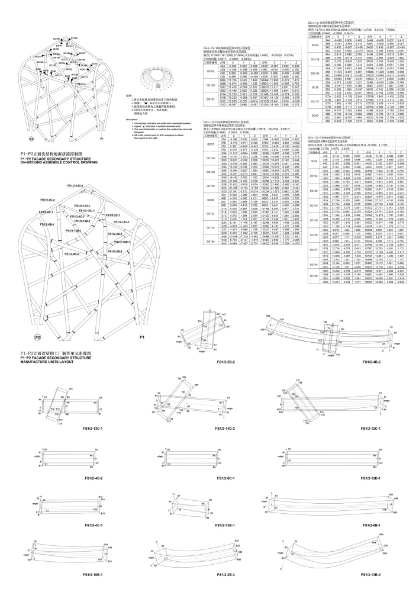

[:material-arrow-left-bold: BIM과 디지털 제조](./index.md){ .md-button }

{width=800}

{width=800}

- 시기: AD 2008
- 장소: Beijing, China
- 건축가: Herzog & de Meuron
- reference: <https://www.herzogdemeuron.com/projects/226-national-stadium/lightbox/32695/>

[:material-arrow-left-bold: BIM과 디지털 제조](./index.md){ .md-button }
