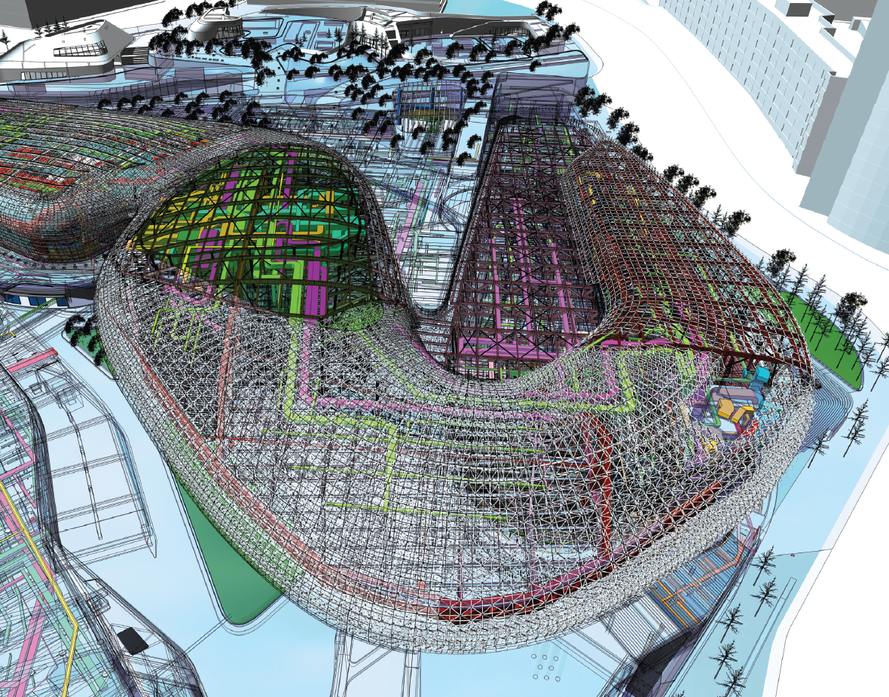

[:material-arrow-left-bold: BIM과 디지털 제조](./index.md){ .md-button }

{width=800}

- 시기: AD 2014
- 장소: Seoul, Republic of Korea
- 건축가: Zaha Hadid Architects
- BIM: Gehry Technologies
- reference: <https://www.theb1m.com/video/transforming-dongdaemun-design-park-plaza-with-bim>

[:material-arrow-left-bold: BIM과 디지털 제조](./index.md){ .md-button }
