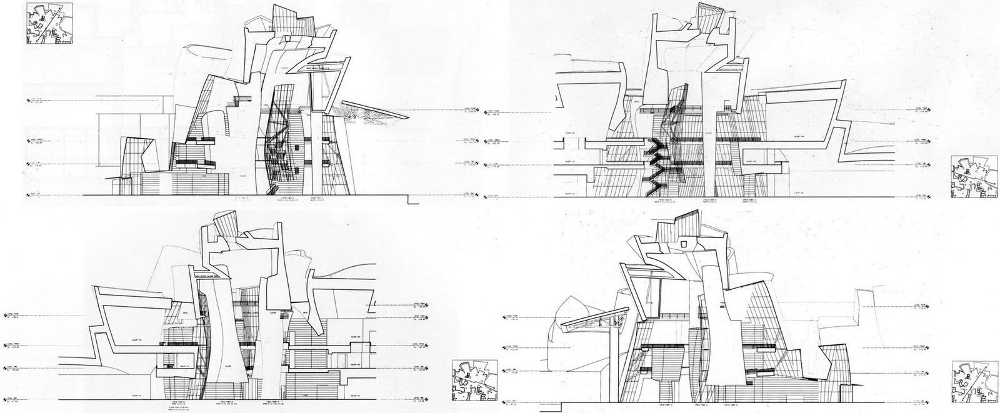

[:material-arrow-left-bold: 디지털 드로잉](./index.md){ .md-button }

{width=800}

- 시기: AD 1997
- 장소: Bilbao, Spain
- 건축가: Frank Gehry
- reference: <https://www.arch2o.com/guggenheim-museum-bilbao-frank-gehry/>

[:material-arrow-left-bold: 디지털 드로잉](./index.md){ .md-button }
