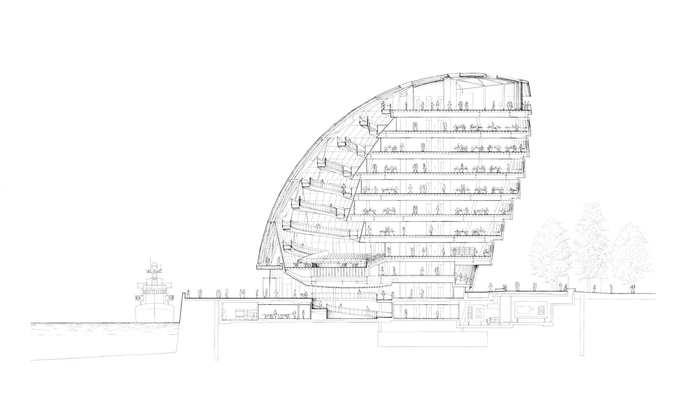

[:material-arrow-left-bold: 디지털 드로잉](./index.md){ .md-button }

{width=800}

- 시기: AD 2002
- 장소: London, England
- 건축가: Norman Foster
- reference: <https://www.fosterandpartners.com/projects/city-hall>

[:material-arrow-left-bold: 디지털 드로잉](./index.md){ .md-button }
