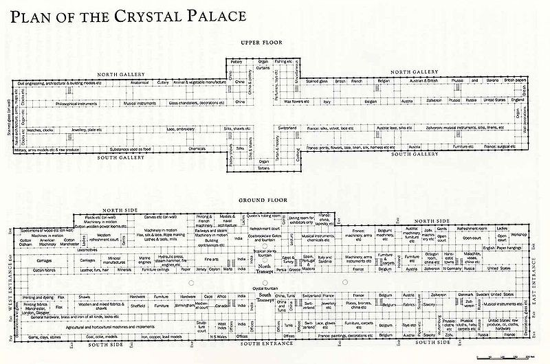

[:material-arrow-left-bold: 부재의 표준화](./index.md){ .md-button }

{width=800}

- 시기: AD 1851
- 장소: London, England
- 건축가: Joseph Paxton
- reference: <https://www.archdaily.com/397949/ad-classic-the-crystal-palace-joseph-paxton>

[:material-arrow-left-bold: 부재의 표준화](./index.md){ .md-button }
