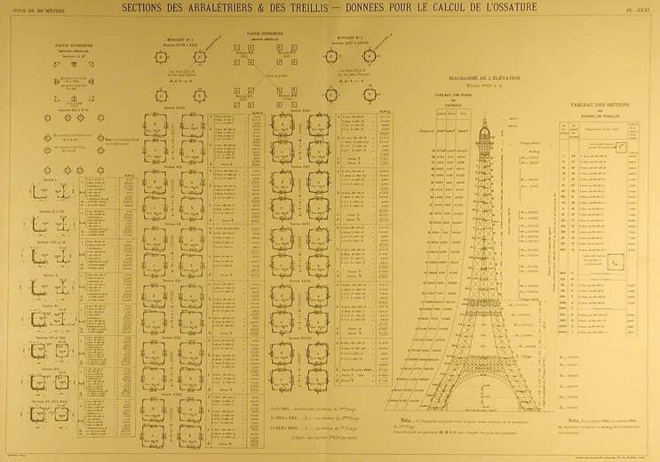
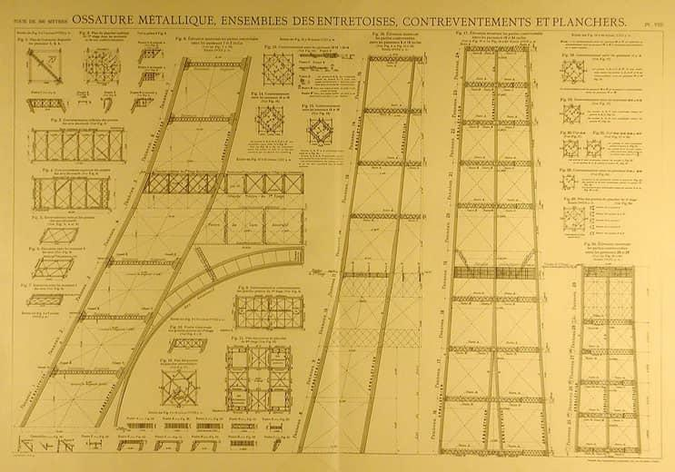
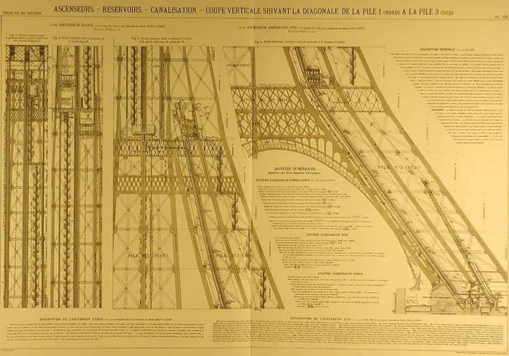

[:material-arrow-left-bold: 부재의 표준화](./index.md){ .md-button }

{width=800}

{width=800}

{width=800}

- 시기: AD 1900
- 장소: Paris, France
- 건축가: Alexandre Gustave Eiffel
- reference: <https://www.toureiffel.paris/en/the-monument/history>

[:material-arrow-left-bold: 부재의 표준화](./index.md){ .md-button }
