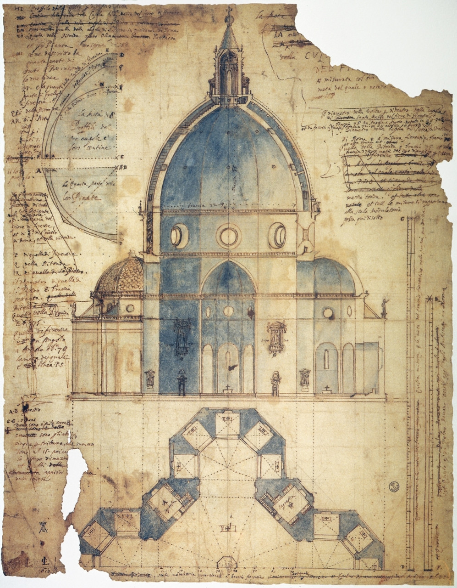

[:material-arrow-left-bold: 시공을 위한 도면 세트](./index.md){ .md-button }

{width=600}

- 시기: AD 1420
- 장소: Firenze, Italy
- 건축가: Filippo Brunelleschi
- reference: <https://en.wikipedia.org/wiki/Filippo_Brunelleschi>

[:material-arrow-left-bold: 시공을 위한 도면 세트](./index.md){ .md-button }
