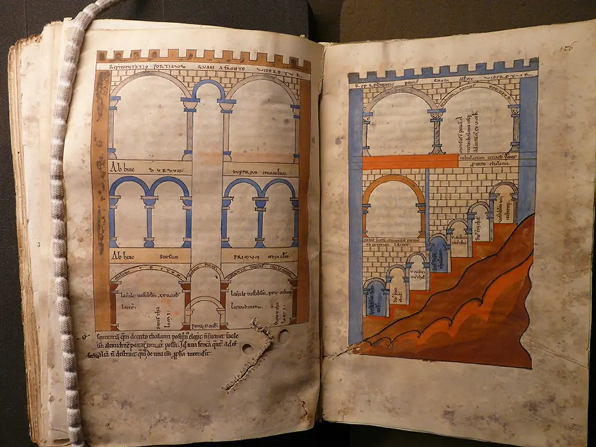

[:material-arrow-left-bold: 시공을 위한 도면 세트](./index.md){ .md-button }

{width=800}

- 시기: AD 1170
- 소재지: Bodleian Library, Oxford
- reference: <https://aeon.co/essays/the-surprising-history-of-architectural-drawing-in-the-west>
- description:
    - 예언자 Ezekiel의 책에 묘사된 성의 모급을 Richard라는 사람이 시각화하는 것을 시도했다. 즉, 실제로 존재하지 않은 건축물을 묘사만 보고 실재하는 건축물인 것처럼 표현한 것.
    - 하지만 이 과정에서 입면도 및 단면도라고 할 수 있는 결과물이 나왔다. 도면의 발전에 중요한 영향을 끼친 사례라고 생각되어 추가했다.

[:material-arrow-left-bold: 시공을 위한 도면 세트](./index.md){ .md-button }
