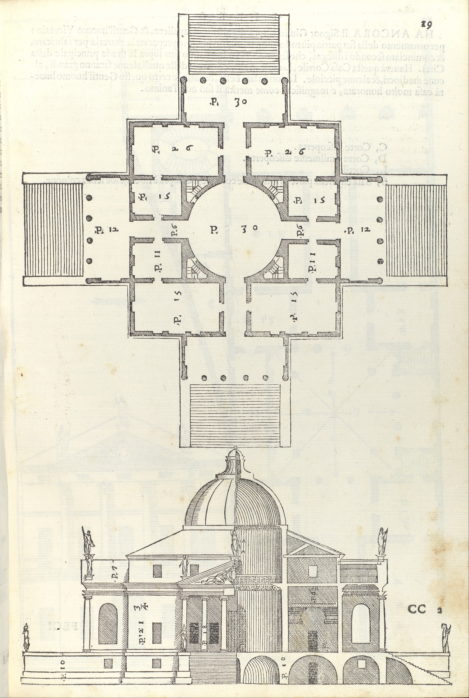

[:material-arrow-left-bold: 시공을 위한 도면 세트](./index.md){ .md-button }

{width=600}

- 시기: AD 1570
- 장소: Vicenza, Italy
- 출판: Venice, Italy
- 건축가: Andrea Palladio
- reference: <https://www.metmuseum.org/art/collection/search/698054>
- description:
    - 책에 그려진 도면. 목판화의 발명으로 도면을 복제하는 것이 가능해졌다.

[:material-arrow-left-bold: 시공을 위한 도면 세트](./index.md){ .md-button }
