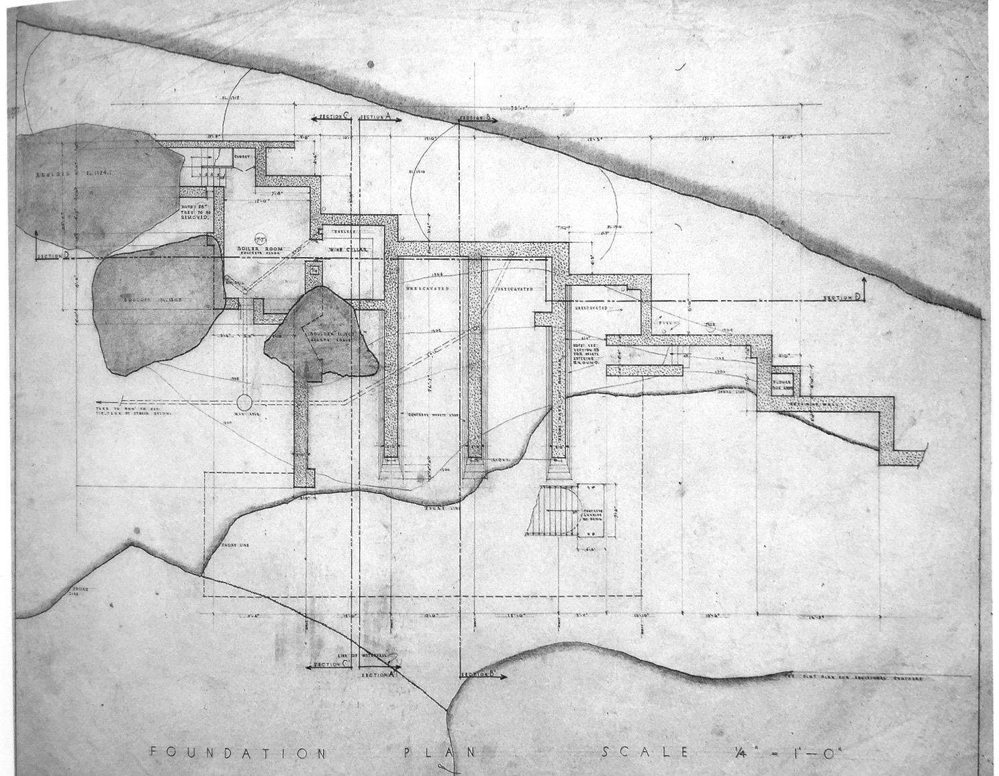

[:material-arrow-left-bold: 도면 요소의 표준화](./index.md){ .md-button }

{width=800}

- 시기: AD 1931
- 장소: Mill Run, United States
- 건축가: Frank Lloyd Wright
- reference: <https://wrightchat.savewright.org/viewtopic.php?t=11533>

[:material-arrow-left-bold: 도면 요소의 표준화](./index.md){ .md-button }
