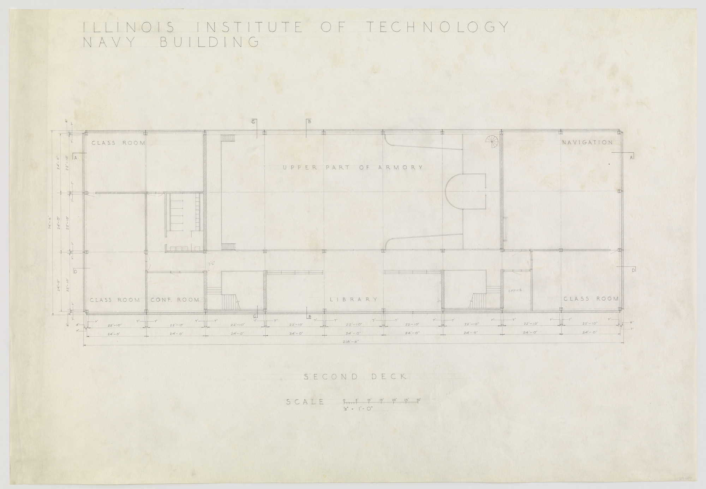

[:material-arrow-left-bold: 도면 요소의 표준화](./index.md){ .md-button }

{width=800}

- 시기: AD 1945
- 장소: Chicago, Illinois
- 건축가: Mies van der Rohe
- reference: <https://www.moma.org/collection/works/162615>

[:material-arrow-left-bold: 도면 요소의 표준화](./index.md){ .md-button }
