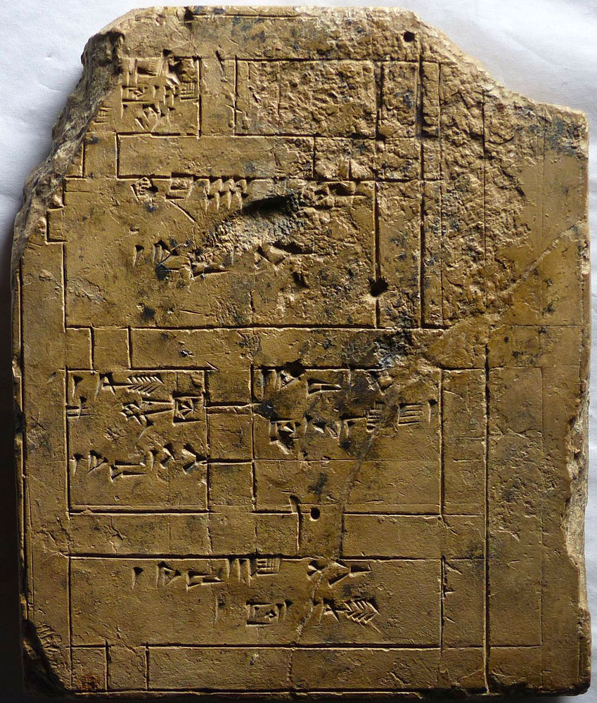

[:material-arrow-left-bold: 기록된 도면](./index.md){ .md-button }

{width=600}

- 시기: 3000 BC, Neo-Babylonian
- 장소: Sippar, Iraq
- reference: <https://www.csmc.uni-hamburg.de/publications/mesopotamia/2024-03-24.html>
- description:
    - 점토판에 새겨진 도면.
    - 치수와 비율이 정확하지는 않지만, 방의 이름이 작성되어있다.

[:material-arrow-left-bold: 기록된 도면](./index.md){ .md-button }
