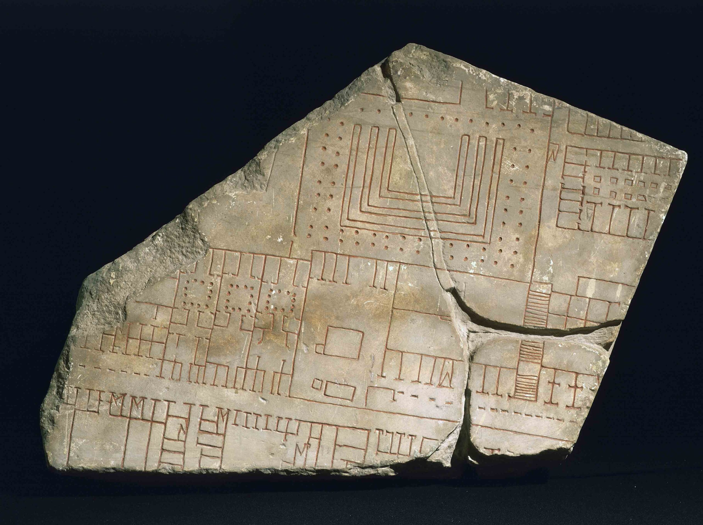

[:material-arrow-left-bold: 기록된 도면](./index.md){ .md-button }

{width=800}

- 시기: AD 205
- 장소: Rome, Italy
- reference: <https://archaeology.org/issues/may-june-2019/collection/maps-rome-forma-urbis-romae/mapping-the-past/>
- description:
    - 대리석에 새겨진 로마의 도시.
    - 1:240 스케일, 건물의 내부 인테리어까지 표현되었다.
    - 거대한 크기로 보아 실용적인 목적보다 장식적인 목적으로 활용되었을 것이라 추측.

[:material-arrow-left-bold: 기록된 도면](./index.md){ .md-button }
