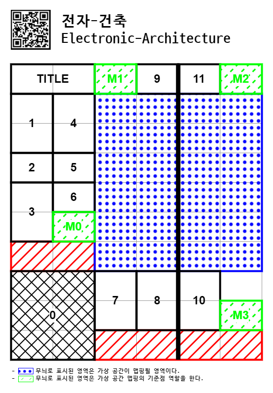

# 전자-건축

- 전시: 2025 서울대학교 공과대학 건축전
- 장소: 서울대학교 제1파워플랜트 68동
- 기간: 2025.06.30. ~ 2025.07.05.

{width=400}

<iframe width="560" height="315" src="https://www.youtube.com/embed/bE7T5-TVkQQ?si=cen74f4bpezG8RR3" title="YouTube video player" frameborder="0" allow="accelerometer; autoplay; clipboard-write; encrypted-media; gyroscope; picture-in-picture; web-share" referrerpolicy="strict-origin-when-cross-origin" allowfullscreen></iframe>

- [__1. 도면의 역사__](./history-of-drawing/index.md)
- [__2. 도시 경험__](./city-experience/index.md)
- [__3. 가상 공간__](./virtual-space/index.md)
- [__4. 전자-건축__](./electronic-architecture/index.md)
- [__5. 메모리__](./memory/index.md)
- [__6. 네트워크__](./network/index.md)
- [__7. 전자 공간의 메커니즘__](./elec-space-mechanism/index.md)
- [__8. 어플리케이션__](./application/index.md)
- [__Appendix A. 전시 디자인 과정__](./design-process/index.md)
- [__Appendix B. `Antichamber` 스터디__](./antichamber-study/index.md)
- [__Appendix C. `Maze`와 멀티플레이어 모드__](./maze-multiplayer/index.md)

