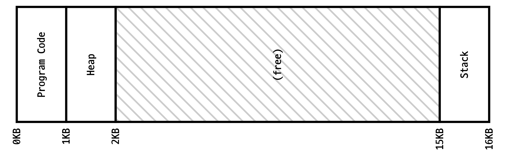

[:material-arrow-left-bold: 전자-건축](../index.md){ .md-button }

## 개요

메모리란 무엇인가? 간단하게 설명하자면, 메모리는 컴퓨터나 스마트폰 등의 전자기기에 들어있는, 데이터를 임시로 저장하는 전자장치다. 그렇다면 메모리에는 어떤 데이터가 저장되는가? 메모리에는 우리들이 컴퓨터, 스마트폰 등을 사용할때 실행되는 각종 프로그램들의 정보가 저장되는데, 단순하게 보자면 우리가 화면을 통해 볼 수 있는 각종 정보들은 메모리에 저장되어 있다가 일련의 과정을 거쳐서 화면에 픽셀 정보로 변환되어 표시되는 것이라고 할 수 있다.
이 글에서는 바로 이 지점을 눈여겨보고자 한다. 화면에 표시되는 모든 ‘것들’의 정보가 실제로는 메모리에 올려져 있다가 필요한 순간에 화면을 통해 시각화되는 것이라면, 그렇다면 우리가 화면을 통해 경험할 수 있는 모든 것 - 웹페이지에 방문하는 것이든, 게임 속의 맵을 돌아다니는 것이든, 인스타그램 계정에 접속해서 다른 친구들의 사진을 보고 덧글을 다는 것이든 - 이 존재하는 곳은 메모리가 아닌가? 그렇다면 전자적인 방식을 통해 구현된(혹은, 지어진) 공간의 사이트는 메모리라고 할 수 있지 않을까?
이후 항목에서는 메모리란 무엇인지, 그리고 메모리가 어떻게 작동하는지에 대해 좀 더 살펴보고 메모리를 사이트로 하여 구현된 공간에서는 어떤 일이 일어날 수 있는지 설명하도록 하겠다.

## 메모리, 저장 장치

### 메모리

먼저 메모리에 대해 알아보자. 메모리는 프로그램 실행과 데이터 처리를 위해 데이터를 임시로 저장하는 공간이다. 우리가 흔히 이야기하는 RAM(Random Access Memory)도 바로 이 메모리에 속한다. 임시로 저장하는 것인 만큼 전원이 꺼지면 저장되어 있던 정보가 휘발된다. 대신 CPU가 데이터에 접근하고자 할때 빠르게 데이터에 접근할 수 있다는 장점이 있다.

### 저장 장치

저장 장치는 메모리와 비슷하게 데이터를 저장할 수 있는 기능을 제공하지만, 전원이 꺼지더라도 데이터가 휘발되지 않고 그대로 남는다. 컴퓨터에 장착하는 하드디스크 및 SSD가 이 저장 장치에 속한다. 저장 장치에 저장된 데이터에 접근하는 데에는 메모리에 비해 비교적 많은 시간이 소요되는데, 제품에 따라 차이가 있겠지만 RAM의 읽기/쓰기 속도가 SSD에 비해 약 10배 정도 빠르다고 생각하면 된다.

### 메모리와 저장장치에서 일어나는 일

메모리와 저장 장치를 더 간단하게 이해하고 싶다면 메모리를 건축학도가 작업하는 책상으로, 저장 장치를 재료 창고로 생각하는 것도 괜찮다. 건축학도는 모형을 만들고 싶으면 먼저 창고에서 재료를 꺼내서 책상 위에 올려놓을 것이다. 그 다음 책상에서 모형 작업을 진행하고, 작업이 끝나면 (아마도)책상을 정리하고 남은 재료를 창고에 다시 넣어둘 것이다.
컴퓨터와 스마트폰에서 일어나는 일도 이와 크게 다르지 않다. 스팀에서 다운받은 게임을 실행한다고 하면 먼저 CPU는 저장 장치에 저장되어 있던 게임의 데이터를 RAM 위에 올리고, 게임을 실행하면서는 이 RAM 위에 올라가있는 정보를 기반으로 화면에 각종 맵과 캐릭터를 그리고, 게임을 종료하면 게임에 할당되어 있던 RAM의 공간을 해제하여 다른 프로그램에서 쓸 수 있도록 한다.

## 메모리와 주소

{width=600}

메모리와 저장장치 모두 1, 0으로 이루어진 정보를 다룬다. 이 1/0 둘 중 하나로 표현되는 단위가 바로 bit(비트)다. 이 비트 8개를 묶으면 byte(바이트)가 되는데, 각 비트는 0 혹은 1 둘 중 하나로 결정되므로 1 바이트에는 00000000부터 11111111 사이의 값, 총 2^8 = 256가지의 값을 저장하는 것이 가능하다.
메모리에 이미지 파일을 올려두고 싶다면 이미지 파일을 이루는 픽셀의 정보를 비트를 활용하여 표현하고 이러한 픽셀 정보 및 픽셀 정보를 읽는 방법을 묶어 하나의 파일로 만든 다음, 이 비트로 이루어진 정보 덩어리를 메모리 위에 올리면 된다.
그런데 그렇다면 파일이 메모리 어디에 올라가있는지 어떻게 알 수 있을까? 이를 위해 메모리의 모든 위치에는 주소가 붙어있다. 이 주소는 선형적으로 정의되어있는 하나의 숫자인데, 각 주소에는 1 바이트 크기의 정보가 할당된다. 예를 들어, 8 바이트 크기의 정보를 메모리의 주소 10에 올려두었다면, 주소 10, 11, ..., 17에 이 정보가 순차적으로 할당된다고 생각하면 된다.

## 읽기와 쓰기

메모리 위에 정보를 읽고 쓰는 것은 메모리의 성능에 달려있지만, 일반적으로 RAM의 데이터 읽기/쓰기 속도는 두 경우 모두 수십 GB/s 수준이다. 이는 SSD의 읽기/쓰기 속도가 500MB~5GB/s, 하드 디스크의 읽기/쓰기 속도가 50~200MB/s 수준인 것에 비해 매우 빠르다는 것을 알 수 있다.

### 읽기

메모리의 정보를 읽기 위해서는 정보가 저장되어 있는 메모리의 주소가 필요하다. 게임에 있는 특정 캐릭터의 옷의 이미지를 읽어오는 상황을 예로 들자면, 게임을 실행하여 처음 로딩할때 여러 옷의 이미지를 메모리 위에 올려놓으면서 동시에 어떤 옷을 어떤 주소에 올려두었는지에 대한 정보도 같이 어딘가에 기록해두고, 이후에 특정한 옷을 불러와야 할 일이 생기면 옷의 주소 기록을 확인하여 해당되는 옷의 위치를 찾아 이를 불러오는 것이라고 보면 된다. 물론 이렇게 옷의 주소를 찾는 과정에는 수 ms도 채 걸리지 않는다.
만약 주소가 잘못되어 다른 옷의 정보가 들어있거나, 관리되지 않고 있는 위치에서 정보를 불러오려고 하면 이상한 옷이 불러와지거나 프로그램이 멈추는 등 각종 문제가 발생할 수 있다.

### 쓰기

메모리에 정보를 쓰는 데에는 정보를 쓸 주소 정보가 필요하다. 게임을 하며 맵을 돌아다니다가 어떤 새로운 맵에 도달했는데, 아직 프로그램에서 RAM 위에 올려놓지 않은 맵이었다고 해보자. 이 경우 프로그램은 저장 장치에서 해당 맵 정보를 가져와서 아직 다른 정보가 올라가있지 않은 주소를 찾은 뒤 이 위치에 맵 정보를 새로 올려놓는다. 새로운 맵 정보는 종종 수백 MB에서 수 GB의 크기를 가진 경우도 있기 때문에 저장 장치로부터 이러한 정보를 읽어와서 RAM에 올려놓는 데에는 어느 정도 시간이 걸릴 수 있다.
읽기와 비슷하게 쓰기가 일어나는 상황에서 잘못된 주소를 사용할 경우 기존에 정보가 이미 들어있던 주소에 새로운 값을 덮어쓰기 하는 일이 발생할 수 있다. 이 경우에도 예상할 수 없는 각종 문제들이 발생할 수 있는데, 예를 들어 특정 적 몬스터의 체력과 공격력 정보가 저장되어 있던 공간에 잘못하여 캐릭터의 옷 이미지 정보의 일부가 덮어쓰기 된 상황을 상상해보자. 원래라면 픽셀 데이터로 해석되어야 하는 값이 몬스터의 체력 값을 덮어썼다면 갑자기 몬스터의 체력이 예상할 수 없는 값으로 바뀌어버릴 것이다.

[:material-arrow-left-bold: 전자-건축](../index.md){ .md-button }
