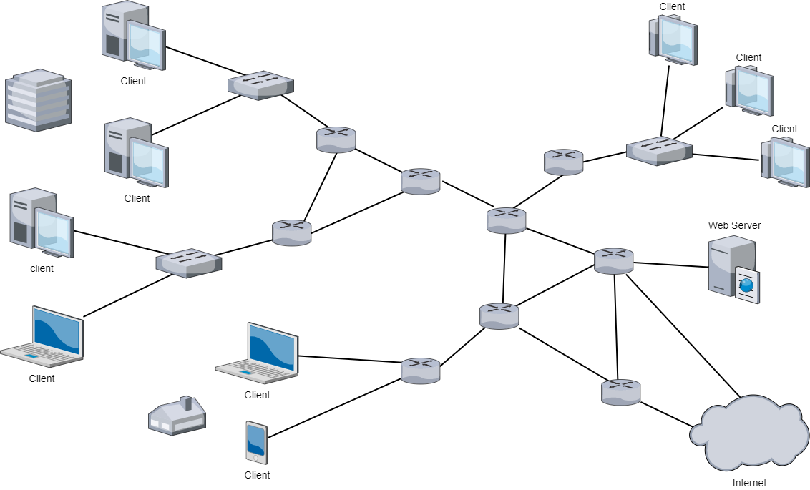

[:material-arrow-left-bold: 전자-건축](../index.md){ .md-button }

{width=600}

## 개요

네트워크는 컴퓨터나 스마트폰 등 여러 전자 기기들이 연결되어 서로 정보를 주고받을 수 있는 시스템이다. 이 정보들은 모두 0, 1의 값을 가진 신호로 치환되어 네트워크 사이를 돌아다니는데, 정보를 전송하는 장치는 목적지와 보낼 데이터 등이 포함된 메세지를 네트워크 망을 향해 전송하며, 정보를 수신하는 장치는 본인을 향해 전송된 메시지를 전부 읽고 메시지의 내용에 지시된 방식으로 해당 메시지를 처리한다.
여기서 중요한 것은 외부와 소통을 해야 하는 프로그램은 모두 이 네트워크 망을 통해 소통을 해야 한다는 것이다. 라이노3D를 활용하여 작업을 하는 건축학도를 상상해보자. 라이노3D만 사용하여 모델링 작업을 하는 상황에서는 컴퓨터에 설치된 라이노3D가 작동하는 것 외에 특별히 다른 일이 일어나지 않아도 된다. 그런데 만약 인터넷을 통해 무료 모델링 소스를 찾아서 다운받으려고 한다면? 모델링 소스 파일은 내 컴퓨터에 저장되어 있는 것이 아니므로 분명 어딘가로부터 소스 파일을 내려 받아야 하는데, 이 과정에서 네트워크 망을 통해 연결된 내 컴퓨터와 소스가 저장되어있는 어떤 장치 사이에 소통이 이루어진다.

네트워크를 통해 이루어지는 소통과 현실에서 이루어지는 소통은 서로 다른 점이 아주 많기 때문에 그만큼 설명할만한 내용도 많지만, 이번 글에서는 온라인 게임이나 인스타그램과 같이 다른 사람들과 소통을 하는 것을 설명하기 위한 간단한 서버-클라이언트 구조만 살펴보도록 하겠다.

## 서버-클라이언트

배틀그라운드 같은 FPS(First Person Shooting) 게임을 하는 상황을 상상해보자. 내 시야에 상대방 캐릭터가 보이고, 나는 이 캐릭터를 향해 총을 쏘지만 맞지 않고, 상대 캐릭터가 나를 향해 총을 쏴서 내 체력이 줄어든다. 앞선 메모리에 관한 글을 통해 이 모든 일이 실제로 일어나는 곳은 내 컴퓨터 혹은 스마트폰의 메모리라는 것을 알 수 있다. 그런데 그렇다면 내 메모리 위에서 일어나는 일에 어떻게 타인의 정보가 끼어있는 것일까?
이를 이해하기 위해서는 우선 게임의 정보를 관리하는 주체가 존재하여 내 기기가 이 주체로부터 상대방의 정보를 계속해서 전달받고 있다는 사실을 알아야 한다. 네트워크 분야의 용어로는 내 기기를 클라이언트, 게임의 정보를 관리하는 주체를 서버라고 부른다.

### 작동 원리

앞선 게임의 상황을 이어서 설명해보자. 내 시야에 상대방 캐릭터가 보이기 위해서는 상대방이 이동한 위치에 대한 정보를 서버로부터 받아야 한다. 이 정보는 상대방의 게임 클라이언트에서 서버로 보낸 것으로, 서버는 게임에 참여하고 있는 모두에게 상대방 캐릭터 위치 정보를 전달한다. 내 위치도 같은 방식으로 서버를 거쳐 다른 모든 플레이어들에게 전달된다.
내가 상대 플레이어를 향해서 총을 쏘지만 맞지 않았다. 이로 인해 게임에서 아무런 일이 발생하지 않았다면 내 클라이언트는 서버로 아무런 정보도 전송하지 않아도 괜찮다. 하지만 플레이어 근처로 총알이 스치는 소리가 나야 한다면, 내 캐릭터가 발사한 총알이 어떤 플레이어 근처를 스치고 지나갔는지에 대한 정보를 서버로 보낸 뒤 서버가 이 정보를 상대 클라이언트로 보낼 수도 있고, 내 클라이언트에서는 총알의 발사 방향 및 발사 지점 정보만 서버로 보내고 서버가 이 정보와 다른 플레이어들의 위치 정보를 토대로 스치고 지나간 플레이어를 특정해서 해당 정보를 상대 플레이어에게 보낼 수도 있고, 서버가 총알의 정보만 그대로 다른 클라이언트들에 보낸 다음 상대 클라이언트에서 직접 이게 스친 것인지 판단해서 총알이 스치고 지나가는 소리를 낼 수도 있다.
총알에 맞는 것도 비슷하다. 상대가 내 캐릭터를 명중했다는 것을 판단하는 주체가 상대 클라이언트일 수도 있고, 서버일 수도 있고, 내 클라이언트일 수도 있다. 이는 게임을 구현한 개발사의 선택에 달려있다.
인스타그램에서 다른 친구 사진에 좋아요를 누르는 것도 서버-클라이언트 구조로 쉽게 설명할 수 있다. 내 기기에서 인스타그램을 실행하면 기기는 서버로 내 정보를 보내며 피드를 요청한다. 그러면 서버는 미리 저장되어 있던 내 계정의 정보를 활용하여 어떤 친구들이 있는지, 이 친구들이 어떤 사진을 올렸는지 파악하여 적절한 사진들을 내 기기로 전송한다. 내가 친구 사진에 덧글을 남기면 기기는 덧글 내용을 서버로 전송하고, 서버는 이 정보를 어딘가에 기록해둔다. 그러다 친구가 인스타그램을 열어 본인 사진에 새로 달린 덧글을 확인하려 하면 기록해둔 덧글 내용을 친구의 기기로 보내준다.

### 복제된 ‘나’

위의 FPS 게임 예시를 읽으며 눈치챘을 수도 있겠지만, 이러한 서버-클라이언트 구조 위에서 이루어지는 게임은 게임에 참여한 모든 플레이어의 메모리 위에서 동시에 이루어진다. 내 화면에 보이는 상대방은 내 메모리 위에 올라온 상대방의 정보일 뿐이고, 이 정보는 다른 플레이어의 메모리와 서버의 메모리 위에도 존재한다. 비슷하게, 내 기기의 메모리에 올라와있는 내 정보는 (아마도) 다른 플레이어의 메모리 위에도 동시에 존재한다.
이를 확장하면 게임이 진행되는 맵도 각 플레이어의 메모리 위에 복제되어 있는 것이므로, 만일 메모리를 모든 일이 이루어지는 사이트라고 생각한다면 온라인 게임에서 이루어지는 모든 소통은 실제로는 같은 공간에 모두가 모여 직접 정보를 주고받는 것이 아니라 각자의 사이트에서 모든 환경과 상대방의 정보를 모방하여 재현해낸 뒤 이 모방체들과 소통하는 것이라고 볼 수 있겠다. 서버는 이 소통 정보를 수신, 전송여 모든 사이트에서 어떤 사이트에서 이루어진 소통을 모방할 수 있도록 매개하는 역할을 하는 것이다.

## 버그와 딜레이

이상적인 환경에서 정상적으로 메세지를 잘 주고받는다면 재현된 소통이 실제 소통과 크게 다르지 않을 것이고, 이런 상황에서는 별 걱정 없이 게임을 하거나 앱을 활용하면 된다. 하지만 현실은 그리 녹록지 않다.

### 버그

만약 소통이 이루어지는 사이트가 각 플레이어마다 하나씩 주어진 것이고, 서버는 소통이 이루어지기 위해 필요한 정보만을 매개하는 것이라면, 내게 주어진 환경만 나에게 유리하게 변조해서 소통을 엉망진창으로 만드는 것이 가능하지 않을까? 예를 들어, 모두가 총알 데미지가 10인 환경에서 플레이를 하고 있을때 어떻게 잘 내 기기의 메모리 위에 올려진 정보를 바꿔치기해서 데미지를 1000으로 만들면 게임을 훨씬 쉽게 할 수 있는 것이 아닐까?
서버-클라이언트 환경에서는 이러한 일이 얼마든지 일어날 수 있기 때문에, 게임을 설계하는 단계에서 이러한 문제를 발생시키지 못하게 조치를 취해야 한다. 클라이언트를 변조하지 못하게 방어하는 방법, 모든 주요 계산을 클라이언트가 변조하는 것이 불가능한 서버에서 진행하도록 하는 것 등의 방법이 있는데, 이 글에서 다루는 범위를 넘어가므로 자세한 설명은 생략하겠다.

### 딜레이

메모리에서의 읽기/쓰기와는 다르게 서버와 클라이언트 사이의 통신에는 사람이 인지 가능한 수준의 시간이 소요될 수도 있다. 예를 들어, 철권과 같은 격투게임을 지구 반대편에 있는 플레이어와 같이 하는 상황을 상상해보자. 네트워크를 통한 통신은 결국 0, 1로 이루어진 정보를 상대에게 전송하는 것인데, 이 정보의 전송은 빛의 속도보다 빠를 수 없으므로 빛의 속도로 지구 반 바퀴를 이동하는 데에 걸리는 시간인 0.13초 정도의 딜레이가 무조건 발생하게 된다. 그런데 격투 게임은 장르 특성상 프레임 단위의 반응을 요구하는데, 이는 144Hz 모니터를 기준으로 해도 18프레임 정도의 차이를 발생시켜 게임 자체가 성립하기 어려운 상황이 발생할 수 있다.
철권 같은 게임이 아니더라도 느린 와이파이, 혹은 인터넷 연결이 불안정한 환경에서 게임을 플레이할 경우 서버와 클라이언트의 소통이 수 초, 혹은 수십 초 정도 지연될 수도 있는데, 이 경우 상대방의 입장에서는 내 캐릭터가 얼어붙어있거나 특정한 방향으로 계속 이동하다가 다시 정상적인 위치로 순간이동 하는 것처럼 보이는 등 정상적인 플레이를 할 수 없을 수도 있다.
혹은, 소통이 지연되는 것이 아니라 네트워크 망의 문제로 소통이 갑자기 끊어지는 일도 발생할 수 있다. 이 경우 클라이언트에서 보낸 메세지가 서버에 도달하지 못하므로 특정한 소통이 영영 유실되기도 하므로 클라이언트와 서버를 개발하는 입장에서는 이러한 경우를 잘 방어해야 한다.

[:material-arrow-left-bold: 전자-건축](../index.md){ .md-button }
