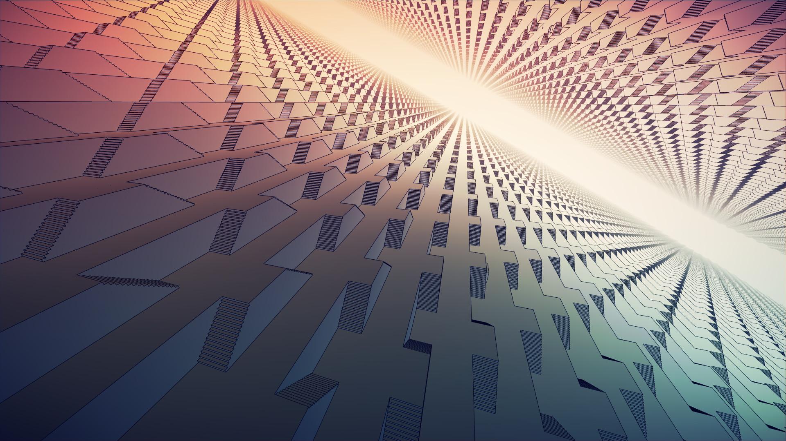

[:material-arrow-left-bold: 가상 공간](./index.md){ .md-button }

{width=800}

- link: <https://store.steampowered.com/app/473950/Manifold_Garden/>
- category: 3D adventure game
- release year: 2020
- developer: William Chyr Studio
- publisher: William Chyr Studio
- description:
    - 특정한 방향으로 무한히 이어져있는 공간. 건물에서 떨어지면 아래로 계속 떨어질 수 있으며, 처음 떨어지기 시작한 위치를 반복해서 지나친다.
    - 중력의 방향을 바꾸는 것이 가능하다.

[:material-arrow-left-bold: 가상 공간](./index.md){ .md-button }
