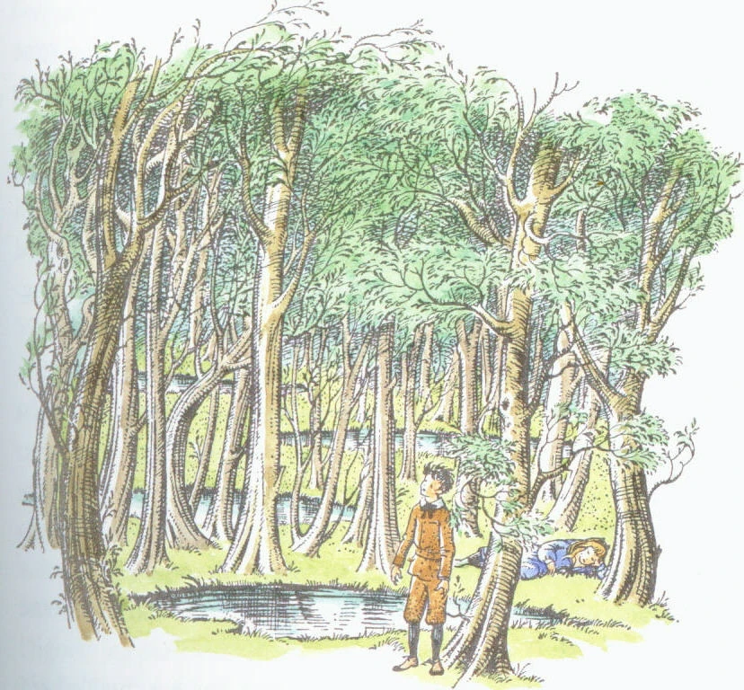

[:material-arrow-left-bold: 가상 공간](./index.md){ .md-button }

{width=800}

- link: <https://narnia.fandom.com/wiki/Wood_Between_the_Worlds>
- category: novel
- publication year: 1955
- author: C. S. Lewis
- publisher: The Bodley Head
- description:
    - 글로 구현된, 여러 세계를 이어주는 허브 역할을 하는 공간.
    - 웅덩이로 들어가면 다른 세계로 진입할 수 있다.
    - 공간 사이의 물리적인 거리가 아닌 공간의 연결 관계가 중요한 공간의 예시.

[:material-arrow-left-bold: 가상 공간](./index.md){ .md-button }
