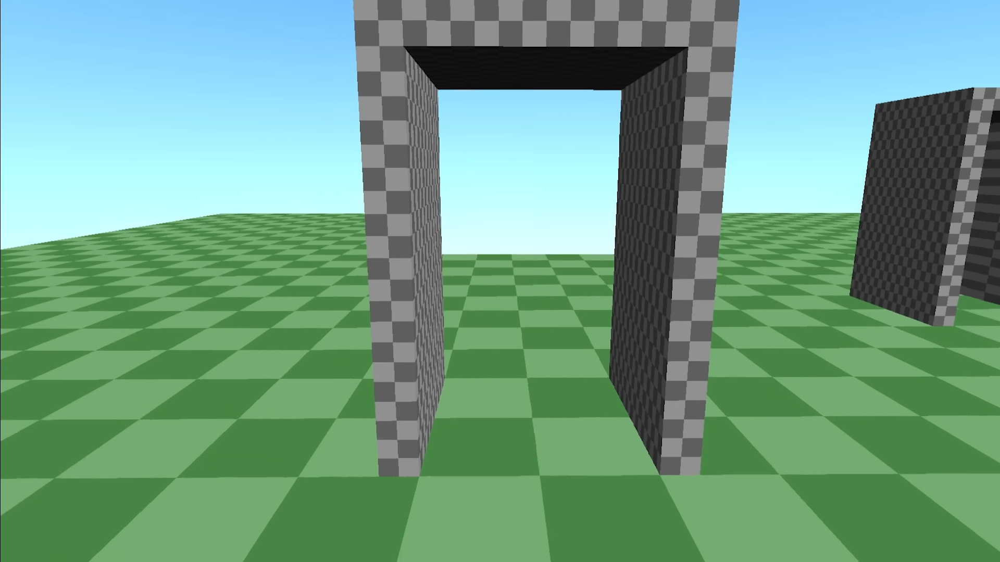

[:material-arrow-left-bold: 가상 공간](./index.md){ .md-button }

{width=800}

- link: <https://www.youtube.com/watch?v=kEB11PQ9Eo8>  
- category: Game engine
- upload year: 2018
- channel: CodeParade
- description:
    - 유클리드 기하학을 따르지 않는 공간을 여럿 구현했다.
        - 터널을 통과하는 길이 실제 길보다 짧거나
        - 직사각형 방의 테두리를 따라갔는데 변을 여섯 개를 지나야 원래 자리로 돌아오거나
        - 아래로 내려가는 경사의 터널을 지나갔는데 실제로는 더 높은 곳으로 이동했거나
        - ... 기타 여러 예시들이 구현되어 있다.
        - 구현 원리에 대한 설명도 나온다.

[:material-arrow-left-bold: 가상 공간](./index.md){ .md-button }
