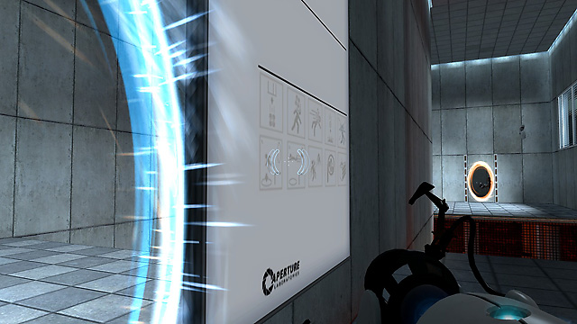

[:material-arrow-left-bold: 가상 공간](./index.md){ .md-button }

{width=800}

- link: <https://store.steampowered.com/app/400/Portal/>
- category: 3D action game
- release year: 2007
- developer: Valve
- publisher: Valve
- description:
    - 두 포탈 사이의 공간이 연결되어 있다.
    - 예를 들어, 포탈 하나를 바닥에 열고 나머지 포탈을 천장에 연 다음 바닥에 있는 포탈로 오브젝트를 떨어뜨리면 이 오브젝트는 무한히 낙하한다.

[:material-arrow-left-bold: 가상 공간](./index.md){ .md-button }
