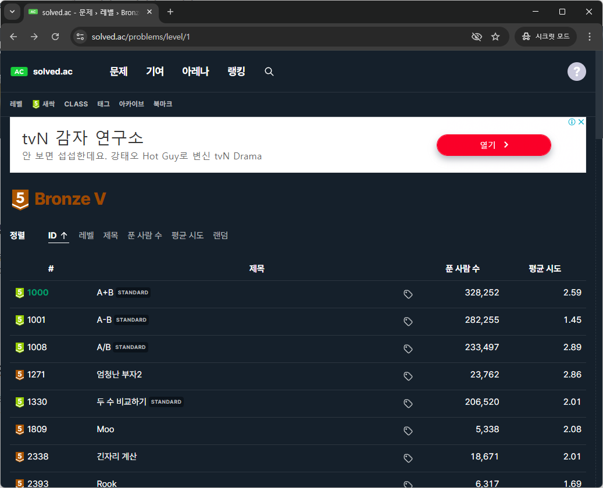

[:material-arrow-left-bold: 글 목록](../index.md){ .md-button }

boj는 [백준 온라인 저지(Baekjoon Online Judge)](https://www.acmicpc.net/){:target="\_blank"}를 약자만 따서 부른 것으로, 사이트 가입 후 사이트에 있는 프로그래밍 문제를 풀고 코드를 제출해서 채점받을 수 있다.

solved는 [솔브드(solved.ac)](https://solved.ac/){:target="\_blank"}를 이야기하며, boj에 있는 문제들을 boj 사용자들이 난이도를 매겨놓은 곳이다. boj 계정으로 가입하여 사용할 수 있다.

## boj

1. 메인 화면에서 '문제' -> '전체 문제' 카테고리로 이동한다.
  

2. 문제 목록을 볼 수 있다. 번호와 문제의 난이도는 무관하므로 쉬운 문제를 찾는 것은 이후 solved를 활용하기로 하자. 첫 번째 문제를 풀어보겠다.
  

3. 문제를 확인할 수 있다. 여기서 문제 내용과 어떤 포맷으로 입력이 주어지며 어떤 포맷으로 출력을 해야 하는지 확인하고, 본인의 개발 환경에서 문제를 풀어보자. 문제를 풀고 나면 캡쳐에 표시된 '제출' 탭으로 넘어가면 된다.
  

4. 제출할 언어를 먼저 선택한 뒤에 제출할 코드를 넣고 '제출' 버튼을 누른다.
  

5. 오작동 하는 코드를 넣으면 이와 같이 결과에 에러라고 표시해주거나, '틀렸습니다'라고 표시해준다.
  

6. 다시 제출하자.
  

7. 다행히도 이번에는 맞았다. 결과에 '맞았습니다' 표시를 확인할 수 있다.
  

## solved

1. 메인 화면이다. 처음 문제를 푸는 사람들은 캡쳐에 표시한 '새싹 문제'부터 풀어보는 것이 좋다.
  

2. 새싹 문제도 여러 탭으로 분리가 되어있으니 각 탭에 있는 문제를 풀어보자. 문제를 누르면 boj의 문제 페이지로 넘어간다. 다른 문제를 확인하기 위해 '문제' 탭을 클릭해보자.
  

3. 문제 탭에 들어가면 수 만 개의 문제들이 난이도 별로 분류가 되어있다. unrated는 난이도가 아직 판정되지 않은(보통 어려운) 문제들이니 제외하면, 위에서부터 난이도가 쉬운 순서대로 분류되어있다.
  

4. 브론즈 5 탭을 누르면 아래와 같은 문제들이 있다. 같은 난이도로 묶여있어도 푼 사람 수가 많은 문제일수록 쉬울 가능성이 높다. 문제를 클릭하면 boj의 문제 페이지로 넘어간다.
  

### 팁

- 입력, 출력만 보면 쉬워보이는 문제더라도 다시 조건을 확인하면 엄청난 양의 인풋이 주어진다거나 해서 푸는 것이 어려울 수도 있다. 앞서 설명하지는 않았지만 '시간 초과', 혹은 '메모리 초과'같은 결과가 나왔으면 단순히 눈에 보이는 방식으로는 문제를 풀 수 없다는 이야기일 수 있으니, 다른 사람들이 어떻게 풀었는지 검색해서 구현 방법을 찾아보면서 테크닉들을 익히는 것을 추천한다.

[:material-arrow-left-bold: 글 목록](../index.md){ .md-button }
