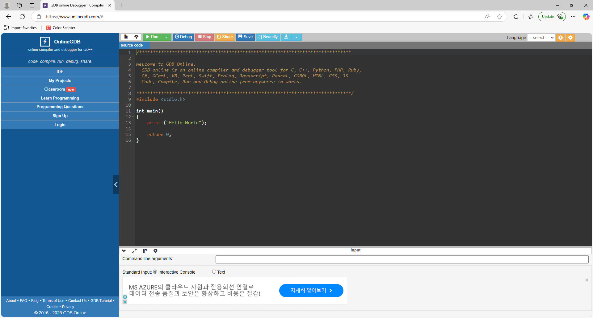
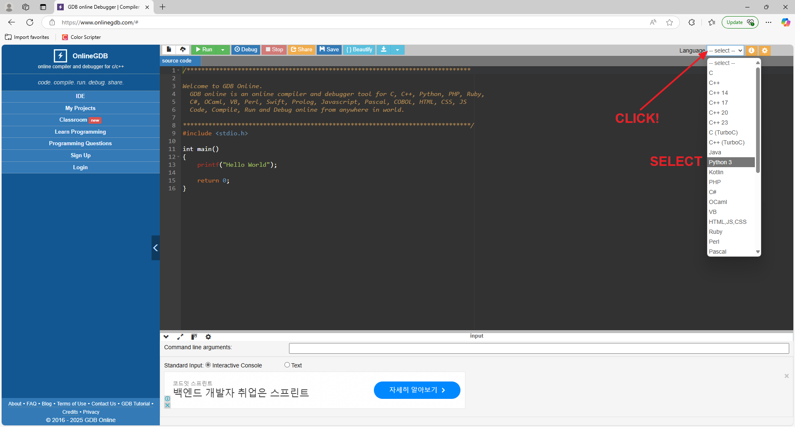
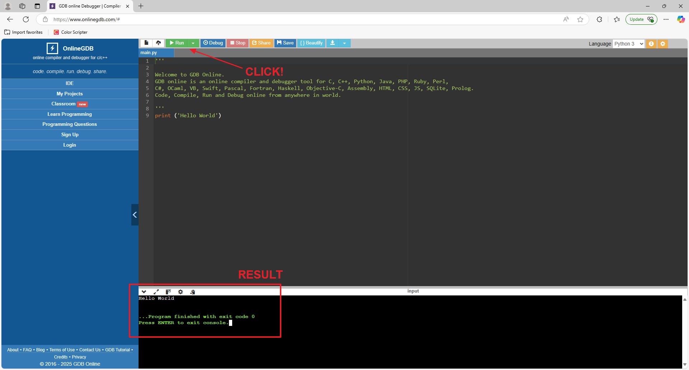
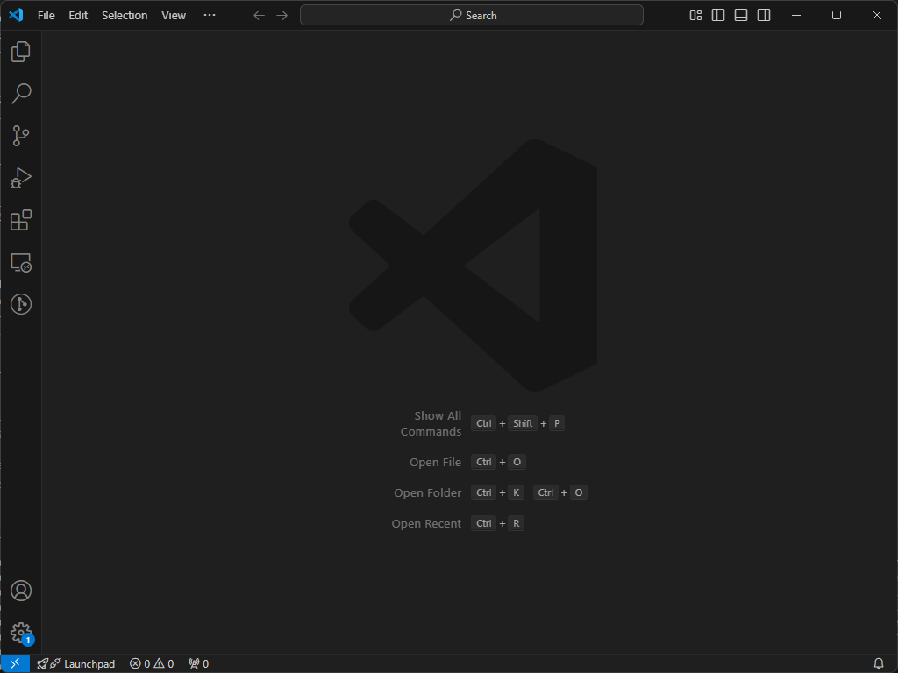
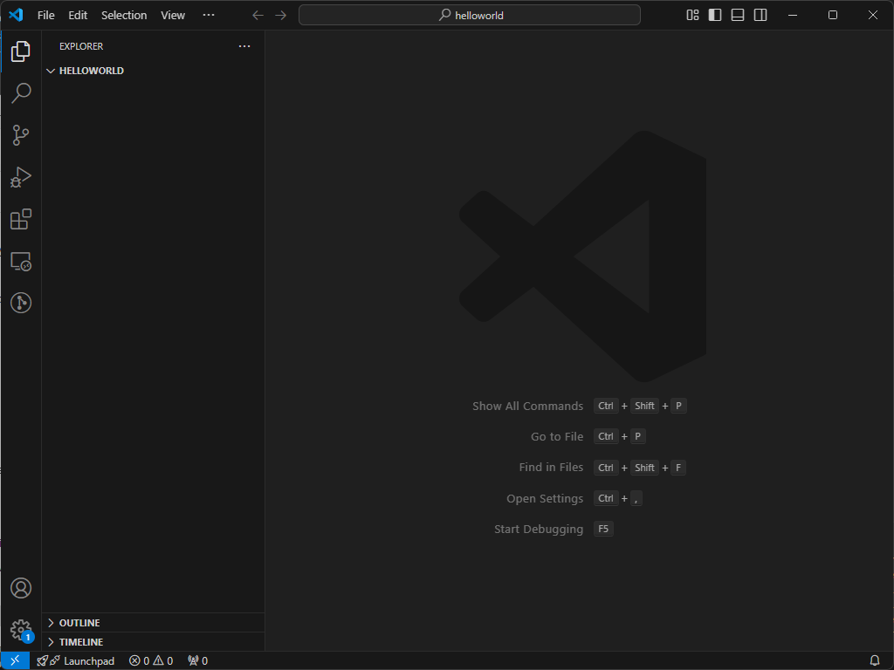
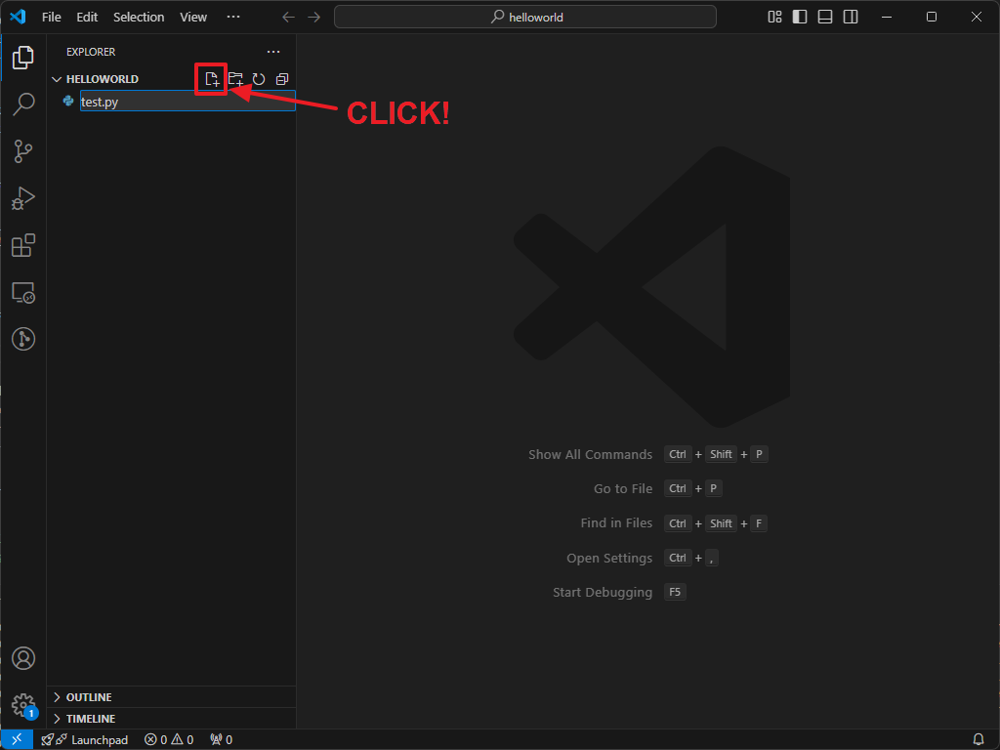
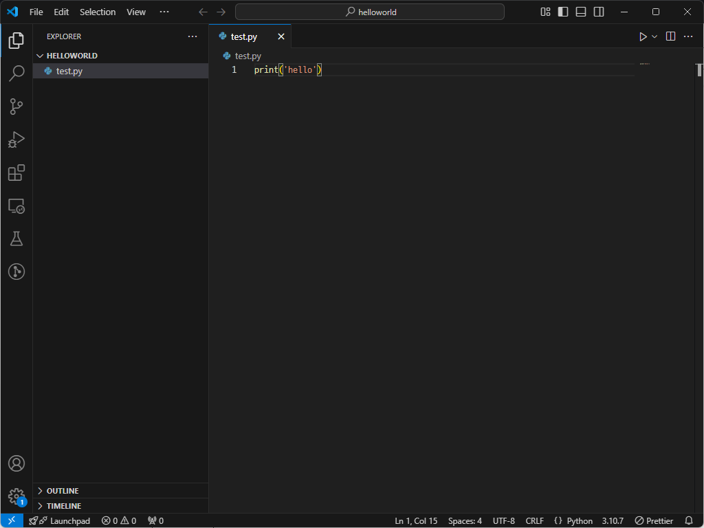
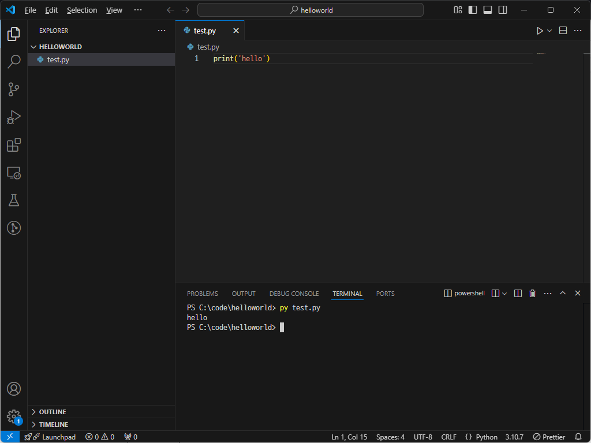

[:material-arrow-left-bold: 글 목록](../index.md){ .md-button }

기초 문법을 한 번 훑어보았다면, 이제 실습을 진행해보자.

## 온라인

매번 정해진 pc에서 개발할 수 있는 것이 아니고, 사용하는 pc에 개발 환경이 세팅되어 있지 않다면, 개발을 할 때마다 매번 환경을 새로 세팅해주는 것보다 작성한 코드를 돌려주는 온라인 서비스들을 활용하는 것이 더 편할 수도 있다. online python, online c++, ... 등의 키워드로 구글링해보면 무료로 코드 실행이 가능한 사이트들을 찾을 수 있을 것이다.

개인적으로는 아주 간단한 코드가 돌아가는지 확인해야 하는 상황에서는 [onlinegdb](https://www.onlinegdb.com/){:target="\_blank"}사이트에 들어가서 테스트를 해보기도 한다. 이 글을 작성하고 있는 2025년 2월 시점에 무료로 사용이 가능하고, python, js, c#, c++등 여러 주요 언어들을 지원해준다.

아래에서는 python 코드를 작성하고 돌려보는 것을 보여주도록 하겠다.

  
  
  

## 언어 설치 및 통합 개발 환경 설치

### 언어 설치

로컬 환경에서 코드를 작성하고 실행하기 위해서는 먼저 언어를 설치해야 한다. 이에 대한 내용은 검색을 통해 간단하게 찾을 수 있으므로, 자세한 내용은 생략하도록 하겠다.

- python은 python 검색 후 공식 홈페이지에서 최신 버전을 다운받으면 된다.
- javascript는 node를 검색하여 설치하도록 하자.
- C# 및 C++은 이후 단계에서 설치할 수 있으니 일단 넘어가자.

### 통합 개발 환경 설치

언어를 설치했으면 이 언어를 사용해서 코드를 짜고 실행해볼 수 있는 환경을 갖춰야 한다. 이때 통합 개발 환경, 혹은, IDE(Integrated Development Environment)를 설치해서 사용하면 된다. 이에 대한 내용도 검색을 통해 찾아보도록 하자.

- python, javascript로 개발을 한다면 Visual Studio Code를 설치하자.
- C#, C++로 개발을 한다면 Visual Studio Community를 설치하자.
    - 설치 과정 중 C# 유저는 '.NET', C++ 유저는 'C++를 사용한 데스크톱 개발' 항목을 체크하여 같이 설치하면 된다.
되는데, 처음에는 언어에 따라 Visual Studio Code나 Visual Studio Community로 시작하는 것이 무난하다.

개발 환경 세팅이 완료되었으면 코드를 작성하고 실행해보도록 하자.

=== "python, javascript"

    파이썬과 자바스크립트는 비슷한 방식으로 개발을 할 수 있다.

    1. 먼저 vscode를 실행한다. 여기에서는 welcome 창을 닫아서 화면이 비어있는데, 처음 실행했을 때는 다른 정보들이 같이 보일 수 있다.
      

    2. 작성한 코드를 저장할 폴더를 하나 만든 뒤, vscode에 드래그 앤 드롭을 한다. 여기에서는 'helloworld'라는 폴더를 만들었다.
      

    3. 이미지에 표시된 버튼을 누른 뒤
        - 파이썬 유저는 'test.py'라는 파일을 만들자.
        - 자바스크립트 유저는 'test.js'라는 파일을 만들자.
      
    
    4. 생성한 파일에 다음과 같이 코드를 작성한다.
    ``` python
    # test.py
    print('hello')
    ```
    혹은
    ``` js
    // test.js
    console.log('hello')
    ```
      

    5. 이제 작성한 코드를 실행해보자. 먼저 ``ctrl + ` ``키를 누르면 창 하단에 터미널 창이 뜰 것이다(`` ` ``기호는 백틱이라고 읽으며, 숫자 1 옆에 있다.). 이 창에 `py test.py`, 혹은 `node test.js`라고 입력하고 엔터를 누르면 작성한 코드가 실행된다. 실행하고 나면 터미널 창에 `hello`라는 문자열이 출력된다.
      

=== "C#, C++"

    ``` cs
    // WIP
    ```

[:material-arrow-left-bold: 글 목록](../index.md){ .md-button }
