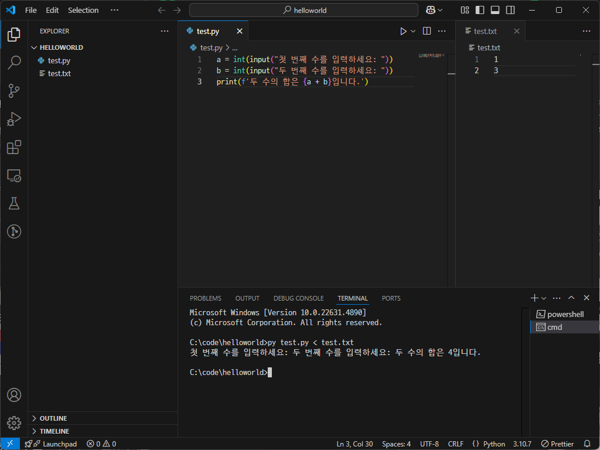

[:material-arrow-left-bold: 글 목록](../index.md){ .md-button }

실습을 원활하게 진행하기 위해서는 중간중간 출력을 해보기도 하고, 코드에 있는 변수를 수정하지 않고 외부의 입력을 받아서 써야 할때도 있다. 여기에서는 아주 간단한 입출력 방법을 설명하겠다.

## 출력

코드를 작성한 뒤 실행하면 코드가 돈다. 이때 코드 사이에 어떤 값을 출력하도록 하는 것이 가능하다. 지금은 출력한 결과물이 콘솔 창에 나타난다고만 이해하고 넘어가도 괜찮다. 출력은 다음의 상황에 매우 유용하다.

- 연산을 한 뒤 특정 변수에 어떤 값이 들어있는지 확인
- 조건문에서 어떤 분기를 타고 갔는지 확인
- 반복문 내부에서 일어난 일 확인

=== "python"

    ``` python
    """변수를 다음과 같이 확인할 수 있다.
    """
    a, b = 1, 2
    c = a + b
    print(c)  # 3

    """문자열 사이에 변수값을 같이 출력하고 싶을 수 있다.
    파이썬에서는 fstring이라는 것을 사용할 수 있다. 문자열 앞에 `f`를 붙이고, 출력
    하고 싶은 변수를 중괄호 안에 묶어서 쓴다.
    """
    print(f"a is {a} and b is {b}, so a + b equals {c}.")

    """조건문을 다음과 같이 확인할 수 있다.
    """
    x, y = 24, 42
    if x > y:
        print('x is larger than y')
    else:
        print('x is not larger than y')
    
    """반복문에 print를 넣어두면 반복문 내에서 일어나는 일을 쉽게 확인할 수 있다.
    """

    s = 0
    for i in range(10):
        s += i
        print(i, s)  # 공백으로 구분된 두 변수가 출력된다.
    
    # 출력 결과:
    # 0 0
    # 1 1
    # 3 2
    # 6 3
    # 10 4
    # 15 5
    # 21 6
    # 28 7
    # 36 8
    # 45 9
    ```

=== "javascript"

    ``` js
    // WIP
    ```

=== "C#"

    ``` cs
    // WIP
    ```

=== "C++"

    ``` cpp
    // WIP
    ```

## 입력

많은 경우 출력까지만 할 줄 알아도 괜찮다. 하지만 콘솔 창을 통해 입력을 받거나 텍스트 파일을 불러와서 입력으로 사용하는 경우가 종종(...이라고 썼지만, 아마 알고리즘 문제를 푸는 경우 외에 볼 일이 많지는 않을 것이다.) 있으니니, 이를 위해 기본적인 입력 함수 사용법을 설명하도록 하겠다.

=== "python"

    ``` python
    """다음과 같이 직접 입력을 받을 수 있다.
    """
    # 터미널 창에 문자열이 먼저 나오고, 이어서 사용자가 값을 입력한 뒤 엔터를 누른다.
    a = input("첫 번째 수를 입력하세요: ")
    b = input("두 번째 수를 입력하세요: ")
    print(f'두 수의 합은 {a + b}입니다.')  # fstring의 중괄호 안에서 연산을 할 수도 있다.

    # 출력 예시:
    # 첫 번째 수를 입력하세요: 1
    # 두 번째 수를 입력하세요: 3
    # 두 수의 합은 13입니다.

    """출력 예시가 뭔가 이상하다. 1 + 3 = 4가 되어야 하는데, 13이 되었다.
    그 이유는, input함수를 통해 받아온 값은 문자열이기 때문이다. 참고로 input함수는 줄바꿈
    (엔터를 치면 줄바꿈 문자가 입력된다)이 나오기 전까지의 값을 한 번에 문자열로 받아온다.
    우리는 숫자로 계산을 하고 싶다. 그러므로 문자열로 들어온 값을 정수로 변환해주어야 한다.
    """

    a = int(input("첫 번째 수를 입력하세요: "))
    b = int(input("두 번째 수를 입력하세요: "))
    print(f'두 수의 합은 {a + b}입니다.')

    # 출력 예시:
    # 첫 번째 수를 입력하세요: 1
    # 두 번째 수를 입력하세요: 3
    # 두 수의 합은 4입니다.

    """터미널 창에 직접 값을 입력하는 것이 번거로울 수 있다. 미리 입력할 값을 텍스트 파일로
    저장해둔 뒤 이를 코드를 실행할때 입력으로 사용하는 것도 가능하다.

    실습을 위해 파이썬 파일이 있는 폴더에 다음과 같은 텍스트 파일을 준비한다.
    
    (data.txt)
    1
    3
    """

    # 아래는 바로 위에서 사용한 것과 같은 코드다.
    a = int(input("첫 번째 수를 입력하세요: "))
    b = int(input("두 번째 수를 입력하세요: "))
    print(f'두 수의 합은 {a + b}입니다.')

    # 지금까지 터미널에서 `py test.py`로 코드를 작동시켰다면,
    # 이번에는 `py test.py < test.txt`로 코드를 작동시켜보자.
    # 만약 어떤 에러가 발생했다고 나오면 다음 항목에서 해결 방법을 알아보고 다시 돌아오자.
    
    # 출력 예시:
    # 첫 번째 수를 입력하세요: 두 번째 수를 입력하세요: 두 수의 합은 4입니다.
    
    # 텍스트 파일에 있는 내용을 읽어서 입력으로 사용하기 때문에 사용자가 직접 값을 입력하거나
    # 엔터를 누르지 않는다. 그래서 input 함수 안에 있는 문자열이 한 줄로 출력된다. 
    # 이를 방지하기 위해서 다음과 같이 코드를 수정하자.
    a = int(input())
    b = int(input())
    print(f'두 수의 합은 {a + b}입니다.')

    # 출력 예시:
    # 두 수의 합은 4입니다.

    """종종 한 줄에 공백으로 구분된 숫자가 여럿 들어있을 수도 있다.
    이번에는 실습을 위해 파이썬 파일이 있는 폴더에 다음과 같은 텍스트 파일을 준비한다.
    
    (data-2.txt)
    1 3
    """
    # 다음의 두 함수에 대해 알아야 한다.
    # - split 함수는 문자열을 특정 문자를 기준으로 잘라준다.
    # - map 함수는 리스트 안에 있는 값들에 특정한 함수를 적용해준다.
    # 이렇다는 개념만 숙지하고 다음의 코드를 보자.
    
    a, b = map(int, input().split())
    
    # 1. 여기서 split 함수 안에 아무 값도 넣지 않았는데, 그럴 경우 공백을 기준으로 문자를
    # 잘라준다. 즉, 아래와 같은 일이 일어난다.
    # '1 3'.split() -> ['1', '3']

    # 2. map함수를 써서 각 값에 int함수를 적용했다. 이는 아래와 같이 작동한다.
    # map(int, ['1', '3']) -> [int('1'), int('3')] -> [1, 3]

    # 3. a, b에 리스트 안에 있는 값을 펼쳐서 넣어준다.
    # a, b = [1, 3] -> a = 1이 되고, b = 3이 된다.

    # 두 값을 더한 값은 다음과 같이 출력한다.
    print(f'두 수의 합은 {a + b}입니다.')

    # 출력 예시:
    # 두 수의 합은 4입니다.
    ```

=== "javascript"

    ``` js
    // WIP
    ```

=== "C#"

    ``` cs
    // WIP
    ```

=== "C++"

    ``` cpp
    // WIP
    ```

### 에러: '<' 연산자는 나중에 사용하도록 예약되어 있습니다

만약 터미널이 powershell이라면 작동하지 않을 수 있다. 이 경우 cmd 등의 기타 프로파일을 사용하면 되는데, 방법은 아래와 같다.

1. 먼저 문제가 발생한 화면이다. 아래와 같은 에러 메세지가 뜬다.
  

2. 표시된 화살표 버튼을 눌러서 다른 프로파일을 확인한다. `Command Prompt`를 선택한다.
  

3. 다시 기존의 실습을 이어서 진행한다. 잘 작동하는 것을 확인할 수 있다.
  

[:material-arrow-left-bold: 글 목록](../index.md){ .md-button }
