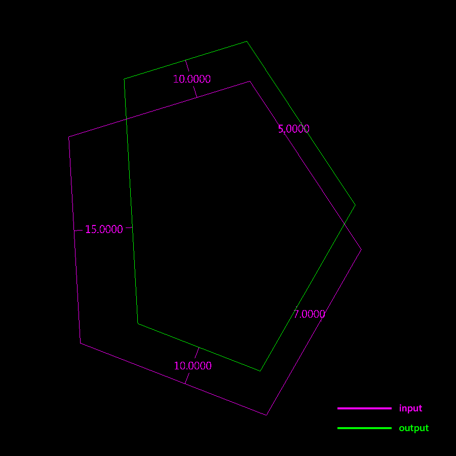

{width=900}

Polyline과 오프셋 간격(그림의 경우 {10, 5, -7, -10, -15})을 입력받아서 각 변을 원하는 거리만큼 오프셋 시킨 새로운 polyline을 출력하는 방법을 고안하시오.

Find a way to generate a new polyline with each edge offset by different distances, with base polyline and offset distances(in this case, {10, 5, -7, -10, -15}) given as inputs.

<iframe src="https://www.facebook.com/plugins/post.php?href=https%3A%2F%2Fwww.facebook.com%2Fphoto%2F%3Ffbid%3D514199578780259%26set%3Da.514199872113563&show_text=true&width=500&is_preview=true" width="500" height="674" style="border:none;overflow:hidden" scrolling="no" frameborder="0" allowfullscreen="true" allow="autoplay; clipboard-write; encrypted-media; picture-in-picture; web-share"></iframe>
