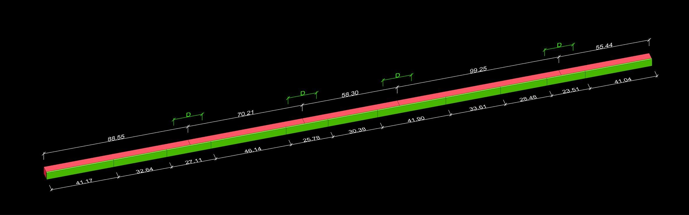

[:material-arrow-left-bold: Back to problem list](../index.md){ .md-button }

{width=900}

기다란 각목을 가지고 놀던 중 그만 여러 조각으로 부러져 버렸습니다. 이 각목을 다시 쓸 수 있도록 얇은 나무를 덧대려고 하는데, 하필 같은 길이의 얇은 나무를 가져오다가 여러 조각으로 산산조각 나버리고 말았습니다. 이 각목 조각들과 나무조각들을 이어붙여서 쓰고 싶은데, 각목의 부러진 부분 주변으로 D만큼의 길이는 덧대는 나무로 감싸져 있어야 한다고 합니다.

예를 들어, 잘려진 각목의 길이가 순서대로 (88.554695, 70.20813, 58.299934, 99.252353, 55.450232)의 5조각으로 부러졌고, 덧대려고 하는 나무가 (41.174523, 32.644077, 27.107224, 46.148522, 25.782222, 30.377803, 41.896296, 33.606177, 28.4785, 23.508608, 41.041391)의 11조각으로 부러졌고, 각목을 안전하게 덧대기 위해서는 부러진 부분 주변으로 20만큼이 확보되어야 한다고 했을 때(즉, 최소 길이 20의 나무가 덧대져 있어야한다고 할때) 주어진 그림과 같이 나무 조각들을 배치하면 각목을 쓸 수 있습니다.

임의의 각목 조각 길이, 임의의 얇은 나무 조각 길이가 양의 실수의 배열로 주어져 있고, 확보되어야 하는 길이 D가 가장 작은 각목 조각의 길이보다 작은 양의 실수로 주어져 있다고 할 때, 어떻게 나무를 덧댈 수 있을까요?

You accidentally broke a piece of lumber wood into a few smaller pieces while playing with it. In order to get these pieces back into its original shape, you try to glue a layer of thin piece of wood over, but you accidentally broke the thin layer of wood into a few pieces while carrying it. You have to glue those pieces of lumber wood and thin wood, but to make it strong enough, you have to make sure that broken points of lumber wood and broken points of thin wood don't overlap(which means, distances between broken points are at least D/2, where D is given length).

For example, you have length (88.554695, 70.20813, 58.299934, 99.252353, 55.450232) of lumber wood pieces(in order), length (41.174523, 32.644077, 27.107224, 46.148522, 25.782222, 30.377803, 41.896296, 33.606177, 28.4785, 23.508608, 41.041391) of thin wood pieces, and given length D is 20(which means, piece of thin wood longer than 20 is required to cover a single broken point of lumber wood), by glueing pieces of wood in given order(shown in picture) will work.

Find a way to glue the pieces of wood with given array of positive real numbers as lengths of lumber wood pieces, another array of positive real numbers as lengths of thin wood pieces, and safety length limit D(which is bigger than half of shortest length of lumber wood piece).

<iframe src="https://www.facebook.com/plugins/post.php?href=https%3A%2F%2Fwww.facebook.com%2Fphoto%2F%3Ffbid%3D516914025175481%26set%3Da.514199872113563&show_text=true&width=500&is_preview=true" width="500" height="461" style="border:none;overflow:hidden" scrolling="no" frameborder="0" allowfullscreen="true" allow="autoplay; clipboard-write; encrypted-media; picture-in-picture; web-share"></iframe>
