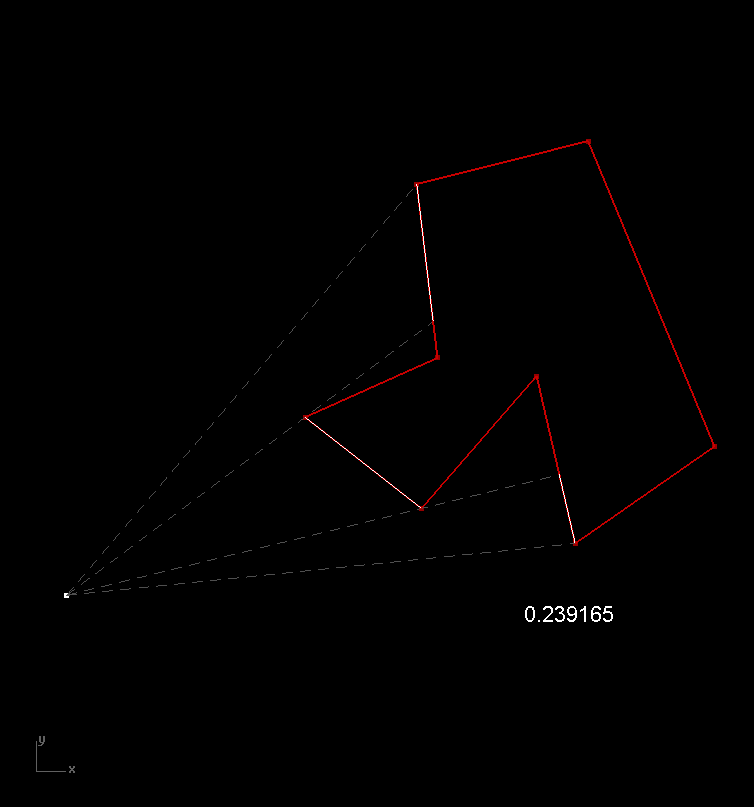

{width=900}

2차원 평면 상의 점 A에서 같은 평면상의 다각형을 바라볼 때 보이는 선분들을 구하고, 다각형의 전체 둘레 길이 중 보이는 부분의 비율을 계산할 방법을 고안하시오.

With given point and polyline on a plane as inputs, give a solution to find visible segments of polygon and calculate (length of visible segments / perimeter of polygon).

<iframe src="https://www.facebook.com/plugins/post.php?href=https%3A%2F%2Fwww.facebook.com%2Fphoto%2F%3Ffbid%3D521923948007822%26set%3Da.514199872113563&show_text=true&width=500&is_preview=true" width="500" height="250" style="border:none;overflow:hidden" scrolling="no" frameborder="0" allowfullscreen="true" allow="autoplay; clipboard-write; encrypted-media; picture-in-picture; web-share"></iframe>