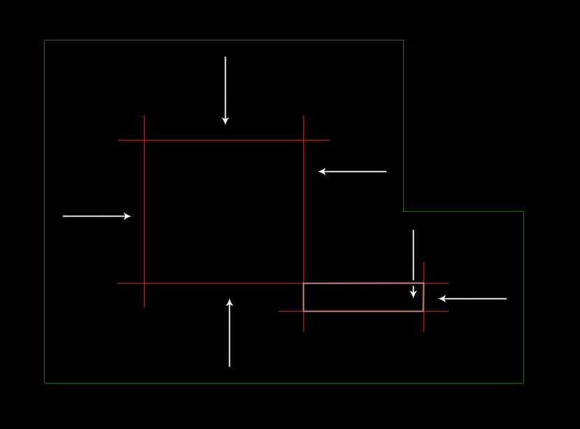
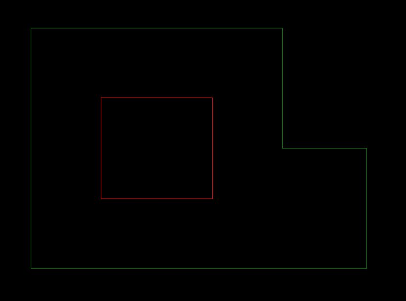

{width=900}
{width=900}

Polyline을 offset하여 새 polyline을 만들 때, 그림과 같은 고리가 생기지 않도록 하는 방법을 고안하시오.

Find a way to offset a polyline without unnecessary loop.

<iframe src="https://www.facebook.com/plugins/post.php?href=https%3A%2F%2Fwww.facebook.com%2Fboundless.X%2Fposts%2Fpfbid0364antn6SnJAD1K3qiYp8a7QnTnuZmXsx2pGMQBmNAS1TkvnkUAKcDimG8mtAz2fNl&show_text=true&width=500&is_preview=true" width="500" height="709" style="border:none;overflow:hidden" scrolling="no" frameborder="0" allowfullscreen="true" allow="autoplay; clipboard-write; encrypted-media; picture-in-picture; web-share"></iframe>
