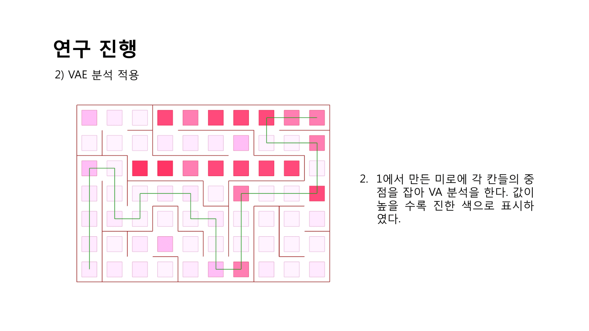

[:material-arrow-left-bold: 글 목록](../../index.md){ .md-button }  

## VAE Project : Using VAE Analysis as a Maze Solving Method

### 연구 목적
VAE 분석을 통해 나온 정량적인 수치들이 구체적으로 활용될 수 있는 사례에 대해 조사한다.

- VAE 분석을 maze solving algorithm으로 활용할 수 있는지에 대한 연구

- 특정 알고리즘을 통해 만들어낸 미로를 VAE 분석을 활용하여 풀 수 있다면, 이 방법을 조금 수정하여 특정 도시의 복잡한 도로망에서 효율적으로 길을 찾는 데에 활용할 수 있지 않을까?
- 이에 대한 가능성을 확인하기 위해 maze solving에 대한 연구부터 진행.

### 이론적 배경
- 미로 생성을 위해 depth first search (DFS) 알고리즘을 활용하였다.
    - DFS를 활용하여 생성한 미로의 갈림길이 있는 곳에서는 시각적인 접근 값(VA)이 높게 나오지 않을까?
    - 그렇다면 미로의 임의의 위치에 있을 때 시각적인 접근 값이 높은 길을 따라가면 미로를 탈출하는 것이 가능하지 않을까?

### 연구 진행
#### 미로 제작

#### VAE 분석 적용
- 원활한 VAE 분석을 위하여 grasshopper로 간단한 분석을 할 수 있도록 새로 구현해보는 것부터 시작하였다.
- 엄밀히 말하면 visual access-connectivity method를 구현하였다. 이는 두 점을 선분으로 연결하였을 때 그 사이에 장애물이 없을 경우 각 점에 1점씩 추가하는 방식이므로 시야각을 적용하기 전 단계의 분석 방법이라고 볼 수 있다.
- 대략적인 경향을 확인하기 위한 시도이므로 엄밀한 분석 이전의 예비 연구를 진행하는 데에 의의를 두도록 하겠다.

<iframe width="560" height="315" src="https://www.youtube.com/embed/6MtPmhchxp8?si=-0W4Z3GofQY1cCv0" title="YouTube video player" frameborder="0" allow="accelerometer; autoplay; clipboard-write; encrypted-media; gyroscope; picture-in-picture; web-share" referrerpolicy="strict-origin-when-cross-origin" allowfullscreen></iframe>

### 연구 결과
|                          |    10%   |    30%   |    50%   |
| :----------------------: | :------: | :------: | :------: |
| 해답 경로 위에 있을 확률 | 0.545134 | 0.516468 | 0.520939 |
| 표준편차                 | 0.245148 | 0.191509 | 0.162402 |

### 결과 분석
- 분석을 진행한 결과 상위 VA값이 상위 10%, 30%, 50%에 해당하는 지점들이 해답경로 위에 있을 확률이 모두 대략적으로 50%라는 것을 알 수 있었다.
- 즉, 내가 미로의 임의의 지점에서 주변을 둘러보아 시각적으로 많은 정보를 얻을 수 있는 지점들을 따라간다고 했을 때 그 지점이 해답 경로 위에 있을 확률이 약 50%라는 이야기이다. 이 말은 이러한 지점들이 해답 경로 위에 없을 확률이 약 50%라는 말과도 같다.

### 결론 및 토의
- 엄밀한 연구를 진행한 것이 아니기에 더 신빙성 있는 결과를 얻기 위해서 더 엄밀한 분석 방법을 적용할 필요가 있다.
- 하지만 그 전에 실험을 좀 더 엄밀하게 설계할 필요를 느낀다. 처음 예상했던 공간구조와 사람들이 시각적인 정보를 길찾기에 어떻게 활용할 것인지에 대한 가정이 잘못된 것으로 보인다.
- 연구를 시작하며 시각적 접근값이 높은 곳이 갈림길이 있는 곳일 것이라고 예상하였지만, 실제로는 직선으로 뚫려있는 공간의 시각적 접근값이 전반적으로 높은 값을 보였다. 갈림길 위주로 분석을 진행하기 위해서 실험 설계를 다시 할 필요가 있다.
- 또한, 특정 갈림길에서 시각적 접근값이 높은 곳을 선택하는 것은 공간 전체에 대한 절대적인 시각적 접근값을 기준으로 선택하는 것이 아니라 여러 갈림길 중 상대적으로 시각적 접근값이 높은 곳을 선택하는 것이므로 이를 적용하여 다시 분석해야 한다.

[:material-arrow-left-bold: 글 목록](../../index.md){ .md-button }  