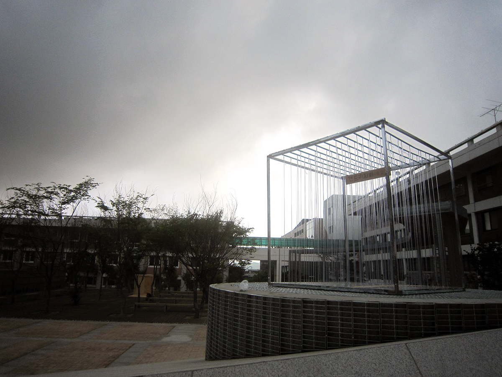

[:material-arrow-left-bold: project list](../../index.md){ .md-button }
 

>date: 2012, 1st semester  
>course: (Architecture major) Architectural Design Studio 1-1  
>team: Byungkwon Kang, Hak Lee, Youngju Lee  
>interval: half-semester (final)  

## Render

Isometric  
{width=600}  

Side Elevation  
{width=600}  

Perspective-1  
{width=600}  

Perspective-2  
{width=600}  

## Cube

Site 1  
{width=600}  

Site 2  
{width=600}  

Cube 1  
{width=600}  

Cube 2  
{width=600}  

Cube 3  
{width=600}  

Photo 1  
{width=600}  

Photo 2  
{width=600}  

## Book
(click the image below to download)  
[{width=300}](https://d1dc0q79zg1bxk.cloudfront.net/cube(2012)-book.pdf){:target="_blank"}

[:material-arrow-left-bold: project list](../../index.md){ .md-button }