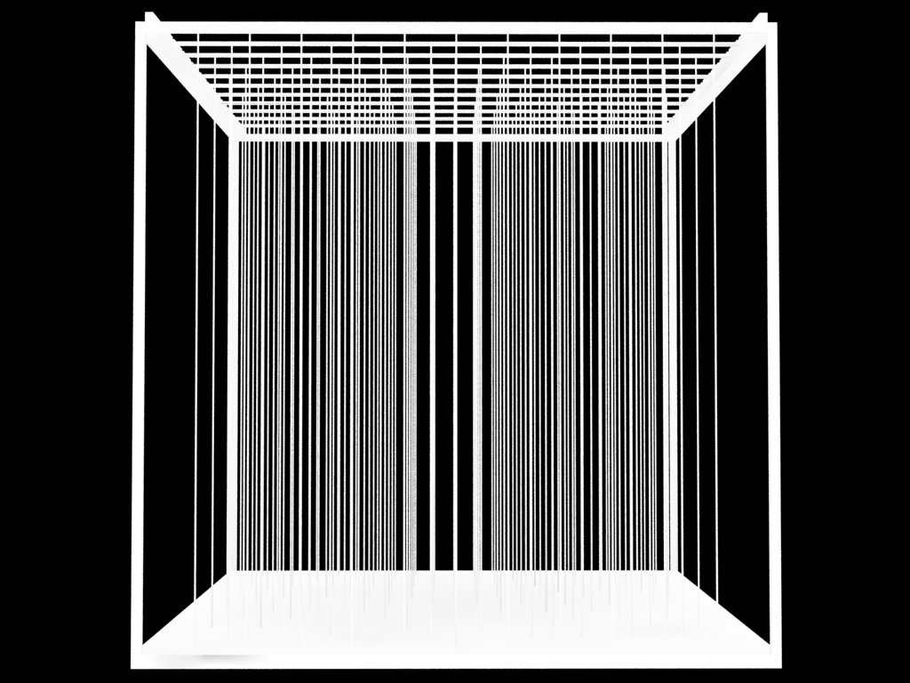

[:material-arrow-left-bold: 프로젝트 목록](../../index.md){ .md-button }  
 

>날짜: 2012, 1학기  
>수업: (건축학과) 건축설계스튜디오 1-1  
>팀원: 강병권, 이영주, 이학  
>기간: 1/2학기 (기말 프로젝트)  

## 렌더

Isometric  
{width=600}  

Side Elevation  
{width=600}  

Perspective-1  
{width=600}  

Perspective-2  
{width=600}  

## 큐브

Site 1  
{width=600}  

Site 2  
{width=600}  

Cube 1  
{width=600}  

Cube 2  
{width=600}  

Cube 3  
{width=600}  

Photo 1  
{width=600}  

Photo 2  
{width=600}  

## 책
(click the image below to download)  
[{width=300}](https://d1dc0q79zg1bxk.cloudfront.net/cube(2012)-book.pdf){:target="_blank"}

[:material-arrow-left-bold: 프로젝트 리스트](../../index.md){ .md-button }