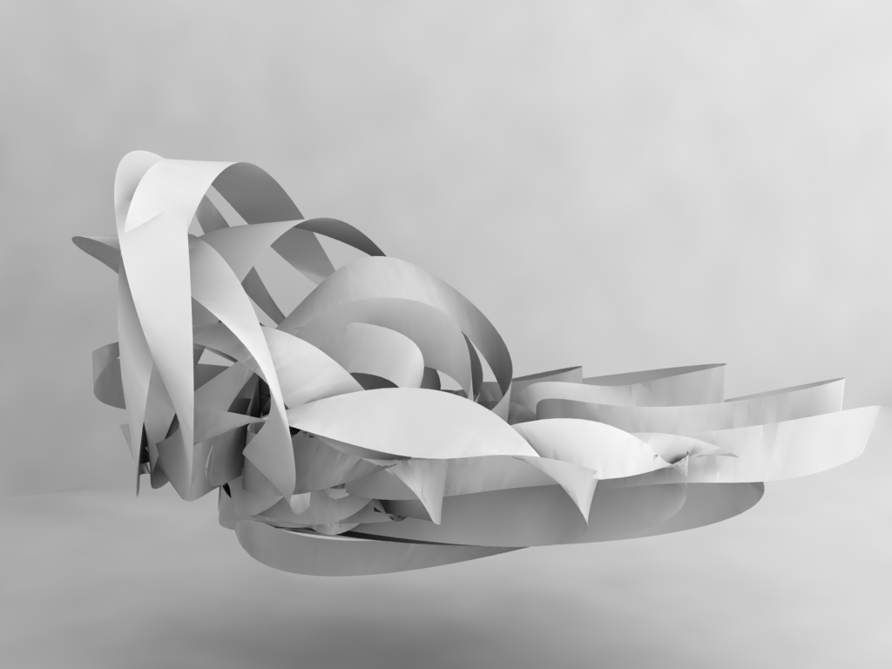
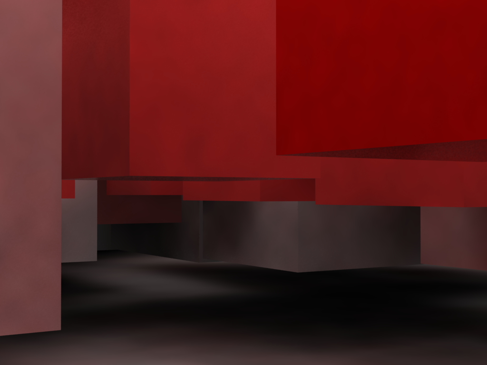

[:material-arrow-left-bold: 프로젝트 목록](../../index.md){ .md-button }  
 

>날짜: 2012  

## 1. Cloud

{width=300}
{width=300}
{width=300}
{width=300}
{width=300}
{width=300}

## 2. Voxels

{width=200}
{width=200}
{width=200}
{width=200}
{width=200}
{width=200}
{width=200}
{width=200}
{width=200}

## 3. Ribbon

{width=300}
{width=300}
{width=300}
{width=300}
{width=300}
{width=300}

## 4. Attractor

{width=300}
{width=300}
{width=300}
{width=300}
{width=300}
{width=300}

## 5. Grid Distortion

{width=600}
{width=600}
{width=600}
{width=600}

## 6. Random Cubes

{width=600}
{width=600}
{width=600}
{width=600}
{width=600}

## 7. Voronoi

{width=600}
{width=600}

[:material-arrow-left-bold: 프로젝트 목록](../../index.md){ .md-button }