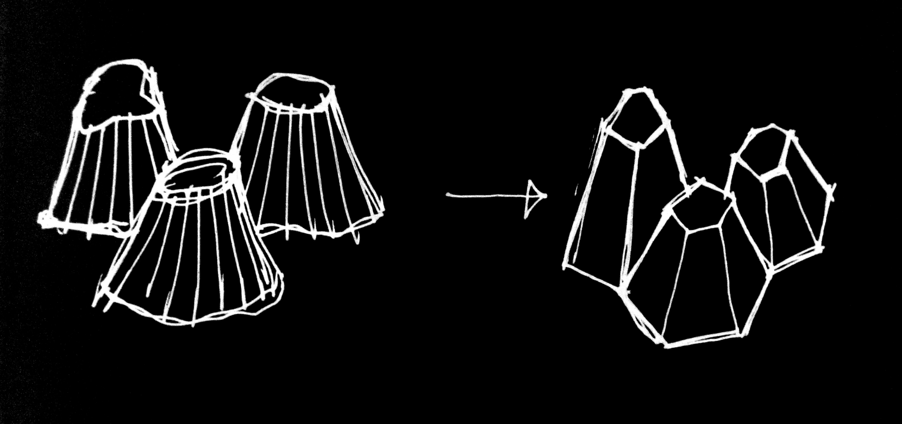
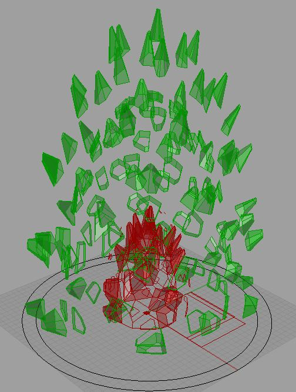
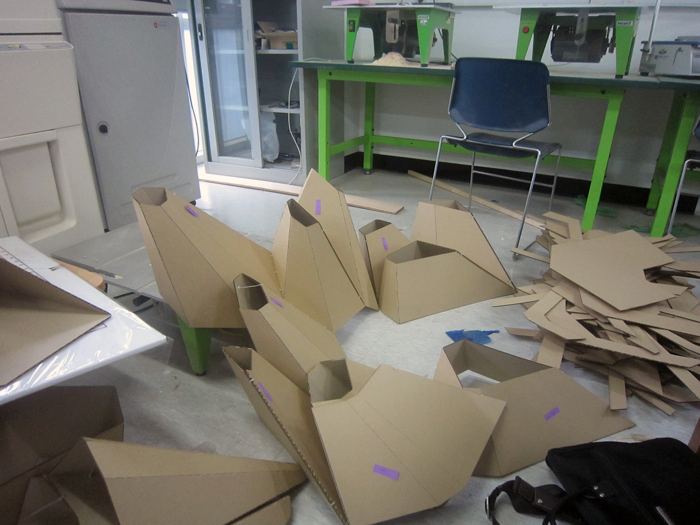
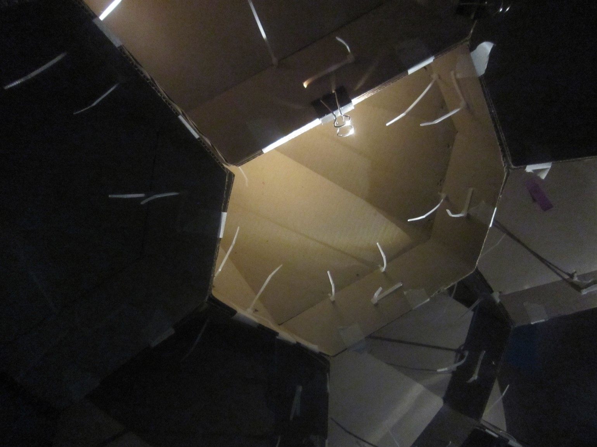
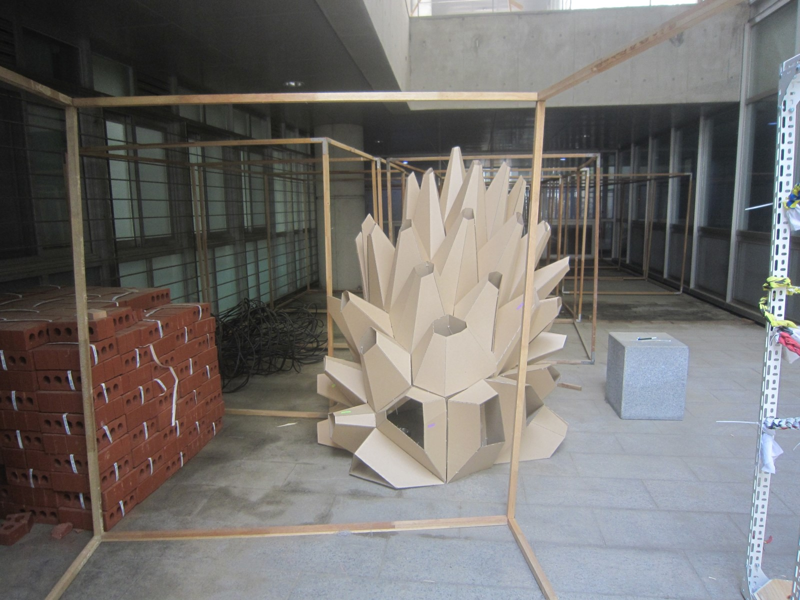

[:material-arrow-left-bold: project list](../../index.md){ .md-button }
 

>date: 2013, 1st semester  
>course: (Liberal education) Creativity and Design  
>interval: 1/3 semester (mid term 2)  

## Intro

As part of the project 'Associating and Designing Artifacts Using Nature's Characteristics', I designed a 2-meter-tall lighting fixture inspired by the barnacles, where individuals with different forms cluster together. I primarily used cardboard boxes and cable ties as materials. Using Grasshopper, I designed and created the profiles, then used a laser cutter to cut the cardboard into the profiles. The lighting fixture fell apart under its own weight as I was putting it together, so I wasn't able to install it.

## Design Process

### Sketch
{width=600}  
{width=600}  

### Modeling
{width=600}  
{width=600}  
{width=600}  

## Fabrication Process

{width=600}  
{width=600}  
{width=600}  
{width=600}  
{width=600}  
{width=600}  
{width=600}  

[:material-arrow-left-bold: project list](../../index.md){ .md-button }