[:material-arrow-left-bold: 프로젝트 목록](../../index.md){ .md-button }
 

>날짜: 2013, 1학기  
>수업: (일반교양) 창조와 디자인  
>기간: 1/3 학기 (중간 프로젝트 2)  

## 개요

`자연의 특성을 이용한 인공물 연상 및 디자인`과제의 일환으로 서로 다른 형태를 지닌 개체들이 무리지어있는 따개비의 특성을 따와서 2m 높이의 조명을 디자인했다. 박스지와 케이블 타이를 주 재료로 사용했으며, 그래스호퍼를 사용하여 디자인 및 전개도를 만들고 레이저 커터를 사용하여 전개도 모양으로 박스지를 가공했다. 조립하는 과정에서 자체 무게로 인해 붕괴하여 조명을 설치하는 데에는 실패했다.

## 디자인 과정

### 스케치
{width=600}  
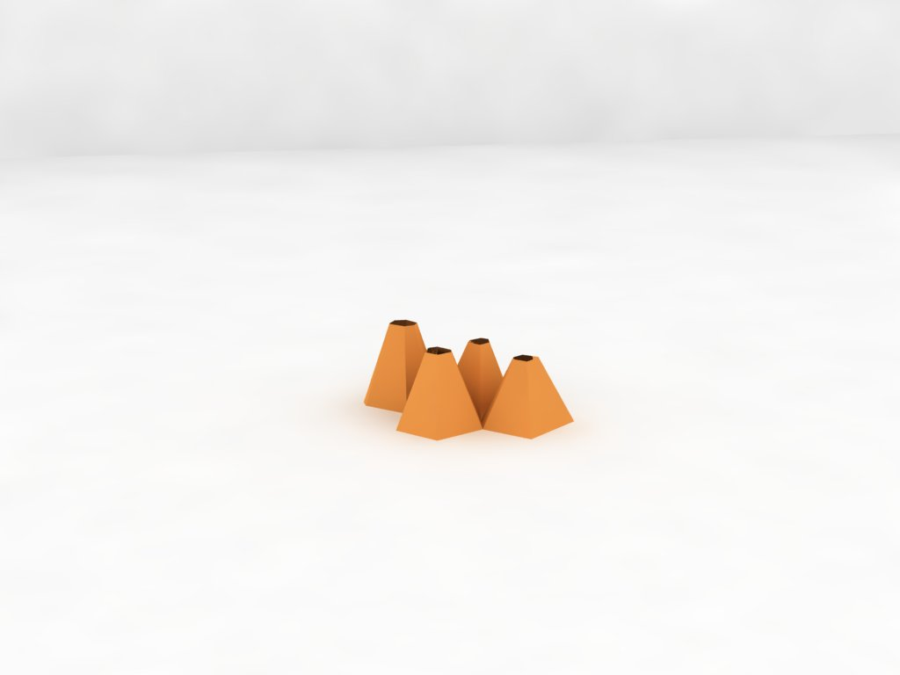{width=600}  

### 모델링
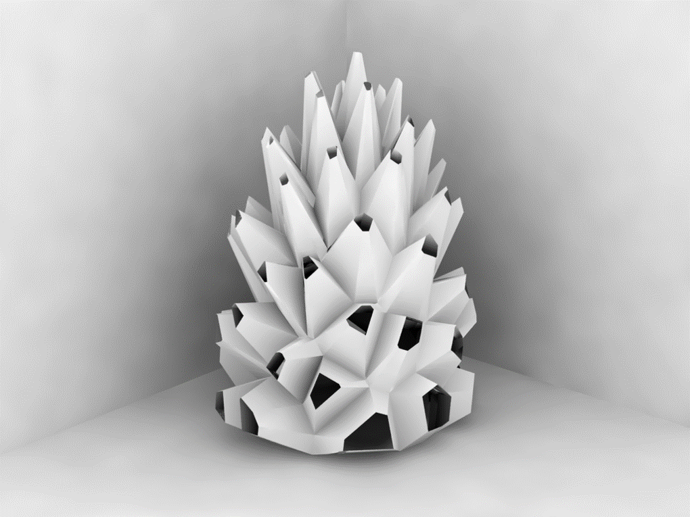{width=600}  
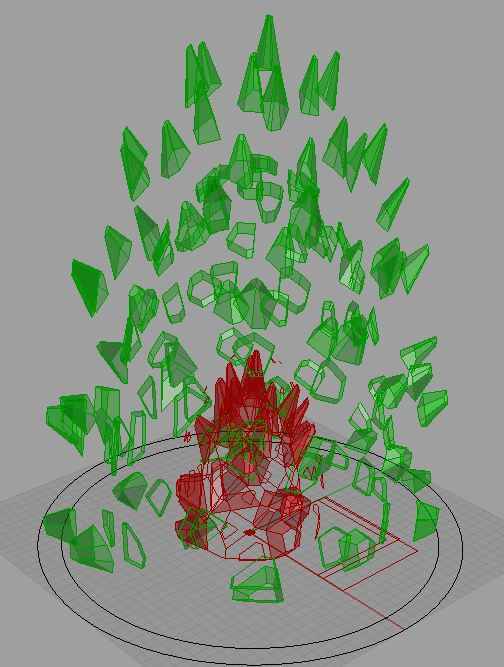{width=600}  
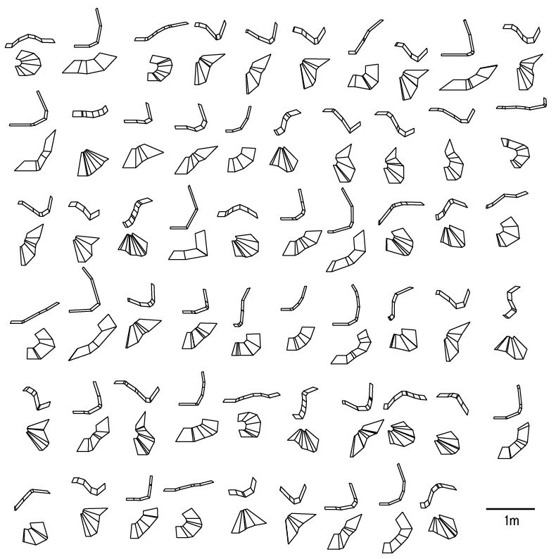{width=600}  

## 제작 과정

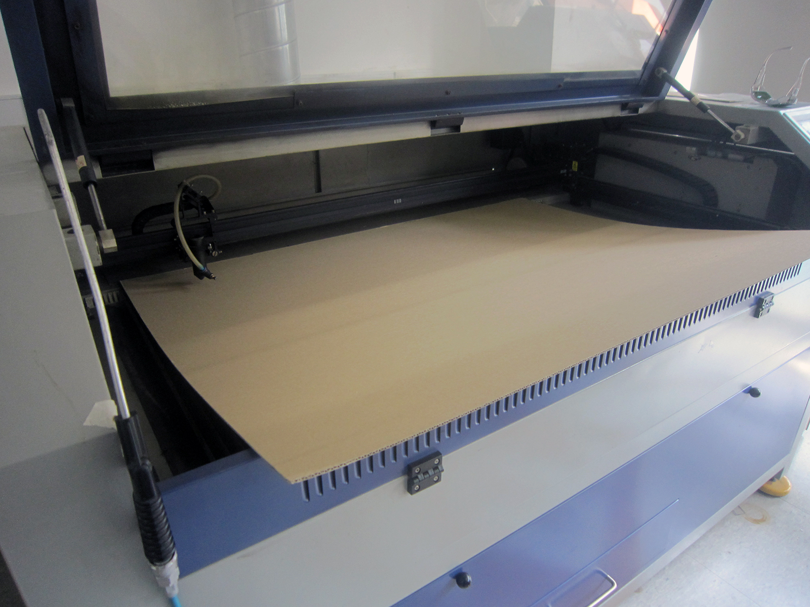{width=600}  
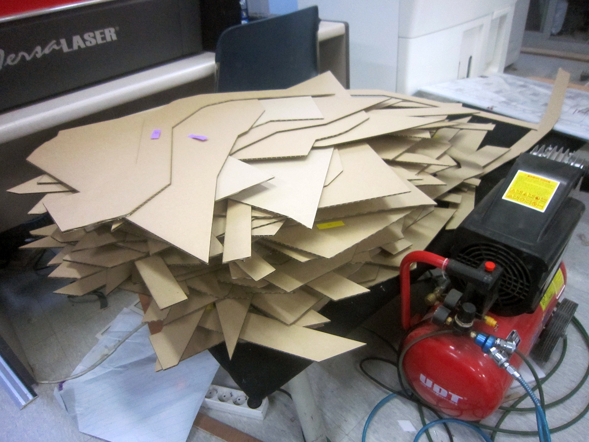{width=600}  
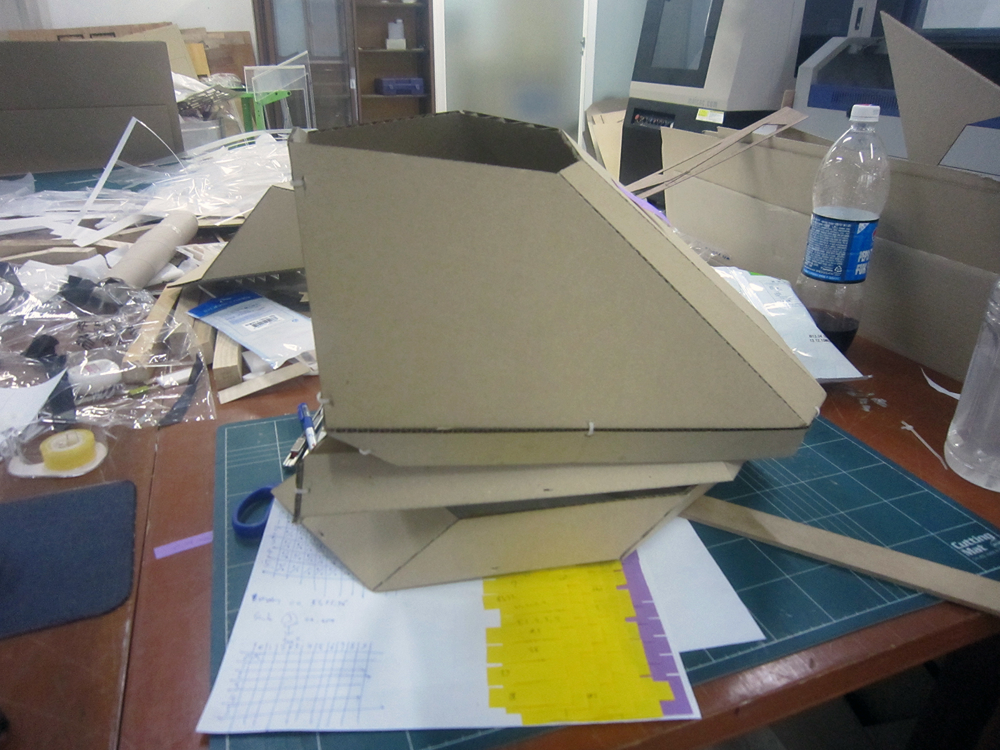{width=600}  
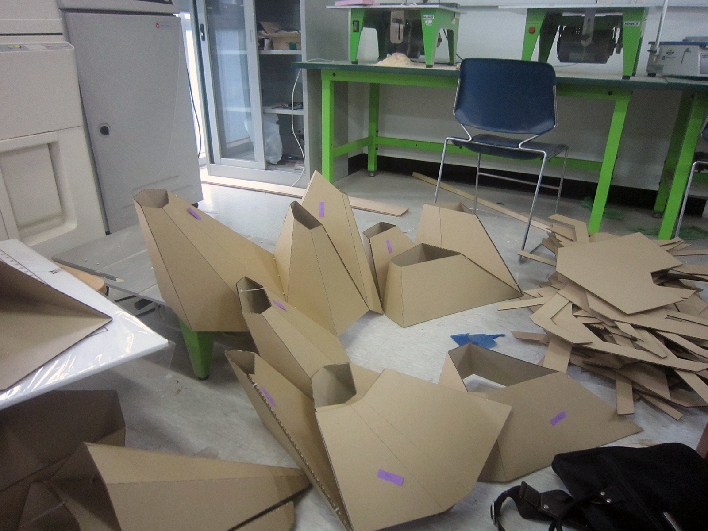{width=600}  
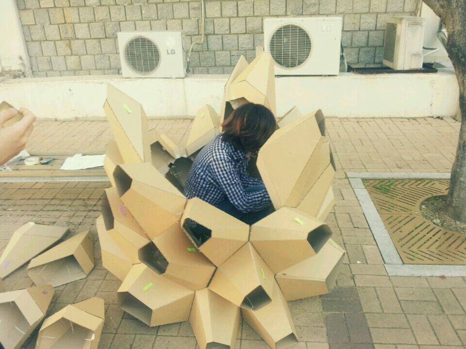{width=600}  
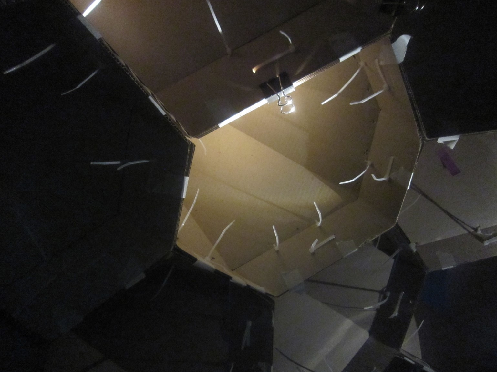{width=600}  
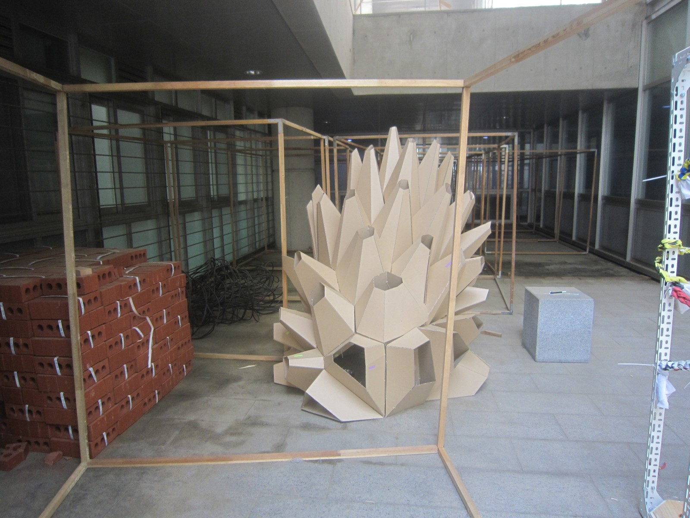{width=600}  

[:material-arrow-left-bold: 프로젝트 리스트](../../index.md){ .md-button }