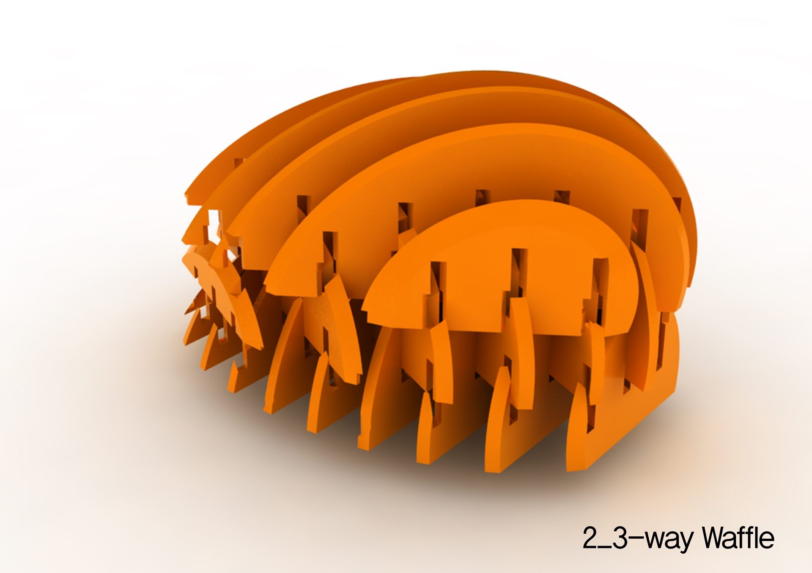

[:material-arrow-left-bold: 프로젝트 목록](../../index.md){ .md-button }  
 

>날짜: 2013, 2학기  
>수업: (건축학과) 디지털 디자인 연구  
>기간: 1 학기 (기말 프로젝트)  

## 1. Allianz Arena

{width=800}
{width=800}
{width=800}

## 2. 3-way Waffle

{width=800}
{width=800}
{width=800}

## 3. Wall Maker

{width=800}
{width=800}

### extra: Form from Mistake
{width=800}
{width=800}

[:material-arrow-left-bold: 프로젝트 목록](../../index.md){ .md-button }