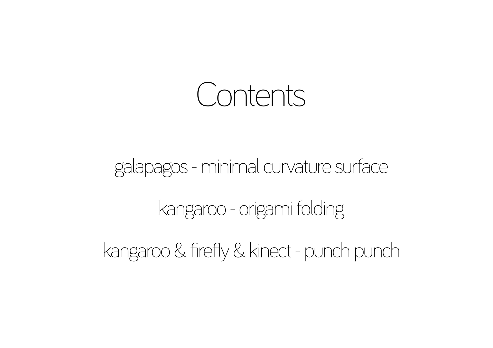
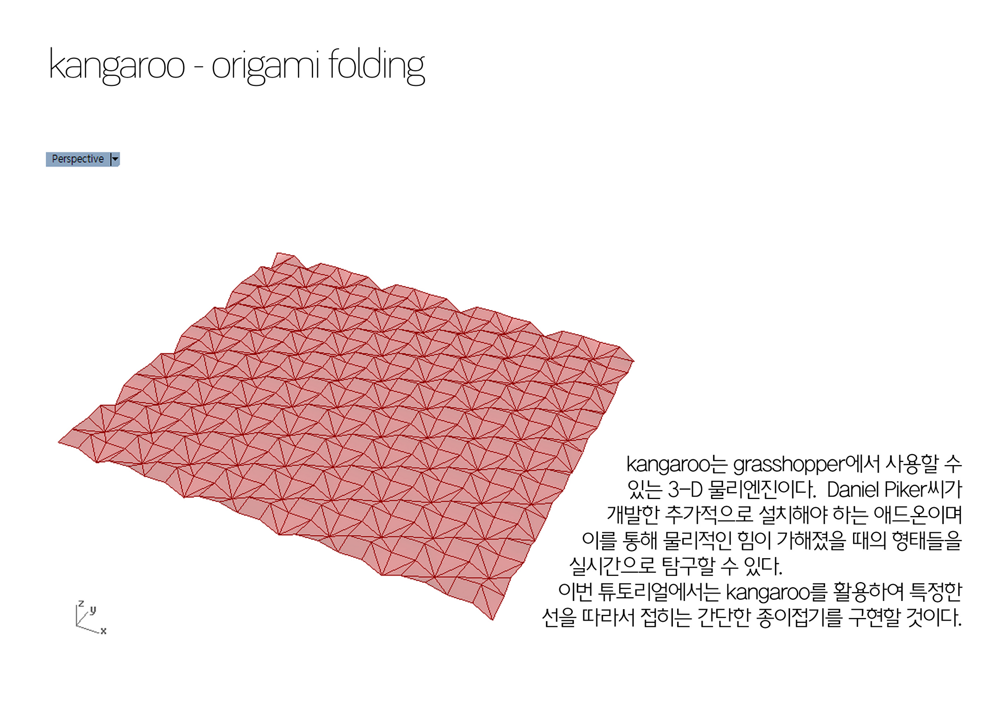
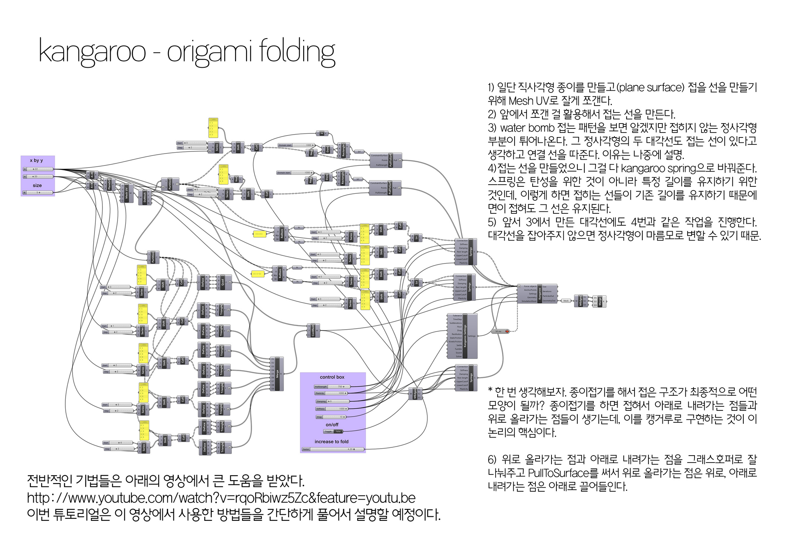
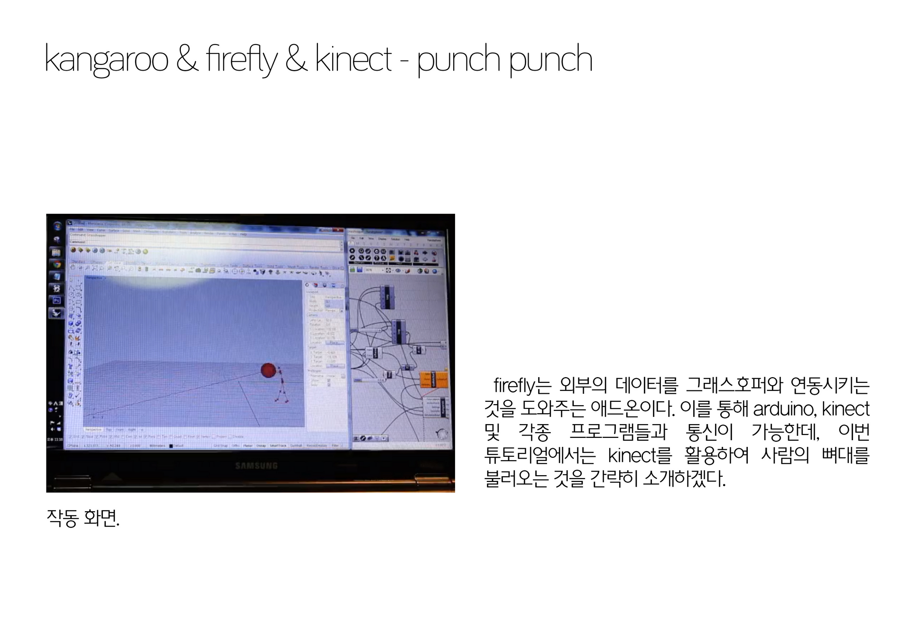
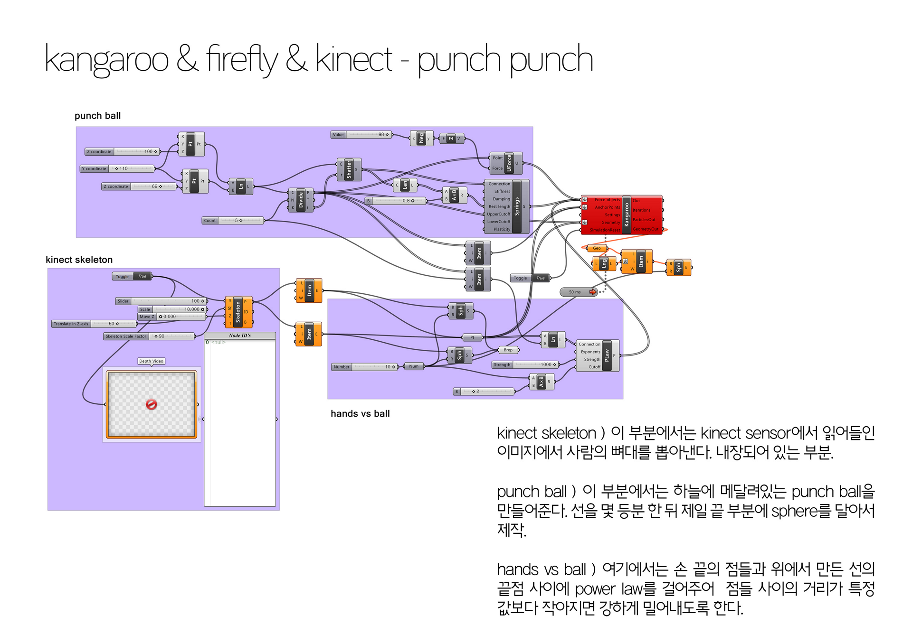

[:material-arrow-left-bold: project list](../../index.md){ .md-button }  
 

>date: 2014, 1st semester  
>course: (Architecture major) Design Computing  
>interval: half-semester (final)  

## Contents

{width=800}
{width=800}
{width=800}
{width=800}
{width=800}
{width=800}
{width=800}

[:material-arrow-left-bold: project list](../../index.md){ .md-button }