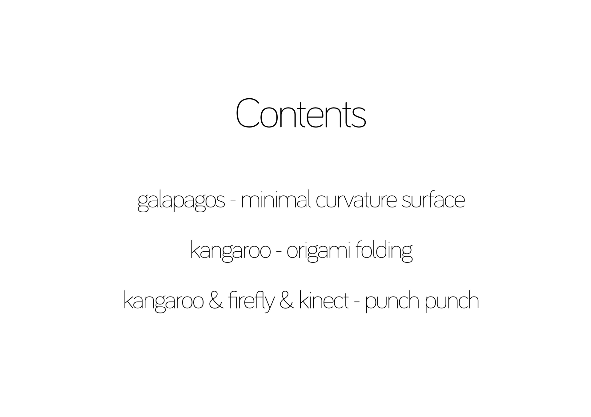
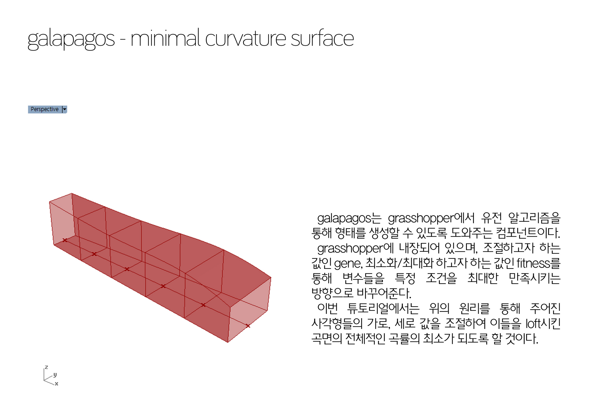
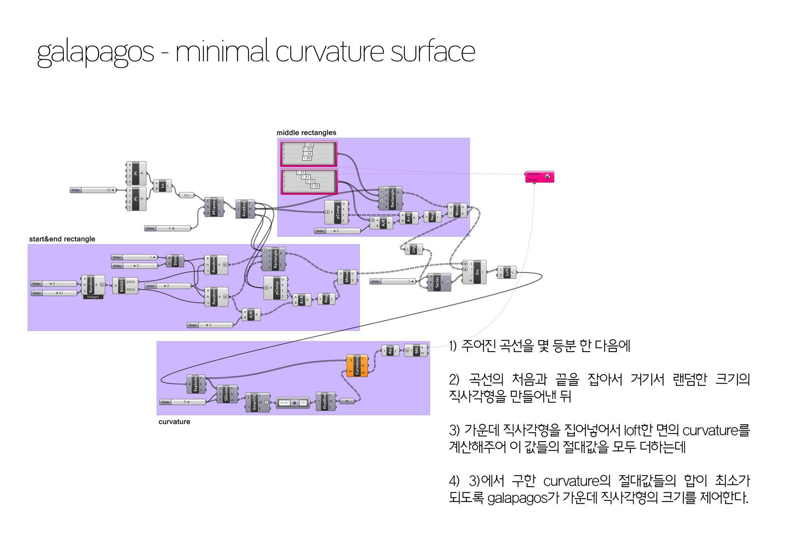
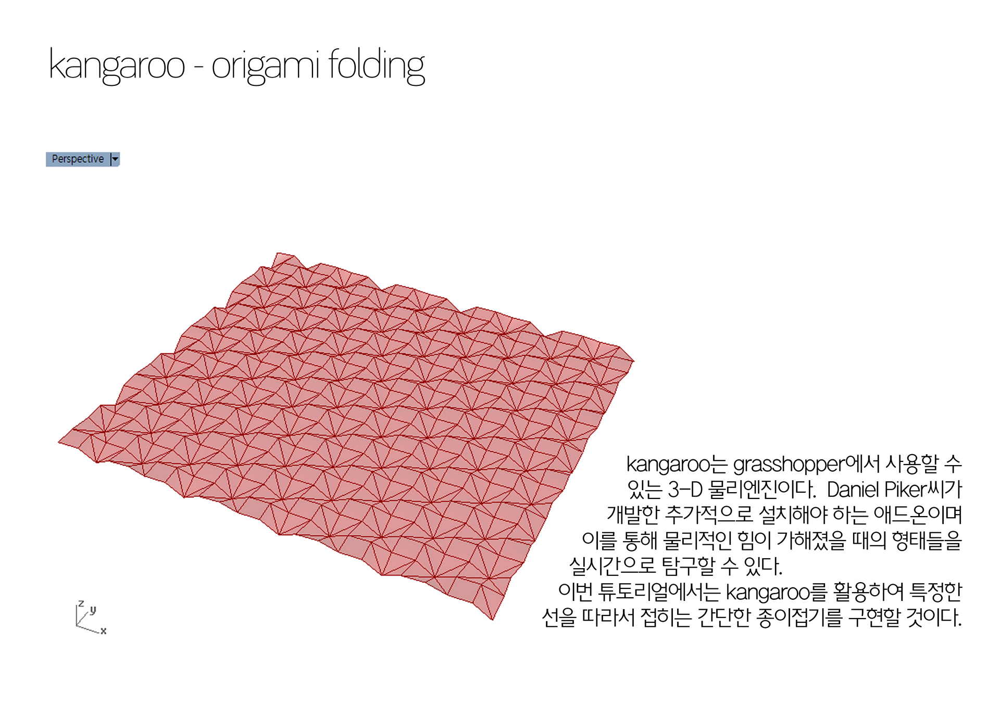
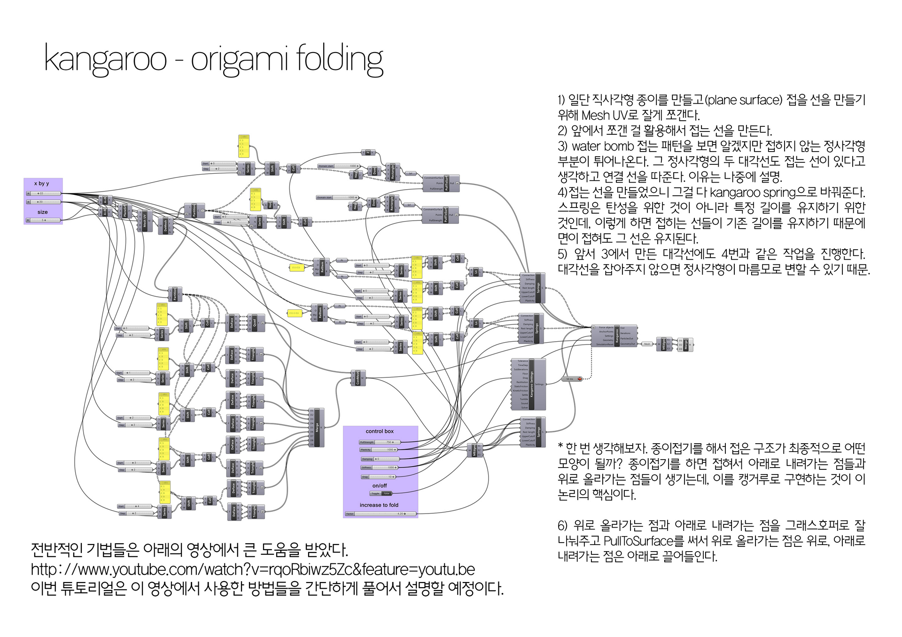
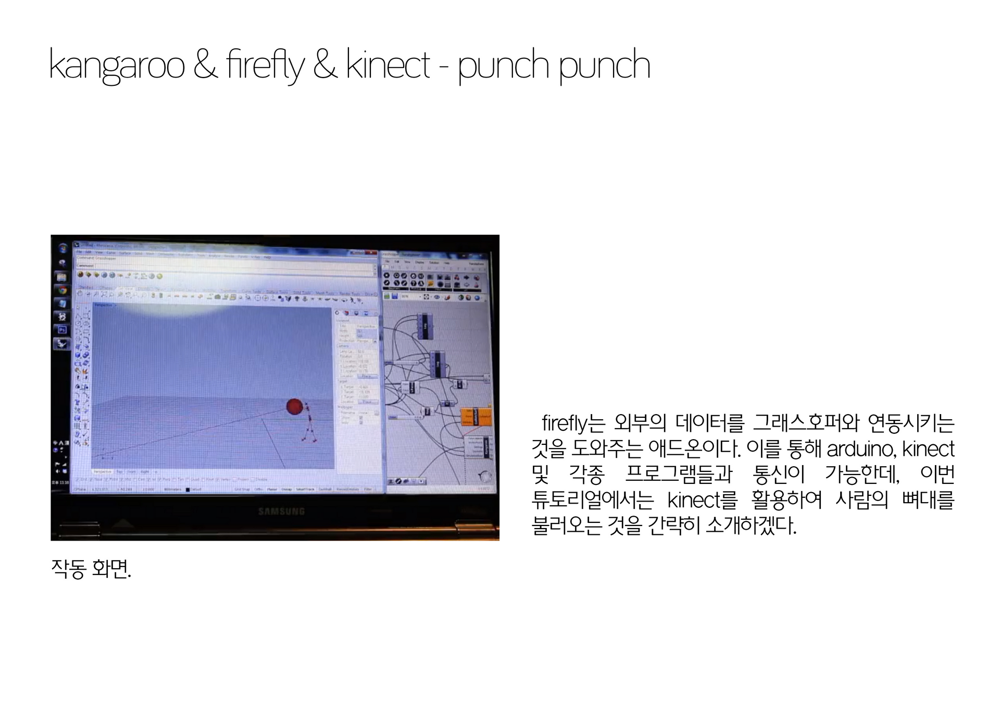
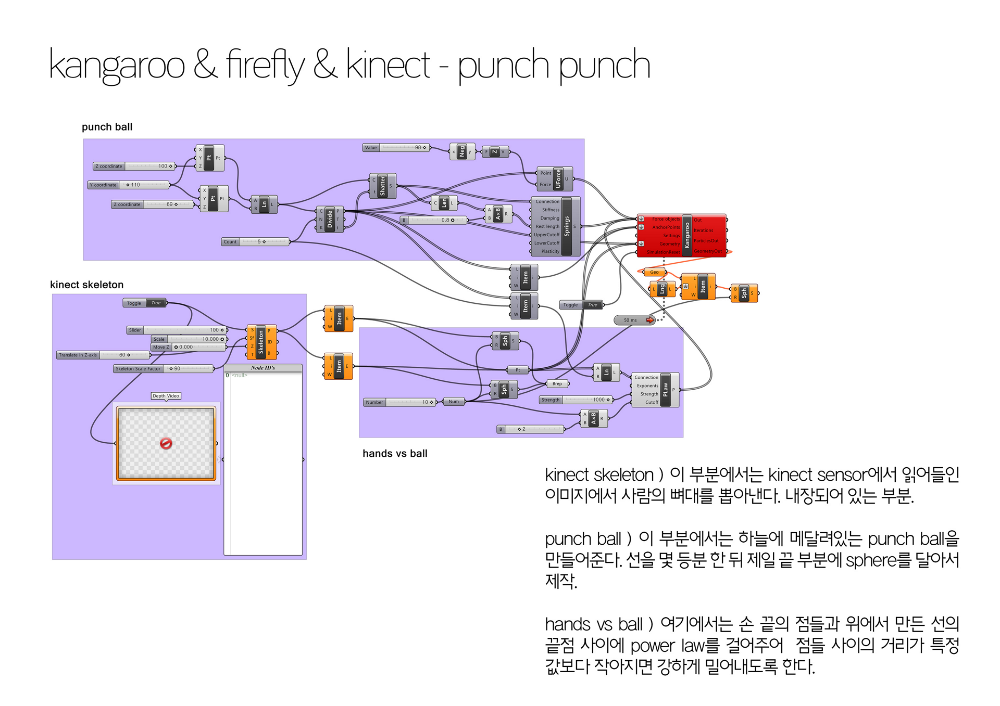

[:material-arrow-left-bold: 프로젝트 목록](../../index.md){ .md-button }  
 

>날짜: 2014, 1학기  
>수업: (건축학과) 건축과 컴퓨터  
>기간: 1/2 학기 (기말 프로젝트)  

## Contents

{width=800}
{width=800}
{width=800}
{width=800}
{width=800}
{width=800}
{width=800}
<iframe width="560" height="315" src="https://www.youtube.com/embed/3KTawDrCJhQ?si=Nhr_RqZa6J8g60P1" title="YouTube video player" frameborder="0" allow="accelerometer; autoplay; clipboard-write; encrypted-media; gyroscope; picture-in-picture; web-share" referrerpolicy="strict-origin-when-cross-origin" allowfullscreen></iframe>

[:material-arrow-left-bold: 프로젝트 목록](../../index.md){ .md-button }