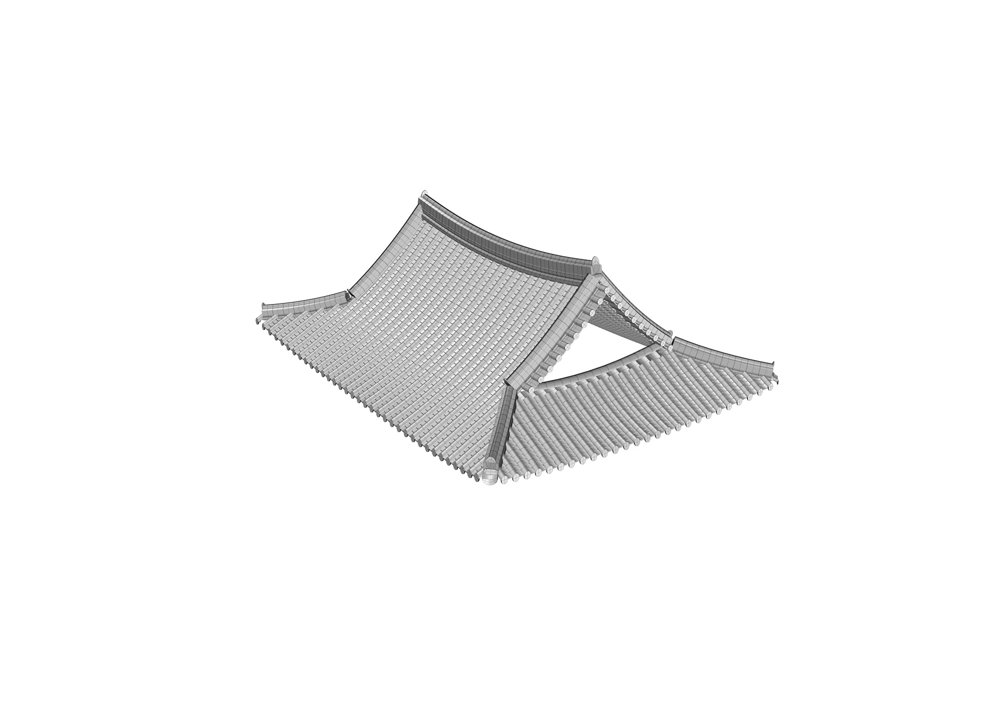
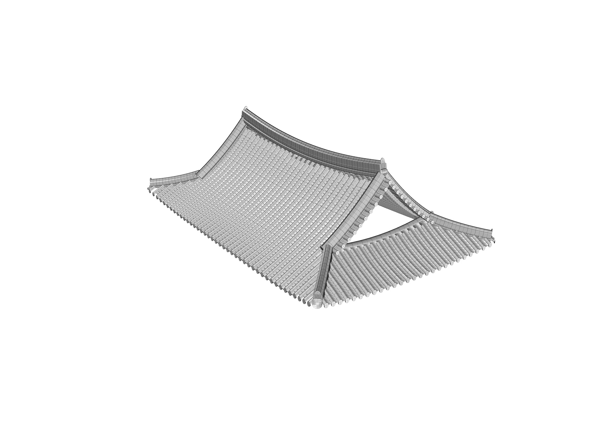
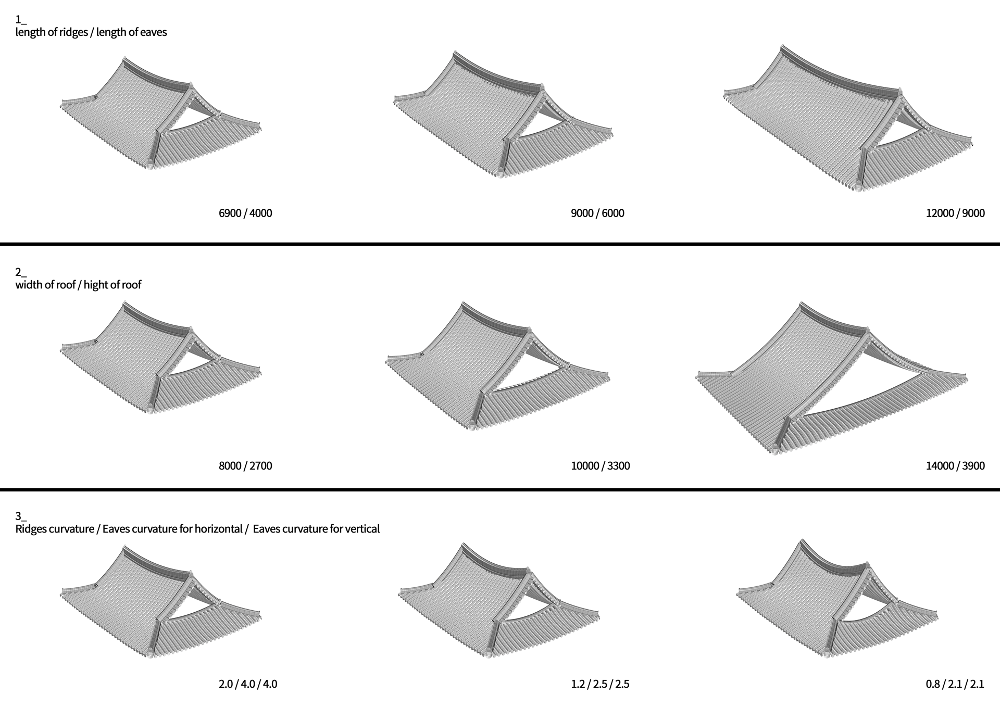

[:material-arrow-left-bold: project list](../../index.md){ .md-button }  
 

>date: 2014, summer  
>lab: Seoul National University Architectural History Lab  
>role: Short-term Researcher
>interval: 2014 Jul – 2014 Aug  

## Intro
During the summer break, I worked at SNU Architectural History Lab and implemented a feature to generate traditional Korean Hanok roofs with grasshopper.

## Diagrams
### Length of Ridges, Length of Eaves
{width=600}  
{width=600}  
{width=600}  
### Width of Roof, Height of Roof
{width=600}  
{width=600}  
{width=600}  
### Ridges Curvature, Horizontal Eaves Curvature, Vertical Eaves Curvature
{width=600}  
{width=600}  
{width=600}
### Total Diagram
{width=900}

## Extra
{width=900}  
{width=900}  

[:material-arrow-left-bold: project list](../../index.md){ .md-button }