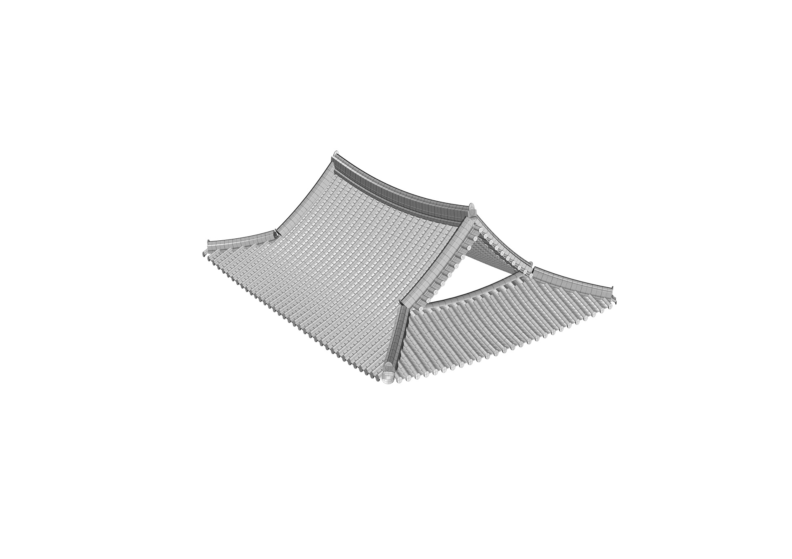
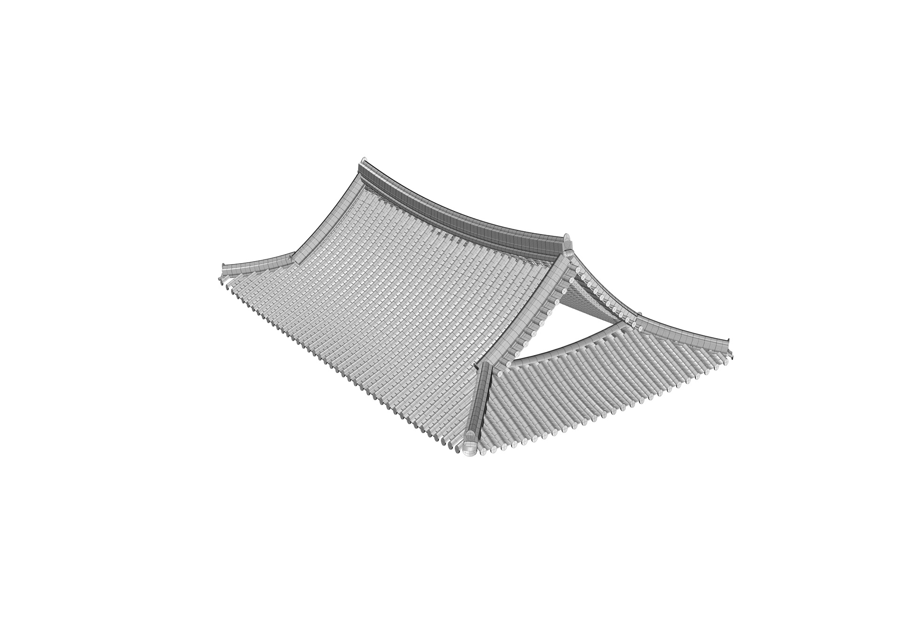
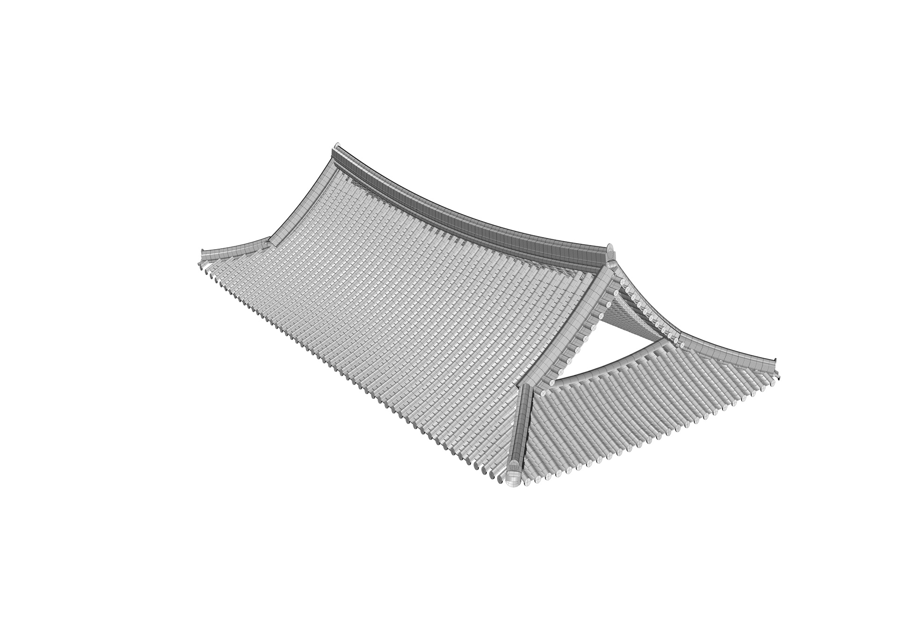
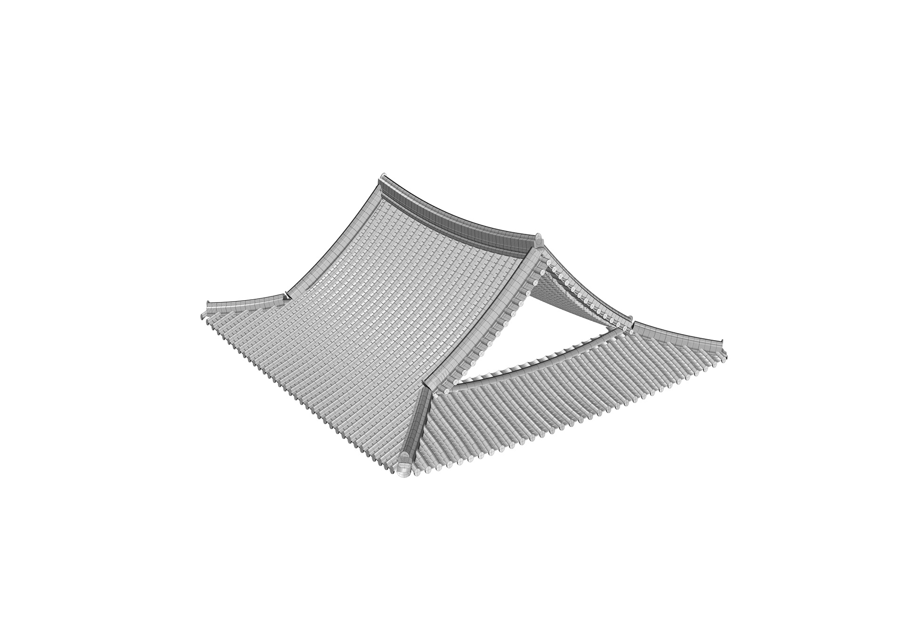
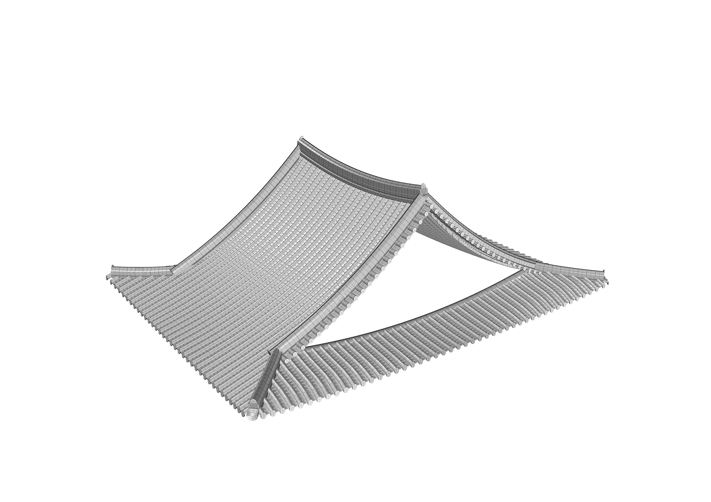
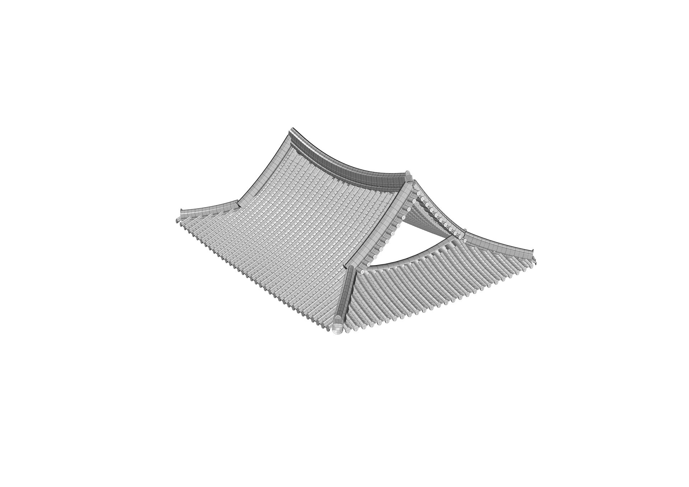
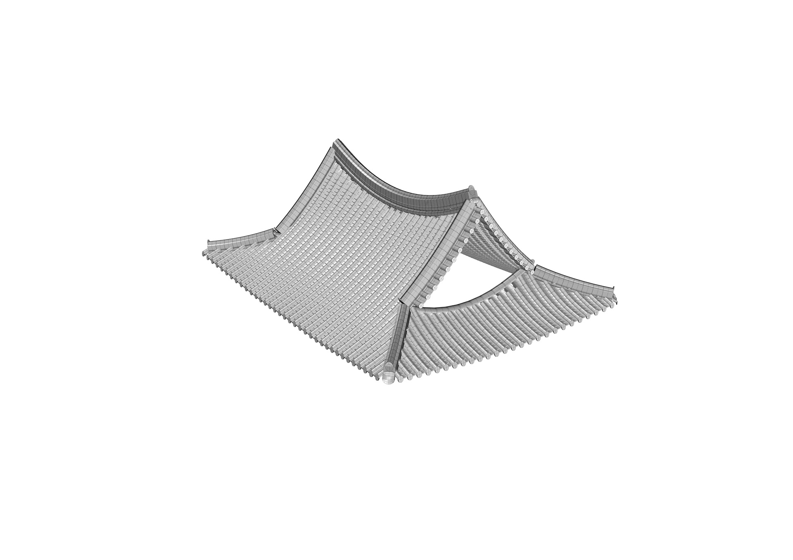
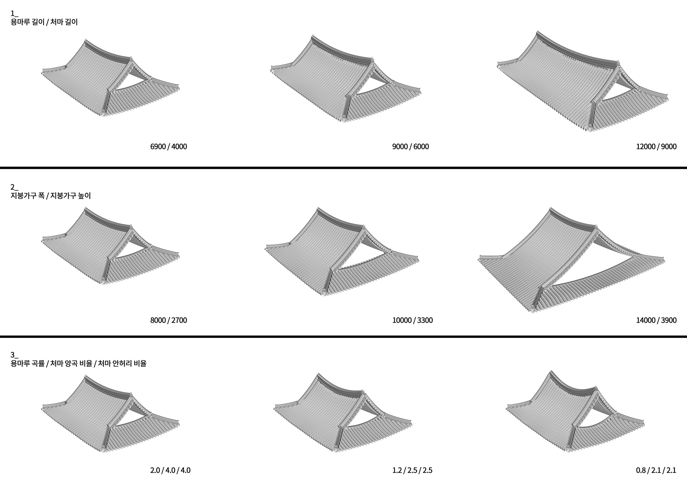
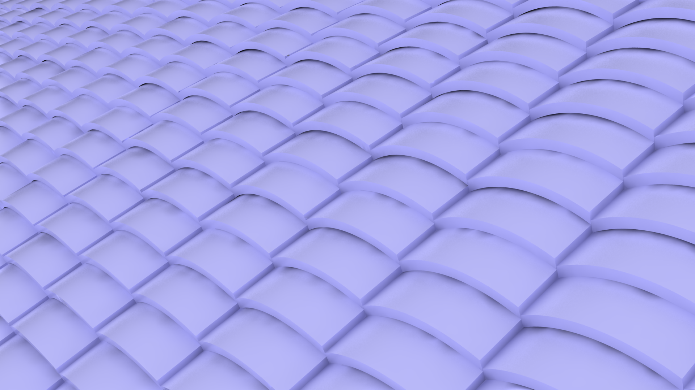

[:material-arrow-left-bold: 프로젝트 목록](../../index.md){ .md-button }  
 

>날짜: 2014, 여름  
>연구실: 서울대학교 건축학과 건축사연구실  
>역할: 전문연구원  
>기간: 2014 7월 – 2014 8월  

## Intro
서울대학교 건축학과 건축사연구실에서 여름방학 기간 동안 그래스호퍼를 활용하여 한옥 지붕을 생성하는 기능을 구현하였습니다.

## Diagrams
### 용마루 길이, 처마 길이
{width=600}  
{width=600}  
{width=600}  
### 지붕가구 폭, 지붕가구 높이
{width=600}  
{width=600}  
{width=600}  
### 용마루 곡률, 처마 앙곡 비율, 처마 안허리 비율
{width=600}  
{width=600}  
{width=600}
### 전체 다이어그램
{width=900}

## Extra
{width=900}  
{width=900}  

[:material-arrow-left-bold: 프로젝트 목록](../../index.md){ .md-button }