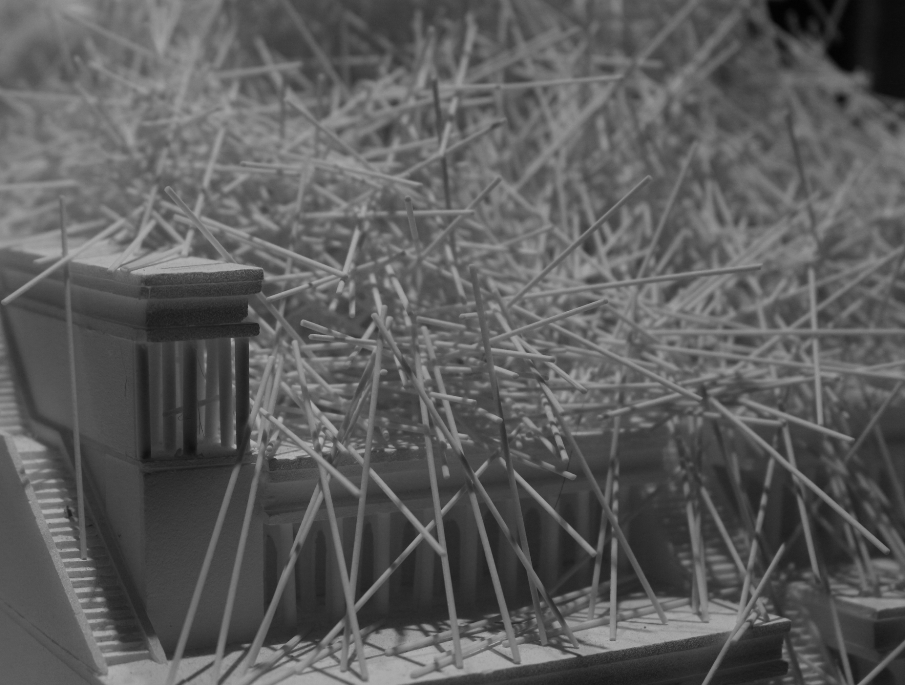

[:material-arrow-left-bold: 프로젝트 목록](../../index.md){ .md-button }  
 

>날짜: 2014  
>기간: 2014 11월 – 2014 12월  

## Intro
건축 구조 수업을 듣던 중 버틸 수 있는 하중을 계산하는 것은 어렵지만 실제로는 작동하는 구조물에는 어떤 것이 있을지 문득 궁금해졌다. 그러다가 나뭇가지를 쌓아 올려서 어느 정도 안정적인 형태를 유지하는 새의 둥지가 떠올랐다. 새의 둥지를 3D 소프트웨어에 있는 물리 엔진을 활용해서 만들 수 있을까? 둥지를 이루는 요소를 단순화한다면 어떤 속성을 가지고 있어야 하며, 어떤 형태여야 할까? 3D의 세상으로 넘기기 전 이 질문에 대한 답을 얻기 위해 간단한 물리적인 모델을 만들어보기로 했다. 재료는 주변에서 쉽게 구할 수 있는 소면을 사용했으며, 빈 바닥 및 그간 만들었던 건축 모형들을 소면을 흩뿌릴 환경으로 활용하여 실험을 진행하였다.

## 실험 1
{width=600}
{width=600}
{width=600}
{width=600}
{width=600}
{width=600}

## 실험 2
{width=300}
{width=300}
{width=300}
{width=300}
{width=300}
{width=300}
{width=300}
{width=300}
{width=300}
{width=300}
{width=300}
{width=300}
{width=300}
{width=300}
{width=300}
{width=300}
{width=300}

## 실험 3
{width=300}
{width=300}
{width=300}
{width=300}
{width=300}
{width=300}
{width=600}
{width=600}
{width=600}
{width=600}
{width=600}

## 실험 4
{width=600}
{width=600}
{width=600}
{width=600}
{width=600}
{width=600}
{width=600}
{width=600}

[:material-arrow-left-bold: 프로젝트 목록](../../index.md){ .md-button }