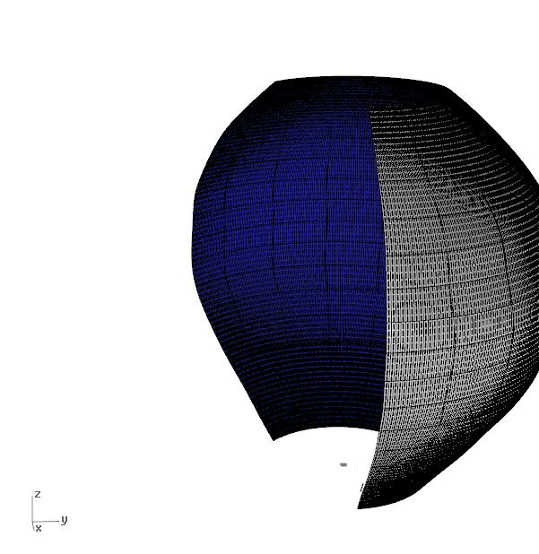

[:material-arrow-left-bold: 프로젝트 목록](../../index.md){ .md-button }  
 

>날짜: 2015, 가을  
>프로젝트: O  
>클라이언트: [전병삼](https://www.bsjeon.com/)  
>설치 위치: 김포국제공항(서울), 2023년 철거  
>역할: 형태 구현 및 제작을 위한 전개도 생성  
>기간: 2015 8월 – 2015 10월  

## Intro
<iframe width="560" height="315" src="https://www.youtube.com/embed/Gs_ytk_SDdA?si=jQBUwLlLNp2O4fHw" title="YouTube video player" frameborder="0" allow="accelerometer; autoplay; clipboard-write; encrypted-media; gyroscope; picture-in-picture; web-share" referrerpolicy="strict-origin-when-cross-origin" allowfullscreen></iframe>

## Works
{width=600}
{width=600}
{width=600}
{width=600}

!!! danger "UNDER CONSTRUCTION"
    This page is under construction.

## Photo
{width=800}

## Press
[김포공항 미디어아트 ‘달 항아리’, 한국의 얼굴이 되다 (jungle.co.kr)](https://www.jungle.co.kr/magazine/23285)  
[랜드마크서 흉물로···김포공항 ‘달항아리’ 7년 만에 결국 퇴장 - 매일경제 (mk.co.kr)](https://www.mk.co.kr/news/society/10813386)

[:material-arrow-left-bold: 프로젝트 목록](../../index.md){ .md-button }